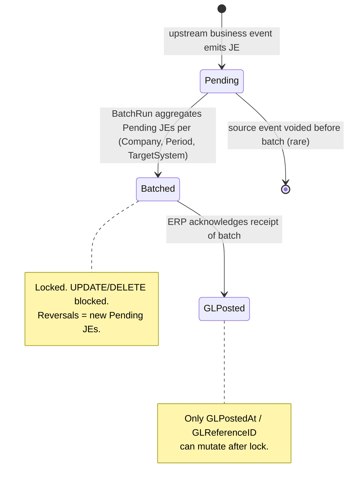

<p align="center">
  
</p>

<h1 align="center">BizApps Accounting</h1>

<p align="center">
  <strong>AR subsidiary ledger of record and journal-entry primitives for the <a href="https://github.com/MemberJunction/MJ">MemberJunction</a> platform</strong>
</p>

<p align="center">
  <a href="#what-this-is--and-is-not">What this is</a> &middot;
  <a href="#installation">Install</a> &middot;
  <a href="#entity-model">Entity Model</a> &middot;
  <a href="#using-bizapps-accounting-in-your-code">Code</a> &middot;
  <a href="plans/bizapps-accounting-master.md">Design Doc</a>
</p>

<p align="center">
  
  
  
  
  
  
</p>

---

Every back-office app eventually grows the same set of accounting primitives — a chart of accounts, balanced journal entries, accounting periods that lock, multi-currency mechanics, sales-tax accruals. BizAppsAccounting ships these as a **MemberJunction Open App** so downstream apps (BizAppsOrders, future BizAppsPayroll / ExpenseManagement / FixedAssets) can emit journal entries by calling into one well-tested primitive layer instead of each reinventing it.

The ERP (Business Central, QuickBooks, NetSuite, Sage) remains the **general ledger** and the system of record for the full chart. BizAppsAccounting batches our subledger JEs to the ERP per company per period.

---

## What This Is — and Is Not

| ✅ This is | ❌ This is not |
|---|---|
| AR subsidiary ledger of record | A general ledger |
| Journal-entry primitives (balanced, immutable-once-batched, dimension-tagged, multi-currency) | A trial-balance / P&L / balance-sheet generator |
| Subledger period close + batch-to-ERP | A year-end closing engine |
| Pluggable tax engine (Avalara / TaxJar / Local) | An expense-management or AP system |
| Recurring JE templates (FX revaluation, depreciation, accruals) | An inventory or COGS engine |

See [`plans/bizapps-accounting-master.md`](plans/bizapps-accounting-master.md) §1 and §15 for the full scope decision (BA-D1) and explicit out-of-scope list.

---

## Installation

BizApps Accounting is a [MemberJunction Open App](https://github.com/MemberJunction/MJ/tree/main/packages/OpenApp). Install it into any MJ environment using the [MJ CLI](https://github.com/MemberJunction/MJ/tree/main/packages/MJCLI):

```bash
mj app install https://github.com/MemberJunction/bizapps-accounting
```

The CLI resolves dependencies automatically — installing this app will install [BizApps Common](https://github.com/MemberJunction/bizapps-common) first (for `Organization`, `Address`) and require an MJ core version that supports the `__mj.Company` IsA pattern. (`Currency` and the exchange-rate table are owned by **this** app — see [BA-D11](plans/bizapps-accounting-master.md).)

### Managing an installed app

```bash
mj app info mj-bizapps-accounting     # Show details and version
mj app upgrade mj-bizapps-accounting  # Upgrade to latest release
mj app disable mj-bizapps-accounting  # Temporarily disable
mj app enable mj-bizapps-accounting   # Re-enable
mj app remove mj-bizapps-accounting   # Uninstall (--keep-data to preserve schema)
```

---

## What You Get

### Database (`__mj_BizAppsAccounting` schema)

| Area | Tables | Purpose |
|---|---|---|
| **Chart of Accounts** | `GLAccount`, `ChartOfAccountsMapping` | Internal COA + mapping to the ERP's COA |
| **Company profile** | `AccountingCompanyProfile` | IsA Disjoint child of `__mj.Company` — functional currency, fiscal year, default GL accounts, business-profile fields |
| **Currency / FX** | `Currency`, `CurrencySpotRate` | ISO-4217 currencies + pluggable exchange-rate providers — owned by **this** app (BA-D11), not BizApps Common |
| **Periods** | `AccountingPeriod` | Per-company period set with hard-close semantics |
| **Journal Entries** | `JournalEntry`, `JournalEntryLine`, `JournalEntryBatch` | Balanced JEs with `Pending → Batched → GLPosted` lifecycle, immutability after batch |
| **Dimensions** | `Dimension`, `DimensionValue`, `JournalEntryLineDimension` | First-class analytical tags (Department, CostCenter, Project, Region, …) |
| **Tax** | `TaxAuthority`, `TaxJurisdiction`, `TaxRate`, `TaxLiability`, `TaxRemittance`, `CustomerTaxProfile` | Pluggable tax engine (Avalara / TaxJar / Local) |
| **Recurring** | `RecurringJournalEntryTemplate`, `RecurringJournalEntry` | FX revaluation, depreciation, prepaid amortization, sales-tax snapshot |
| **Balance materialization** | `AccountBalance`, `AccountBalanceByDimension` | Subledger-account balances per closed period |
| **Read-model views** | `vw_TrialBalance_AR`, `vw_AROpenByCustomer`, `vw_DefRevRollforward`, `vw_SalesTaxLiability`, `vw_ARtoGLRecon`, `vw_DimensionPL`, `vw_ARAging`, `vw_FxExposure`, `vw_JEAuditTrail` | Backing data for Skip-generated reports |

### TypeScript Packages

| Package | NPM Name | Role |
|---|---|---|
| **Entities** | `@mj-biz-apps/accounting-entities` | Strongly-typed entity classes with Zod validation |
| **Actions** | `@mj-biz-apps/accounting-actions` | Server-side action handlers (period close, batch run, tax calculation, FX revaluation) |
| **Server** | `@mj-biz-apps/accounting-server` | GraphQL resolvers and server bootstrap |
| **Angular** | `@mj-biz-apps/accounting-ng` | UI components, form overrides, custom widgets |
| **Core Entities Server** | `@mj-biz-apps/accounting-core-entities-server` | Server-only entity lifecycle hooks (JE numbering, balance materialization, period validation) |

---

## Key Invariants (Enforced at the Database Level)

Critical accounting integrity rules are enforced by **DB-level constraints and triggers**, not just app-layer validation. They cannot be bypassed by direct SA access. Full reference in [`plans/bizapps-accounting-master.md`](plans/bizapps-accounting-master.md) §5.

| Invariant | Mechanism |
|---|---|
| **Balanced JEs** — `SUM(Debits) == SUM(Credits)` per `JournalEntry` | DEFERRABLE constraint trigger; fires at end of transaction |
| **Post-batch immutability** — `JournalEntry` / `JournalEntryLine` cannot UPDATE/DELETE when `Status ∈ {Batched, GLPosted}` | BEFORE UPDATE/DELETE trigger; only `GLPostedAt` / `GLReferenceID` / `Status` may change after lock |
| **Period close** — no JE may post with `EffectiveDate` in a `Closed` `AccountingPeriod` unless `OriginalAccountingPeriodID` is set (adjusting entry) | BEFORE INSERT trigger on `JournalEntry` |
| **One side per line** — exactly one of `DebitAmount` / `CreditAmount` is non-null | CHECK constraint |
| **Original currency coherence** — `OriginalDebitAmount`, `OriginalCreditAmount`, `OriginalCurrencyCode`, `ExchangeRateUsed` move together | CHECK constraint |

The cumulative effect: the **audit trail is correct by construction**. There is no code path — including SQL Server SA — that can produce an unbalanced JE, edit a posted entry, or back-date into a closed period without explicit adjusting-entry intent.

---

## Entity Model

```
                              ┌──────────────────┐
                              │   __mj.Company   │
                              └────────┬─────────┘
                                       │ IsA Disjoint (same UUID)
                          ┌────────────▼─────────────┐
                          │ AccountingCompanyProfile │
                          │  functional currency,    │
                          │  fiscal year, COA refs   │
                          └────────────┬─────────────┘
                                       │
            ┌──────────────────────────┼──────────────────────────┐
            │                          │                          │
       ┌────▼────┐              ┌──────▼──────────┐         ┌─────▼─────────┐
       │GLAccount│              │AccountingPeriod │         │JournalEntry   │
       │(hier.)  │              │(Open|Closing|   │         │(Pending|      │
       └────┬────┘              │ Closed|Reopened)│         │ Batched|      │
            │                   └─────────────────┘         │ GLPosted)     │
       ┌────▼─────────────┐                                 └────────┬──────┘
       │ ChartOfAccounts  │                                          │
       │ Mapping (to ERP) │                          ┌───────────────┼──────────────┐
       └──────────────────┘                          │               │              │
                                                ┌────▼──────────┐ ┌──▼──────┐ ┌────▼──────────┐
                                                │JournalEntry   │ │ Batch   │ │JournalEntry   │
                                                │ Line          │ │ (to ERP)│ │ LineDimension │
                                                └────┬──────────┘ └─────────┘ └────┬──────────┘
                                                     │                              │
                                                     │                       ┌──────▼──────┐
                                                     │                       │  Dimension  │
                                                     │                       │  /Value     │
                                                     │                       └─────────────┘
                                                     ▼
                                            (FX original-currency triple,
                                             counterparty Organization, etc.)
```

### Cross-app references

| FK on Accounting entity | Refers to | Lives in |
|---|---|---|
| `JournalEntryLine.CounterpartyOrganizationID` | `Organization.ID` | `bizapps-common` |
| `CustomerTaxProfile.OrganizationID` | `Organization.ID` | `bizapps-common` |
| `JournalEntry.OrderID` / `SubscriptionID` / `PaymentID` | (polymorphic, soft refs) | `bizapps-orders` (future) |
| `JournalEntry.ContractID` | (polymorphic, soft ref) | `bizapps-contracts` (future) |

See [Entity Model in the master plan](plans/bizapps-accounting-master.md#4-entity-model) for the complete reference.

---

## JE Lifecycle



**Reversal pattern**: business-entity-level reversals (refunded order, voided payment) emit **new** Pending JEs in the current open period with `ReversesJournalEntryID` pointing at the original. Both entries persist; audit chain is the source-of-truth, not an erasure.

---

## Multi-Currency

JEs always post in the Company's **functional** currency. Lines carry the original-currency triple `(OriginalCurrencyCode, OriginalAmount, ExchangeRateUsed)` when the source transaction is in a different currency. Realized FX gain/loss is **auto-emitted** by the engine when an AR booked at rate X is paid at rate Y. Unrealized FX revaluation runs at period close via a seeded recurring template that revalues open foreign-currency balances and reverses the adjustment at the start of the next period.

```
-- AR booked AUD 1000 @ 0.66 = USD 660
-- Payment received AUD 1000 @ 0.64 = USD 640
-- Engine auto-emits:
JournalEntry (EntryType = 'PaymentReceipt'):
  Line 1: Dr Cash               USD 640  (AUD 1000 @ 0.64)
  Line 2: Cr AR                 USD 660  (clears original)
  Line 3: Dr Realized FX Loss   USD  20
-- Balanced: Dr 640+20 = Cr 660 ✓
```

Currency and the exchange-rate table (`Currency` + `CurrencySpotRate`) are **owned by this app** (BA-D11; BizApps Common never shipped them) with pluggable providers (`ExchangeRate-API`, `ECB`, `OpenExchangeRates`, `Manual`). Auto-fetch is **off by default**; deployments opt in via a Scheduled Action.

---

## Using BizApps Accounting in Your Code

> The examples below show the v1 surface area as designed in [`plans/bizapps-accounting-master.md`](plans/bizapps-accounting-master.md). Until Phase G ships these are forward-looking — file an issue or check the phase table below for what's currently buildable.

### Posting a Journal Entry

```typescript
import { Metadata } from '@memberjunction/core';
import {
  AccountingService,
  type JournalEntryDraft,
} from '@mj-biz-apps/accounting-server';

const draft: JournalEntryDraft = {
  companyId: bcCompanyId,
  effectiveDate: new Date(),
  entryType: 'OrderBooking',
  orderId: order.ID,
  lines: [
    { glAccountCode: '11201', dr: 1080.00, counterpartyOrganizationId: customerId }, // AR
    { glAccountCode: '40200', cr: 1000.00 },                                          // Subscription Revenue
    { glAccountCode: '21201', cr:   80.00, dimensions: { Region: 'CA' } },            // Sales Tax Payable
  ],
};

const je = await AccountingService.postJournalEntry(draft, contextUser);
// Returns the created JE with Status='Pending'. Balanced-JE invariant
// is verified by the DB trigger at COMMIT.
```

### Closing a Period

```typescript
import { AccountingService } from '@mj-biz-apps/accounting-server';

// Validates: no Pending JEs in period, all batches Acknowledged,
// tax liabilities resolved, recurring templates emitted.
const result = await AccountingService.closePeriod({
  companyId,
  periodId,
  closedByUserId: contextUser.ID,
});

if (!result.success) {
  console.error('Period close blocked:', result.validationFailures);
}
// On success: AccountBalance and AccountBalanceByDimension are
// materialized for this period. PeriodClosed event is emitted.
```

### Querying the AR Trial Balance

```typescript
import { RunView } from '@memberjunction/core';

const rv = new RunView();
const result = await rv.RunView({
  EntityName: 'MJ_BizApps_Accounting: Trial Balance AR',
  ExtraFilter: `CompanyID = '${bcCompanyId}' AND PeriodStart = '2026-05-01'`,
  ResultType: 'simple',
});
```

---

## Seeded Defaults

Deployed via migrations. Fully customizable per deployment (`IsSystemSeeded = 1` flag preserved for "platform default vs deployment-customized" reporting).

### Default Chart of Accounts (subset)

| Code | Name | Type |
|---|---|---|
| 11101 | Operating Cash | Asset |
| 11201 | Accounts Receivable | Asset |
| 11301 | Deferred Costs | Asset |
| 21201 | Sales Tax Payable | Liability |
| 21301 | Deferred Revenue | Liability |
| 21401 | Commission Payable | Liability |
| 40200 | Subscription Revenue | Revenue |
| 50100 | Sales Commission Expense | Expense |
| 50400 | Realized FX Gain/Loss | Expense |
| 50500 | Unrealized FX Gain/Loss | Expense |

Full ~25-account chart in [`plans/bizapps-accounting-master.md`](plans/bizapps-accounting-master.md#41-glaccount--hierarchy) §4.1.

### Seeded recurring JE templates

- **FX Revaluation** (monthly, with auto-reversing dated entry next period)
- **Prepaid Amortization** template
- **Depreciation Accrual** template
- **Sales Tax Liability Snapshot**

---

## Database Support

SQL Server is the **source of truth** for migrations. PostgreSQL is supported via automatic conversion using [`@memberjunction/sql-converter`](https://github.com/MemberJunction/MJ/tree/main/packages/SQLConverter) — we consume MJ's toolchain directly rather than reinventing it.

```
migrations/                       ←  T-SQL, hand-written
  V<TS>__v<X.Y.x>__Foo.sql

migrations-pg/                    ←  PG, produced by `npx mj sql-convert`
  V<TS>__v<X.Y.x>__Foo.pg.sql        (converter output)
  V<TS>__v<X.Y.x>__Bar.pg-only.sql   (PG-only patches when needed)
```

At runtime, `mj migrate` reads `DB_PLATFORM` and picks the right directory:
- `DB_PLATFORM=sqlserver` → `migrations/`
- `DB_PLATFORM=postgresql` → `migrations-pg/`

CI (`.github/workflows/pg-migrations.yml`) applies the PG migration set to a fresh `postgres:17` container on every PR that touches migrations or the converter. Parity is enforced — a T-SQL migration cannot land without a working PG counterpart.

See [`migrations-pg/README.md`](migrations-pg/README.md) for the conversion workflow.

---

## Building an App That Depends on BizApps Accounting

If you're building your own MJ Open App that emits journal entries (e.g., a new revenue source, a payroll module, a fixed-asset depreciation engine), declare the dependency in your `mj-app.json`:

```json
{
  "dependencies": {
    "mj-bizapps-accounting": {
      "version": ">=0.1.0",
      "repository": "https://github.com/MemberJunction/bizapps-accounting"
    }
  }
}
```

Then call `AccountingService.postJournalEntry()` from your code. The Accounting layer validates the JE (balanced, GL accounts exist, period is open, dimensions valid) and persists with the standard `Pending → Batched → GLPosted` lifecycle. Your app stays focused on its own domain — Accounting handles the ledger discipline.

---

## Contributing (Developer Setup)

To work on BizApps Accounting itself, clone the repo and set up a local development environment:

```bash
git clone https://github.com/MemberJunction/bizapps-accounting.git
cd bizapps-accounting
npm install
```

### Configure Environment

Create a `.env` file at the repo root:

```env
DB_PLATFORM=sqlserver         # or postgresql
DB_HOST=localhost
DB_PORT=1433
DB_DATABASE=YourDatabase
DB_USERNAME=sa
DB_PASSWORD=yourpassword
GRAPHQL_PORT=4102
MJ_CORE_SCHEMA=__mj
```

### Deploy and Build

```bash
npm run mj:migrate                    # Apply migrations (creates __mj_BizAppsAccounting schema)
npx mj-sync push --dir ./metadata     # Load seed metadata
npm run mj:codegen                    # Generate TypeScript / GraphQL / Angular code
npm run build                         # Build all packages (Turborepo)
```

### Run Development Servers

```bash
npm run start:api      # GraphQL server at http://localhost:4102
npm run start:explorer # Angular app at http://localhost:4302
```

Ports are chosen to avoid colliding with concurrent MJ dev environments:

| Project | API | Explorer |
|---|---|---|
| MJ core | 4001 | 4201 |
| bizapps-common | 4101 | 4301 |
| **bizapps-accounting** | **4102** | **4302** |

---

## Repository Structure

```
bizapps-accounting/
├── mj-app.json                    # MJ Open App manifest (schema __mj_BizAppsAccounting)
├── mj.config.cjs                  # CodeGen config + SQL → PG placeholder rules
├── apps/
│   ├── MJAPI/                     # GraphQL API server (port 4102)
│   └── MJExplorer/                # Angular UI application (port 4302)
├── packages/
│   ├── Entities/                  # @mj-biz-apps/accounting-entities
│   ├── Actions/                   # @mj-biz-apps/accounting-actions
│   ├── Server/                    # @mj-biz-apps/accounting-server
│   ├── CoreEntitiesServer/        # @mj-biz-apps/accounting-core-entities-server (server-only lifecycle hooks)
│   └── Angular/                   # @mj-biz-apps/accounting-ng
├── migrations/                    # T-SQL migrations (source of truth)
├── migrations-pg/                 # PG migrations (converter output + .pg-only patches)
├── metadata/                      # Seed data + entity metadata (synced via mj-sync)
├── plans/
│   └── bizapps-accounting-master.md  # Full design doc & decision log (BA-D1..BA-D24)
└── ci/                            # Release scripts
```

### Build Dependency Graph

```
Entities ──► CoreEntitiesServer ──► Server ──► MJAPI
    │                                  ▲
    └──► Actions ──────────────────────┘
    │
    └──► Angular ──────────────────────────► MJExplorer
```

---

## Phasing (per master plan §13)

Modular delivery in ~15 weeks. Each phase produces a demo-able slice.

| Phase | Scope | Demo |
|---|---|---|
| **A** | GLAccount + seeded COA, AccountingCompanyProfile (IsA), AccountingPeriod, CHECK + DEFERRABLE constraints | Create profile, generate period, post a balanced JE manually in MJ Explorer |
| **B** | JournalEntry primitives, immutability triggers, multi-currency, FX gain/loss, period-close enforcement, batch dispatch (mock target) | Post multi-currency JEs, close a period, attempt closed-period post (blocked), reopen, batch |
| **C** | Dimensions, ChartOfAccountsMapping, unmapped-GL hard-fail | Tag JE lines with Department × CostCenter, sync external accounts, admin approves mappings |
| **D** | Tax entities, Local/Avalara/TaxJar adapters, rate sync via Scheduled Action | Calculate sales tax via Local provider, switch to Avalara, sync rates, emit tax JE |
| **E** | Recurring JE templates, account balance materialization | Monthly FX revaluation, close period, see materialized balances per account × dimension |
| **F** | Read-model views, Skip-generated reports, AR-to-GL recon | Render AR Aging via Skip with drill-through to underlying JE |
| **G** | Integration with BizAppsOrders | End-to-end multi-currency multi-company order → JE → batch → balance reflect |

---

## Documentation

| Document | Description |
|---|---|
| [Master Plan](plans/bizapps-accounting-master.md) | Full design doc, decision log (BA-D1..BA-D24), entity model, DB-level enforcement, phasing |
| [PG Conversion Workflow](migrations-pg/README.md) | T-SQL ↔ PostgreSQL conversion pipeline |
| [CLAUDE.md](CLAUDE.md) | Development conventions, schema invariants, build commands |

---

## Tech Stack

| Layer | Technology | Version |
|---|---|---|
| **Platform** | [MemberJunction](https://github.com/MemberJunction/MJ) | 5.33+ |
| **Runtime** | Node.js | 18+ |
| **Language** | TypeScript | 5.9 (strict) |
| **Database (primary)** | SQL Server / Azure SQL | 2019+ |
| **Database (secondary)** | PostgreSQL | 17 |
| **API** | GraphQL (Apollo Server) | -- |
| **UI Framework** | Angular | 21 |
| **Build** | Turborepo | 2.7 |
| **Validation** | Zod | 3.24 |
| **Migrations** | Skyway | -- |
| **SQL Conversion** | [`@memberjunction/sql-converter`](https://github.com/MemberJunction/MJ/tree/main/packages/SQLConverter) | 5.33+ |

---

## License

ISC

---

<p align="center">
  Built on <a href="https://github.com/MemberJunction/MJ">MemberJunction</a> — the open-source metadata-driven application platform.
</p>
