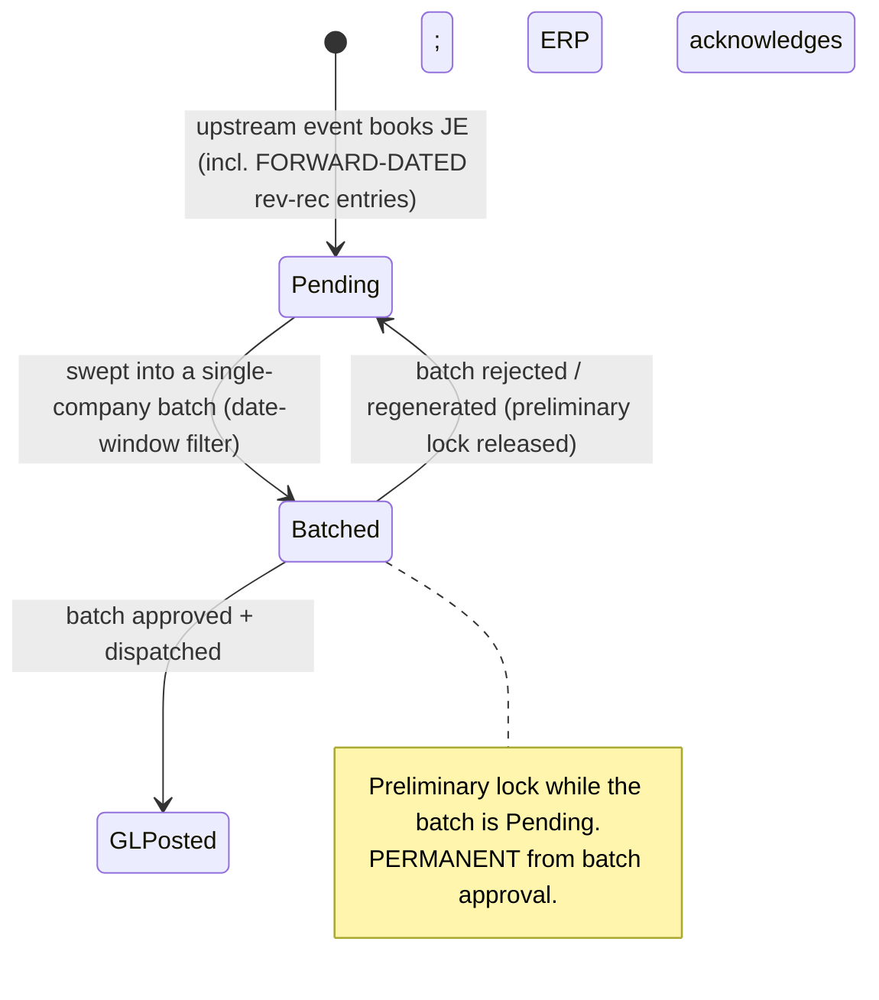

<p align="center">
  
</p>

<h1 align="center">BizApps Accounting</h1>

<p align="center">
  <strong>AR subsidiary ledger of record and journal-entry primitives for the <a href="https://github.com/MemberJunction/MJ">MemberJunction</a> platform</strong>
</p>

<p align="center">
  <a href="#what-this-is--and-is-not">What this is</a> &middot;
  <a href="#installation">Install</a> &middot;
  <a href="#entity-model">Entity Model</a> &middot;
  <a href="#using-bizapps-accounting-from-another-app">Code</a> &middot;
  <a href="plans/bizapps-accounting-master.md">Design Doc</a>
</p>

<p align="center">
  
  
  
  
  
  
</p>

---

Every back-office app eventually grows the same accounting primitives — a chart of accounts, balanced journal entries, dimension tags, batching to the ERP. BizApps Accounting ships these as a **MemberJunction Open App** so upstream apps ([BizApps Orders](https://github.com/MemberJunction/bizapps-orders), future Payroll / Expense / Fixed-Asset apps) emit journal entries into one well-tested primitive layer instead of each reinventing it.

The ERP (Business Central, QuickBooks, NetSuite, Sage) remains the **general ledger** and the system of record for periods and the full chart. BizApps Accounting stages subledger JEs and dispatches one summarized JE per approved batch, per company, to the ERP.

> **Single source of truth for design:** [`plans/bizapps-accounting-master.md`](plans/bizapps-accounting-master.md) — the consolidated plan (decisions D1–D25). This README is the tour; the plan is the law.

---

## What This Is — and Is Not

| ✅ This is | ❌ This is not |
|---|---|
| AR subsidiary ledger of record | A general ledger |
| Journal-entry primitives: balanced, single-company, immutable-once-batched, dimension-tagged | A trial-balance / P&L / balance-sheet generator |
| Role-based GL account resolution (`GLAccountRole` + polymorphic `GLAccountLink`) | A period/close engine — **there are no accounting periods here; the ERP owns periods** (D2) |
| Per-company batch → CFO approval → one summary JE dispatched to the ERP | A tax engine — calculation is **delegated** to a third-party provider; our tax tables are snapshots (D17) |
| The staging ledger for forward-dated revenue-recognition JEs written at booking (D15) | An FX calculator — realized/unrealized FX is computed **upstream**; we store original-currency detail (D16) |

---

## Installation

BizApps Accounting is a [MemberJunction Open App](https://github.com/MemberJunction/MJ/tree/main/packages/OpenApp). Install it into any MJ environment using the [MJ CLI](https://github.com/MemberJunction/MJ/tree/main/packages/MJCLI):

```bash
mj app install https://github.com/MemberJunction/bizapps-accounting
```

The CLI resolves dependencies automatically — installing this app installs [BizApps Common](https://github.com/MemberJunction/bizapps-common) first (for `Organization`, `Address`) and requires an MJ core version supporting the `__mj.Company` IsA pattern. `Currency` is owned by **this** app — BizApps Common does not ship currency entities.

### Managing an installed app

```bash
mj app info mj-bizapps-accounting     # Show details and version
mj app upgrade mj-bizapps-accounting  # Upgrade to latest release
mj app disable mj-bizapps-accounting  # Temporarily disable
mj app enable mj-bizapps-accounting   # Re-enable
mj app remove mj-bizapps-accounting   # Uninstall (--keep-data to preserve schema)
```

---

## What You Get

### Database (`__mj_BizAppsAccounting` schema)

| Area | Tables | Purpose |
|---|---|---|
| **Chart of Accounts** | `GLAccount` | Company-owned COA (hierarchy); ERP account identity lives here (`ExternalSystem` + `ExternalAccountID`) — no separate mapping table (D13) |
| **Account routing** | `GLAccountRole`, `GLAccountLink`, `GLAccountLinkDimension` | The JOB an account plays (AR, Sales, Deferred Revenue, Sales Discounts, Returns & Allowances, …) mapped polymorphically + date-effectively to Company / ProductCategory / Product (D11); company defaults are just company-level link rows (D12) |
| **Company profile** | `AccountingCompanyProfile` | IsA Disjoint child of `__mj.Company` — functional currency, fiscal year settings |
| **Currency** | `Currency`, `CurrencySpotRate` | ISO-4217 seed + spot-rate table; rate providers/auto-fetch deferred until multi-currency activates (D16) |
| **Journal Entries** | `JournalEntry`, `JournalEntryLine`, `JournalEntryLineDimension`, `JournalEntrySequence` | Balanced single-company JEs, `Pending → Batched → GLPosted`, per-company gap-free numbering (D19); polymorphic origin pair `LinkedEntityID`/`LinkedRecordID` (D25) |
| **Batching** | `JournalEntryBatch`, `JournalEntryBatchSequence` | Single-company batches with accountant-set `PostingDate` (D7/D8); the batch's summary is **one aggregated `JournalEntry`** (`EntryType='BatchSummary'`) via `SummaryJournalEntryID` (D9) |
| **Dimensions** | `Dimension`, `DimensionValue` | First-class analytical tags (Department, CostCenter, Project, …), preserved through batch summarization to the ERP |
| **Tax (snapshot)** | `TaxAuthority`, `TaxJurisdiction`, `TaxRate`, `TaxLiability`, `TaxRemittance`, `CustomerTaxProfile` | Records of what the third-party tax engine returned — never a rate authority we author or sync (D17) |

Deliberately absent — see plan §5.9: `AccountingPeriod` (ERP owns periods), `ScheduledJournalEntry` (rev-rec = real forward-dated JEs), `AccountBalance` materialization (views on demand), `ChartOfAccountsMapping`, recurring-template machinery, JE origin FK columns per upstream entity (replaced by the D25 pair).

### TypeScript Packages

| Package | NPM Name | Role |
|---|---|---|
| **Entities** | `@mj-biz-apps/accounting-entities` | Strongly-typed entity classes with Zod validation |
| **Actions** | `@mj-biz-apps/accounting-actions` | Server-side action handlers |
| **Server** | `@mj-biz-apps/accounting-server` | GraphQL resolvers and server bootstrap |
| **Angular** | `@mj-biz-apps/accounting-ng` | UI components, form overrides, custom widgets |
| **Core Entities Server** | `@mj-biz-apps/accounting-core-entities-server` | Server-only entity lifecycle hooks — JE numbering, `JournalEntryEntityServer` (extended entity with a `Lines` collection and properly scoped JE + lines transactions), GL/company alignment validation |

---

## Key Invariants (Enforced at the Database Level)

Critical integrity rules are enforced by **DB-level constraints and triggers**, immune to app-layer bypass — including direct SA access. Full reference: plan §6.

| Invariant | Mechanism |
|---|---|
| **Balanced JEs** — `SUM(Debits) = SUM(Credits)` per JE | Transaction-scope trigger at commit |
| **Single-company JEs** — every line's GLAccount belongs to the header's company | Trigger |
| **Levels of locking** — a JE in a *pending* batch is preliminarily locked (releasable by reject/regenerate); batch **approval makes the lock permanent**; after that only GL-roundtrip fields may change | Immutability trigger (UPDATE/DELETE blocked; sanctioned unlock path only) |
| **One side per line** — exactly one of Debit/Credit, positive | CHECK |
| **Origin pair coherence** — `LinkedEntityID`/`LinkedRecordID` set together or not at all (D25) | CHECK |
| **Original-currency coherence** — original amounts, currency code, and rate move together | CHECKs |

The cumulative effect: the audit trail is **correct by construction**. No code path can produce an unbalanced JE or edit locked history — corrections are new reversing JEs (`ReversesJournalEntryID`), pen not pencil.

---

## Entity Model

```
 __mj.Company ──IsA (same UUID)──► AccountingCompanyProfile
      │
      ├──► GLAccount (company-owned COA, hierarchy, ERP identity)
      │        ▲
      │        │ resolved by role, most-specific wins:
      │   GLAccountLink (polymorphic: Product → ProductCategory → Company default)
      │        │              + GLAccountRole (AR, Sales, DefRev, discounts, …)
      │
      ├──► JournalEntry (single-company; EffectiveDate; Pending|Batched|GLPosted;
      │        │          LinkedEntityID/LinkedRecordID = ONE polymorphic origin, D25)
      │        ├──► JournalEntryLine ──► JournalEntryLineDimension ──► Dimension/Value
      │        └──► ReversesJournalEntryID (reversal chain)
      │
      └──► JournalEntryBatch (single-company; accountant-set PostingDate;
               SummaryJournalEntryID → one aggregated BatchSummary JE, D9)
```

### Cross-app references

| Reference | Refers to | Lives in |
|---|---|---|
| `JournalEntryLine.CounterpartyOrganizationID` | `Organization.ID` | `bizapps-common` |
| `CustomerTaxProfile.OrganizationID` | `Organization.ID` | `bizapps-common` |
| `JournalEntry.LinkedEntityID` + `LinkedRecordID` | The JE's single causal origin record (OrderLine, Payment, TaxRemittance, …) — `LinkedEntityID` is a hard FK to `__mj.Entity`; the record ref is soft by nature (D25) | upstream apps |
| `OrderLine.JournalEntryID` (inverse direction) | This app's `JournalEntry.ID` — one JE per order line | `bizapps-orders` |

---

## JE Lifecycle & Batching


```mermaid
stateDiagram-v2
    [*] --> Pending: upstream event books JE (incl. FORWARD-DATED rev-rec entries)
    Pending --> Batched: swept into a single-company batch (date-window filter)
    Batched --> Pending: batch rejected / regenerated (preliminary lock released)
    Batched --> GLPosted: batch approved + dispatched; ERP acknowledges

    note right of Batched
      Preliminary lock while the batch is Pending.
      PERMANENT from batch approval.
    end note
```

- **No periods, no close.** JEs carry only `EffectiveDate`; the ERP settles periods. Timing discipline is the accountant's, aided by batch-window presets and the displayed swept date range (plan §4).
- **Forward-dated JEs are ordinary rows.** A 12-month subscription books 12 future-dated Dr Deferred Revenue / Cr Revenue entries at order lock (D15). Batch sweeps default to a cutoff of *today*; a future-reaching batch requires an explicit filter, and approval displays the min/max `EffectiveDate` being committed. That date-awareness is the only "scheduling" machinery in the system.
- **One summary JE per batch** posts to the GL, netted per GLAccount × dimension-combo, dated the batch's `PostingDate` (D8/D9). Dispatch targets the BC REST API directly (plan §7.5).
- **Approval is a CFO-level gate** raised through [bizapps-tasks](https://github.com/MemberJunction/bizapps-tasks) (D10); reject unlocks members back to the candidate pool.

---

## Multi-Currency

JEs post in the company's **functional** currency. Lines carry the original-currency triple (`OriginalCurrencyCode`, original amounts, `ExchangeRateUsed`) when the source transaction differed. All FX computation — realized and unrealized — happens **upstream** (Orders/Payments, D16); this app stores the detail and validates coherence. Rate providers and auto-fetch are deferred until multi-currency activates.

---

## Using BizApps Accounting from Another App

The integration contract (plan §14): upstream apps create JEs through the **`Accounting.CreateJournalEntry` / `CreateJournalEntries` remote operations** — one transactional server call per atomic unit of business work (a JE plus its lines; N per-line JEs for an order confirm), never client-side multi-save choreography.

Server-side code composing larger transactions (e.g. an order Save-override booking per-line JEs) works directly with the extended entity classes in `@mj-biz-apps/accounting-core-entities-server` — `JournalEntryEntityServer` exposes a `Lines` collection and persists the JE + lines in one properly scoped transaction, with balance and company-alignment validation before the DB triggers ever see it.

GL account selection uses **role-based resolution** (`AccountingEngineBase.ResolveLinkedAccount`): walk the target's `GLAccountLink` rows — product → product-category tree → company default — for the requested role (AR, Sales, Deferred Revenue, …), date-effective, failing loudly if no link resolves. No GL account columns on catalog entities, ever.

Declare the dependency in your `mj-app.json`:

```json
{
  "dependencies": {
    "mj-bizapps-accounting": {
      "version": ">=0.1.0",
      "repository": "https://github.com/MemberJunction/bizapps-accounting"
    }
  }
}
```

Set your JE's origin so drill-through works: `LinkedEntityID` = your entity's MJ Entity ID, `LinkedRecordID` = the source record's PK (D25).

---

## Seeded Defaults

Seed data (GL account roles, default per-company COA scaffolding) ships via **metadata sync** (`metadata/`), never SQL INSERTs — customizable per deployment. There are no system-level default accounts: **GL account defaults start at the company level** as company-scoped `GLAccountLink` rows (D12).

---

## Database Support

SQL Server is the **source of truth** for migrations. PostgreSQL is supported via automatic conversion using [`@memberjunction/sql-converter`](https://github.com/MemberJunction/MJ/tree/main/packages/SQLConverter).

**Standing practice (pre-production):** schema changes **edit the baseline migration in place** — clean-DB rebuild + CodeGen, no incremental fix-up migrations. The baseline file ends at the `CODEGEN OUTPUT` banner; everything below it is regenerated, never hand-edited.

```
migrations/                       ←  T-SQL, hand-written baseline (+ regenerated CodeGen output)
migrations-pg/                    ←  PG, produced by `pnpm exec mj sql-convert`
```

At runtime, `mj migrate` reads `DB_PLATFORM` and picks the right directory. CI applies the PG set to a fresh `postgres:17` container on every migration-touching PR — a T-SQL migration cannot land without a working PG counterpart.

---

## Contributing (Developer Setup)

```bash
git clone https://github.com/MemberJunction/bizapps-accounting.git
cd bizapps-accounting
pnpm install
```

### Configure Environment

Create a `.env` file at the repo root:

```env
DB_PLATFORM=sqlserver         # or postgresql
DB_HOST=localhost
DB_PORT=1433
DB_DATABASE=YourDatabase
DB_USERNAME=sa
DB_PASSWORD=yourpassword
GRAPHQL_PORT=4102
MJ_CORE_SCHEMA=__mj
```

### Deploy and Build

```bash
pnpm run mj:migrate                   # Apply migrations (creates __mj_BizAppsAccounting schema)
pnpm run mj sync push --dir metadata  # Load seed metadata
pnpm run mj:codegen                   # Generate TypeScript / GraphQL / Angular code
pnpm run build                        # Build all packages (Turborepo)
```

### Run Development Servers

This repo no longer bundles host apps — there is no `apps/MJAPI` or `apps/MJExplorer` to start
here. The packages run inside a MemberJunction host (declared via `mj-app.json`): dev-link or
install the app into an MJ instance and run that host's MJAPI/Explorer.

Ports are chosen to avoid colliding with concurrent MJ dev environments:

| Project | API | Explorer |
|---|---|---|
| MJ core | 4001 | 4201 |
| bizapps-common | 4101 | 4301 |
| **bizapps-accounting** | **4102** | **4302** |
| bizapps-orders | 4103 | 4303 |

---

## Repository Structure

```
bizapps-accounting/
├── mj-app.json                    # MJ Open App manifest (schema __mj_BizAppsAccounting)
├── mj.config.cjs                  # CodeGen config + SQL → PG placeholder rules
├── packages/
│   ├── Entities/                  # @mj-biz-apps/accounting-entities
│   ├── Actions/                   # @mj-biz-apps/accounting-actions
│   ├── Server/                    # @mj-biz-apps/accounting-server
│   ├── CoreEntitiesServer/        # @mj-biz-apps/accounting-core-entities-server
│   ├── EngineBase/                # @mj-biz-apps/accounting-engine-base
│   └── Angular/                   # @mj-biz-apps/accounting-ng
├── migrations/                    # T-SQL baseline (source of truth)
├── migrations-pg/                 # PG migrations (converter output)
├── metadata/                      # Seed data + entity metadata (synced via mj-sync)
├── plans/
│   └── bizapps-accounting-master.md  # THE design doc & decision log (D1..D25)
└── ci/                            # Release scripts
```

---

## Build Sequencing (per master plan §16)

Ruling of record: **build first, iterate in the system** — plans stay thin; nothing is "done" until tests are green and a demo artifact exists.

1. **NOW — Orders per-line booking**: per-line JE factory + `OrderLine.JournalEntryID`, contra-role + company-default `GLAccountLink` seeds.
2. **Schema cleanup wave** (deliberate, later): ACP default-account column drops, `ChartOfAccountsMapping` removal, **D25 provenance rework** (origin pair replaces origin columns + `JournalEntryLink`).
3. **Batch rework**: single-company header, `PostingDate`, approver enforcement.
4. **Rev-rec rework**: forward-dated JEs replace the retired ScheduledJournalEntry machinery; date-window batch filters + approval range display.
5. **Cross-app FK hardening** once MJ CodeGen include-mode lands.
6. Later: FX/multi-currency activation, tax engine selection, roles/approvals screens, report pages.

---

## Documentation

| Document | Description |
|---|---|
| [Master Plan](plans/bizapps-accounting-master.md) | The consolidated design doc & decision log (D1..D25) — single source of truth |
| [PG Conversion Workflow](migrations-pg/README.md) | T-SQL ↔ PostgreSQL conversion pipeline |
| [CLAUDE.md](CLAUDE.md) | Development conventions, schema invariants, build commands |

---

## Tech Stack

| Layer | Technology | Version |
|---|---|---|
| **Platform** | [MemberJunction](https://github.com/MemberJunction/MJ) | 5.33+ |
| **Runtime** | Node.js | 18+ |
| **Language** | TypeScript | 5.9 (strict) |
| **Database (primary)** | SQL Server / Azure SQL | 2019+ |
| **Database (secondary)** | PostgreSQL | 17 |
| **API** | GraphQL (Apollo Server) | -- |
| **UI Framework** | Angular | 21 |
| **Build** | Turborepo | 2.7 |
| **Validation** | Zod | 3.24 |
| **SQL Conversion** | [`@memberjunction/sql-converter`](https://github.com/MemberJunction/MJ/tree/main/packages/SQLConverter) | 5.33+ |

---

## License

Business Source License 1.1 — see [LICENSE](./LICENSE) for details.

---

<p align="center">
  Built on <a href="https://github.com/MemberJunction/MJ">MemberJunction</a> — the metadata-driven application platform.
</p>
