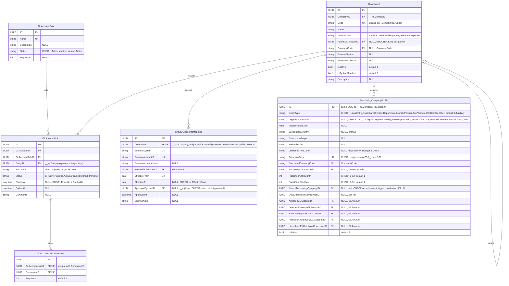
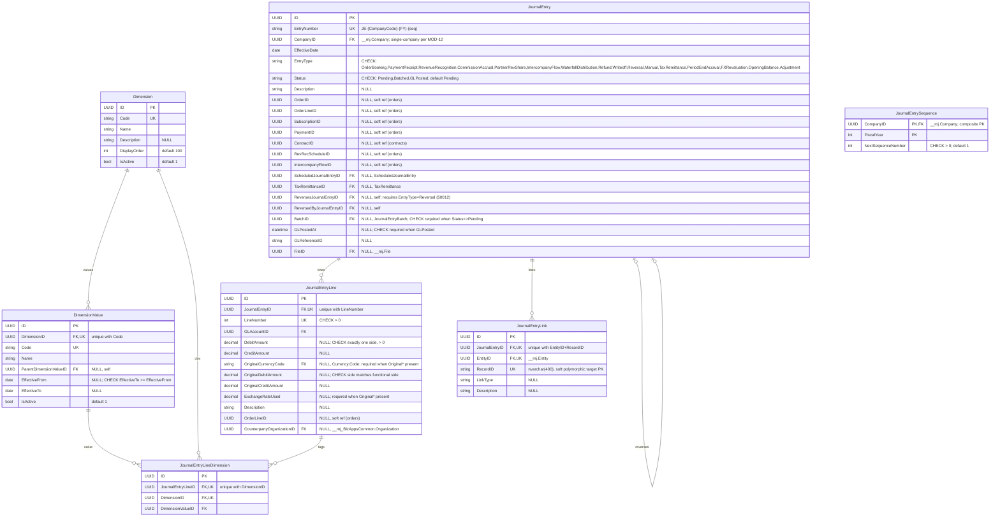
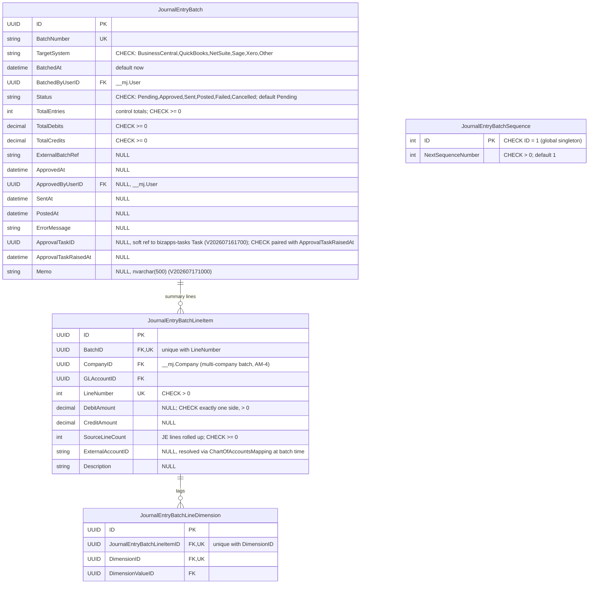
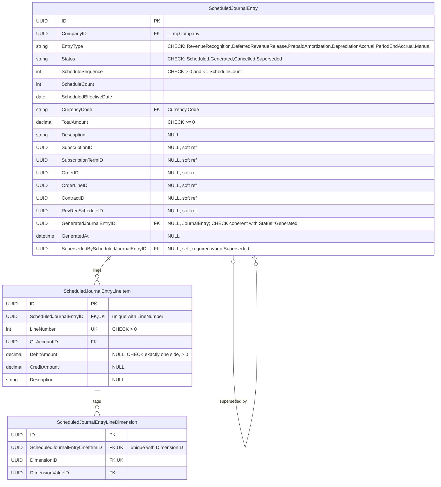
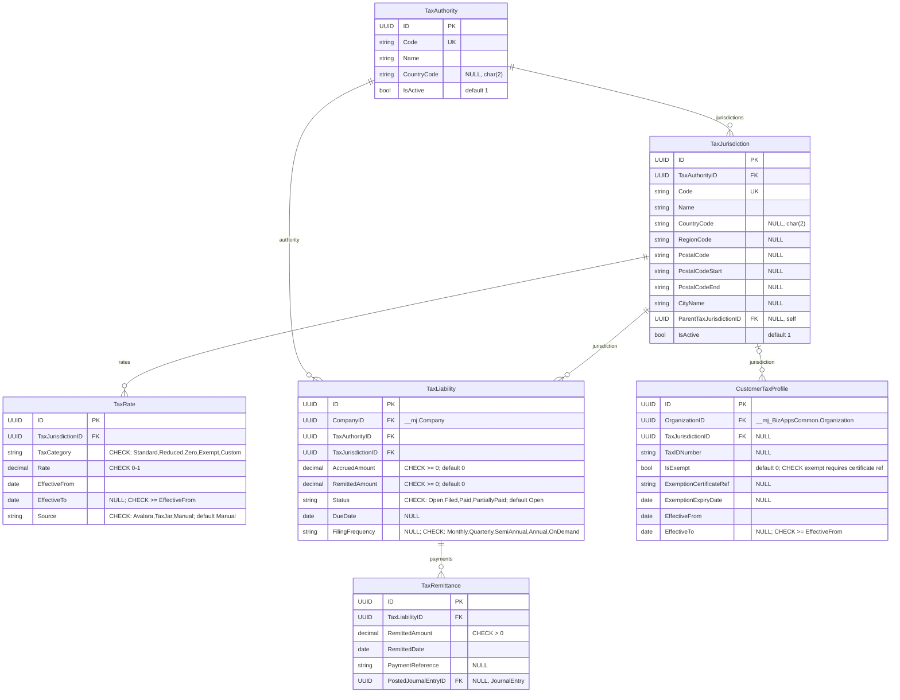
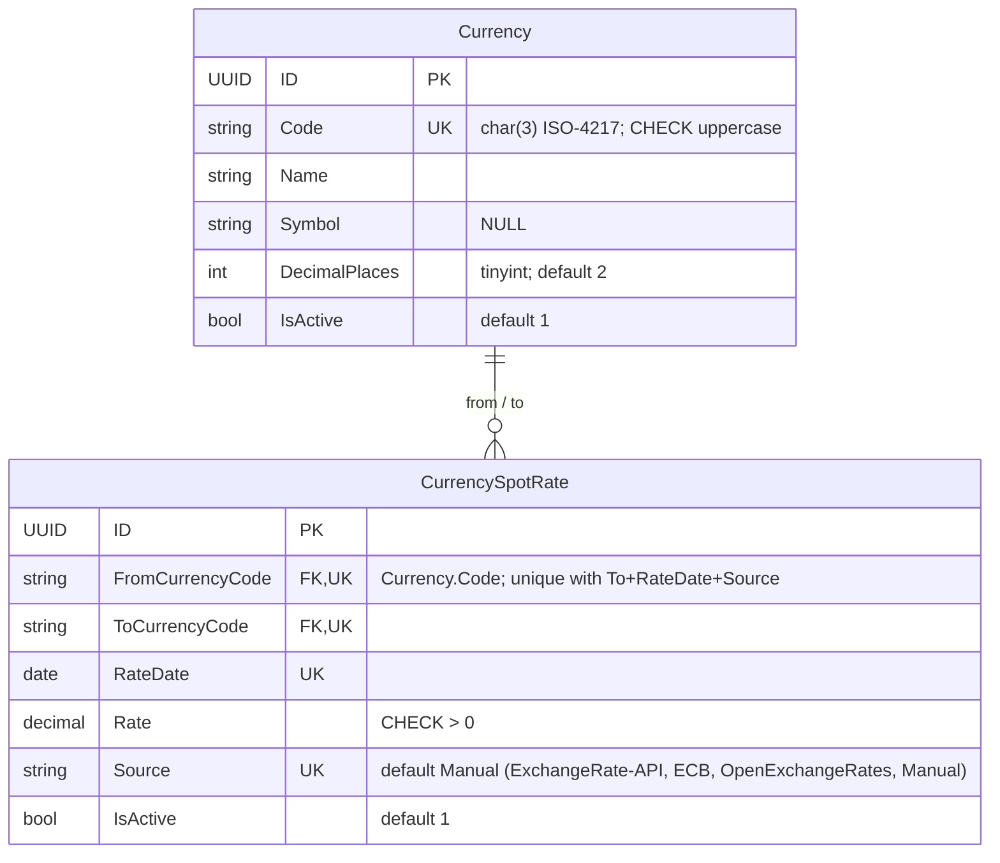

# BizApps Accounting — ERD (CURRENT, as-built)

**Date:** 2026-07-20
**Basis:** AS-BUILT from migrations @ `V202607171000__v1.0.x__Batch_Memo.sql` (baseline `B202605281200__v1.0.x__Schema_and_Tables.sql` + `V202607161700__v1.0.x__Batch_ApprovalTask_Pointer.sql` + `V202607171000__v1.0.x__Batch_Memo.sql`; `V202607060828` is metadata-only). The plan-chain view is **ERD-planned.md**.

**Conventions:**
- All app tables live in schema **`__mj_BizAppsAccounting`**; names below omit the prefix. Cross-schema pseudo-entities are labeled (`__mj.Company`, `__mj.User`, `__mj.File`, `__mj.Entity`, `__mj_BizAppsCommon.Organization`).
- Every table also carries CodeGen-owned **`__mj_CreatedAt` / `__mj_UpdatedAt`** columns — omitted from every diagram.
- Types simplified: `uniqueidentifier`→UUID, `nvarchar`/`char`→string, `decimal`→decimal, `datetimeoffset`→datetime, `bit`→bool, `date`→date, `int`/`tinyint`→int.
- Dotted relationship lines (`..`) = **soft references (no FK constraint)** — polymorphic or cross-app keys.

**Table count: 28.**

---

## §1 Overview — all entities and relationships

```mermaid
erDiagram
    %% ===== IsA + chart of accounts =====
    Company ||--|| AccountingCompanyProfile : "IsA disjoint child (same UUID)"
    AccountingCompanyProfile |o--o{ AccountingCompanyProfile : "parent (no chains)"
    Currency ||--o{ AccountingCompanyProfile : "functional and reporting"
    GLAccount |o--o{ AccountingCompanyProfile : "5 default-account FKs"
    Company ||--o{ GLAccount : "owns CoA"
    GLAccount |o--o{ GLAccount : parent
    Currency |o--o{ GLAccount : denominates
    GLAccountRole ||--o{ GLAccountLink : role
    GLAccount ||--o{ GLAccountLink : "maps to"
    Entity ||--o{ GLAccountLink : "EntityID (polymorphic)"
    GLAccountLink ||--o{ GLAccountLinkDimension : "dimensions to apply"
    Dimension ||--o{ GLAccountLinkDimension : dimension
    %% GLAccountLink target = EntityID + RecordID; soft polymorphic targets:
    Product ||..o{ GLAccountLink : "soft RecordID target"
    ProductCategory ||..o{ GLAccountLink : "soft RecordID target"
    Company ||..o{ GLAccountLink : "soft RecordID target"
    Company ||--o{ ChartOfAccountsMapping : company
    GLAccount ||--o{ ChartOfAccountsMapping : internal
    User |o--o{ ChartOfAccountsMapping : "approved by"

    %% ===== Journal entries =====
    Company ||--o{ JournalEntry : "single-company (MOD-12)"
    JournalEntryBatch |o--o{ JournalEntry : "BatchID when batched"
    JournalEntry |o--o| JournalEntry : "reverses / reversed-by"
    ScheduledJournalEntry |o--o{ JournalEntry : "materialized from"
    TaxRemittance |o--o{ JournalEntry : "remittance origin"
    File |o--o{ JournalEntry : "attached source doc"
    JournalEntry ||--o{ JournalEntryLine : lines
    GLAccount ||--o{ JournalEntryLine : account
    Currency |o--o{ JournalEntryLine : "original currency"
    Organization |o--o{ JournalEntryLine : counterparty
    JournalEntryLine ||--o{ JournalEntryLineDimension : tags
    Dimension ||--o{ JournalEntryLineDimension : dimension
    DimensionValue ||--o{ JournalEntryLineDimension : value
    Dimension ||--o{ DimensionValue : values
    DimensionValue |o--o{ DimensionValue : parent
    JournalEntry ||--o{ JournalEntryLink : "lineage links"
    Entity ||--o{ JournalEntryLink : "EntityID (polymorphic)"
    AnyEntityRecord ||..o{ JournalEntryLink : "soft RecordID target"
    Company ||--o{ JournalEntrySequence : "per-company per-FY"
    %% Orders-side soft origin keys on JournalEntry (no FK, by design):
    Order ||..o{ JournalEntry : "soft OrderID"
    OrderLine ||..o{ JournalEntry : "soft OrderLineID"
    OrderLine ||..o{ JournalEntryLine : "soft OrderLineID"
    Subscription ||..o{ JournalEntry : "soft SubscriptionID"
    Payment ||..o{ JournalEntry : "soft PaymentID"
    Contract ||..o{ JournalEntry : "soft ContractID"
    RevRecSchedule ||..o{ JournalEntry : "soft RevRecScheduleID"
    IntercompanyFlow ||..o{ JournalEntry : "soft IntercompanyFlowID"

    %% ===== Batching =====
    User ||--o{ JournalEntryBatch : "batched by"
    User |o--o{ JournalEntryBatch : "approved by"
    Task ||..o{ JournalEntryBatch : "soft ApprovalTaskID (bizapps-tasks)"
    JournalEntryBatch ||--o{ JournalEntryBatchLineItem : "summary lines"
    Company ||--o{ JournalEntryBatchLineItem : "per-line company (AM-4)"
    GLAccount ||--o{ JournalEntryBatchLineItem : account
    JournalEntryBatchLineItem ||--o{ JournalEntryBatchLineDimension : tags
    Dimension ||--o{ JournalEntryBatchLineDimension : dimension
    DimensionValue ||--o{ JournalEntryBatchLineDimension : value
    JournalEntryBatchSequence {
    }

    %% ===== Scheduled JEs =====
    Company ||--o{ ScheduledJournalEntry : company
    Currency ||--o{ ScheduledJournalEntry : currency
    ScheduledJournalEntry |o--o{ ScheduledJournalEntry : "superseded by"
    ScheduledJournalEntry ||--o{ ScheduledJournalEntryLineItem : lines
    GLAccount ||--o{ ScheduledJournalEntryLineItem : account
    ScheduledJournalEntryLineItem ||--o{ ScheduledJournalEntryLineDimension : tags
    Dimension ||--o{ ScheduledJournalEntryLineDimension : dimension
    DimensionValue ||--o{ ScheduledJournalEntryLineDimension : value
    Subscription ||..o{ ScheduledJournalEntry : "soft origin"
    Order ||..o{ ScheduledJournalEntry : "soft origin"
    Contract ||..o{ ScheduledJournalEntry : "soft origin"

    %% ===== Tax =====
    TaxAuthority ||--o{ TaxJurisdiction : jurisdictions
    TaxJurisdiction |o--o{ TaxJurisdiction : parent
    TaxJurisdiction ||--o{ TaxRate : rates
    Company ||--o{ TaxLiability : company
    TaxAuthority ||--o{ TaxLiability : authority
    TaxJurisdiction ||--o{ TaxLiability : jurisdiction
    TaxLiability ||--o{ TaxRemittance : payments
    Organization ||--o{ CustomerTaxProfile : customer
    TaxJurisdiction |o--o{ CustomerTaxProfile : jurisdiction

    %% ===== Currency =====
    Currency ||--o{ CurrencySpotRate : "from / to"
```

Pseudo-entities (not in this schema): `Company`/`User`/`File`/`Entity` = `__mj` core; `Organization` = `__mj_BizAppsCommon`; `Order`/`OrderLine`/`Subscription`/`Payment`/`Contract`/`RevRecSchedule`/`IntercompanyFlow` = downstream apps (soft UUIDs, no FKs); `Task` = bizapps-tasks; `Product`/`ProductCategory`/`AnyEntityRecord` = polymorphic `EntityID + RecordID` targets.

---

## §2 Chart of accounts & mapping

`AccountingCompanyProfile` is an IsA Disjoint child of `__mj.Company` (same UUID; `FK_ACP_Company` on ID) — never insert a profile without its Company row. `GLAccountLink` (AM-5) is the polymorphic role-based account resolver replacing the per-target GL-account trio; resolution filters `Status='Active'` + date window. `trg_ACP_NoChains` (50010) forbids parent chains.

---

## §3 Journal entries

Invariants (DB triggers): **balanced-JE on lock** — Sum(Dr)=Sum(Cr) required to enter Batched/GLPosted (50001), per-company balance (50019), and **single-company 50025** (every line's `GLAccount.CompanyID` must equal the entry's `CompanyID`, MOD-12). **Immutability**: locked JEs (Batched/GLPosted) allow only `GLPostedAt`/`GLReferenceID`/`ReversedByJournalEntryID`/`Status` forward-moves + the reversible Batched→Pending unlock of an unapproved batch (50003-50006); no status regression (50005). No period machinery — JEs carry dates only (MOD-1).

---

## §4 Batching

Batches are **multi-company** as built (no header CompanyID; per-company grouping on line items, AM-4/CH-4 — superseded in the plan chain, see ERD-planned). Control totals are header columns, not a table; `trg_JEBatch_SummaryReconciles` requires summary lines to foot to totals and balance overall (50014) and per company (50023) before Sent. Batch + line items + line dimensions are immutable once Approved/Sent/Posted (50008/50009/50013/50015); summary lines net JE detail by (GLAccount × dimension combo × side) per BA-D16/BA-D26.

---

## §5 Scheduled journal entries (as built)

Pre-computed future JEs for rev-rec/amortization waterfalls (BA-D25); schedule computed upstream (orders), stored here; locked once Generated (50016/50017). **The plan chain retires this trio (MOD-17)** — see ERD-planned.md.

---

## §6 Tax

No period FK anywhere (`AccountingPeriodID` was removed 2026-07-06 — the ERP owns periods). A `TaxRemittance` can produce a JE (`PostedJournalEntryID`, and `JournalEntry.TaxRemittanceID` points back).

---

## §7 Currency

Currency is owned by this schema (referenced by code, not ID); seed rows come from metadata sync, not the migration. Spot-only by design — forward/average rates are out of scope. (Note: the table is `CurrencySpotRate`; there is no `CurrencyExchangeRate` table.)

---

## §8 Interfaces with other apps (soft keys & cross-schema touchpoints)

- **`__mj.Company`** — hard FKs from AccountingCompanyProfile (IsA, same UUID), GLAccount, JournalEntry, JournalEntryBatchLineItem, ChartOfAccountsMapping, TaxLiability, JournalEntrySequence, ScheduledJournalEntry.
- **`__mj.User`** — hard FKs for actor stamps: JournalEntryBatch.BatchedBy/ApprovedBy, ChartOfAccountsMapping.ApprovedBy.
- **`__mj.File`** — JournalEntry.FileID (attached source document).
- **`__mj.Entity`** — hard FK on the polymorphic pattern's EntityID (JournalEntryLink, GLAccountLink); the paired `RecordID` (nvarchar 400) is soft.
- **`__mj_BizAppsCommon.Organization`** — hard FKs: JournalEntryLine.CounterpartyOrganizationID, CustomerTaxProfile.OrganizationID.
- **Orders/contracts soft origin keys (no FK by design)** — JournalEntry.{OrderID, OrderLineID, SubscriptionID, PaymentID, ContractID, RevRecScheduleID, IntercompanyFlowID}, JournalEntryLine.OrderLineID, ScheduledJournalEntry.{SubscriptionID, SubscriptionTermID, OrderID, OrderLineID, ContractID, RevRecScheduleID}: downstream apps populate the UUIDs; accounting stores them for drill-through only.
- **bizapps-tasks** — JournalEntryBatch.ApprovalTaskID is a deliberate soft pointer (cross-OpenApp FK would couple DDL).
- **AccountingCompanyProfile.DefaultPaymentTermsTypeID** — soft ref (no FK in the baseline DDL).
