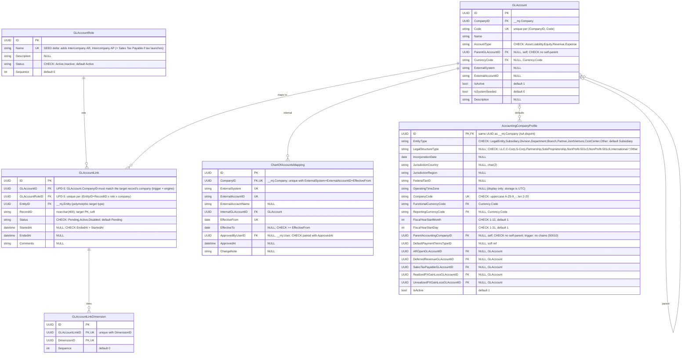
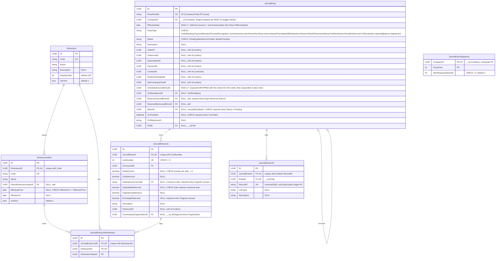
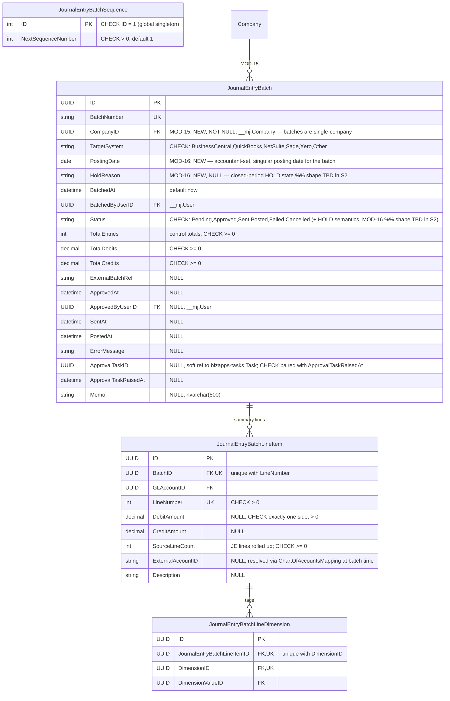
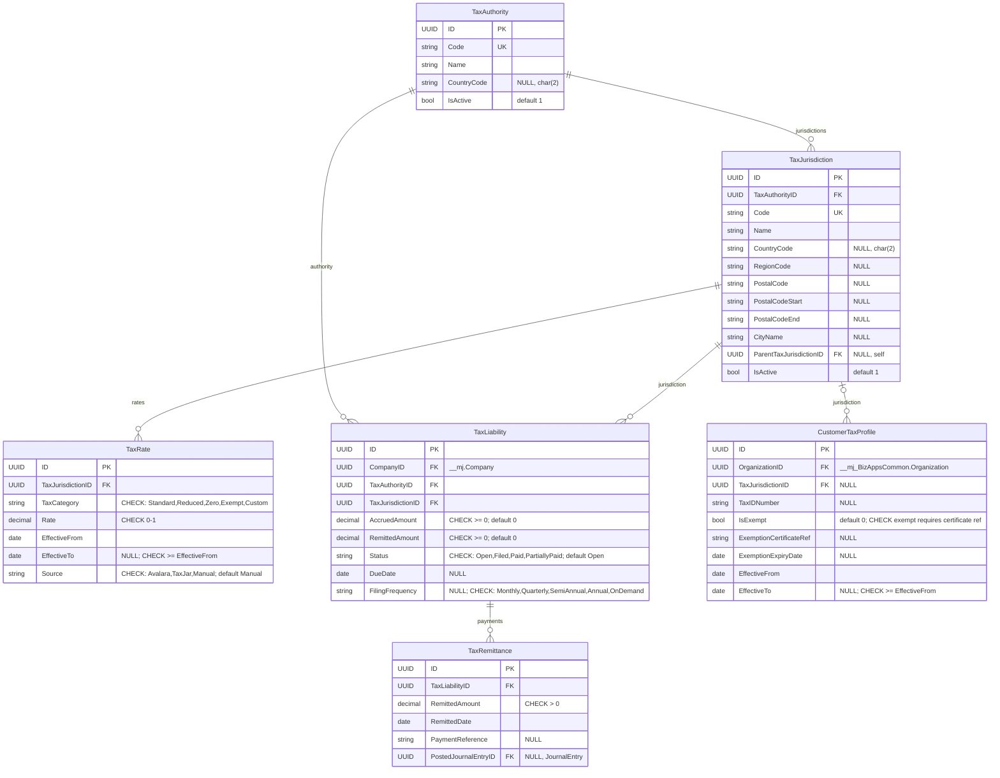
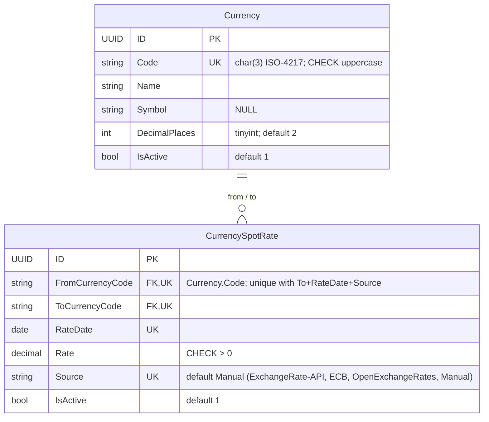
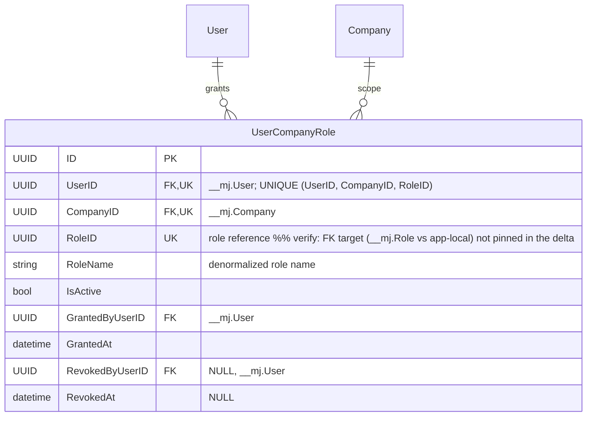

# BizApps Accounting — ERD (PLANNED)

**Date:** 2026-07-20
**Basis:** PLANNED = plan chain through MOD-18/UPD-6 as of 2026-07-20; pending items marked; the ⏸ category-company contradiction is orders-side.
Baseline = the AS-BUILT schema (migrations @ `V202607171000__v1.0.x__Batch_Memo.sql`; see **ERD-current.md**) with these deltas applied. This document is **fully self-contained**: every planned table appears below with its complete column list.

| Delta | Change |
|---|---|
| MOD-15 | `JournalEntryBatch.CompanyID` (FK `__mj.Company`, NOT NULL) added; `JournalEntryBatchLineItem.CompanyID` dropped — batches become single-company |
| MOD-16 | `JournalEntryBatch.PostingDate` (accountant-set, singular) added; closed-period HOLD state (`HoldReason`, shape TBD in S2) |
| MOD-17 | ScheduledJournalEntry trio RETIRED — deferred revenue = real forward-dated `JournalEntry` rows |
| V1.6/S2 | NEW `UserCompanyRole` (per-company role grants) |
| Seeds | New `GLAccountRole` seed rows: Intercompany AR, Intercompany AP (+ Sales Tax Payable if tax launches) |
| UPD-5 | `GLAccountLink` same-company enforcement (trigger + engine) + uniqueness on (target × role × company) |
| MOD-18 | Tax tables unchanged in shape; re-postured as engine-result snapshots |

**Conventions:**
- All app tables live in schema **`__mj_BizAppsAccounting`**; names below omit the prefix. Cross-schema pseudo-entities are labeled (`__mj.Company`, `__mj.User`, `__mj.File`, `__mj.Entity`, `__mj_BizAppsCommon.Organization`).
- Every table also carries CodeGen-owned **`__mj_CreatedAt` / `__mj_UpdatedAt`** columns — omitted from every diagram.
- Types simplified: `uniqueidentifier`→UUID, `nvarchar`/`char`→string, `decimal`→decimal, `datetimeoffset`→datetime, `bit`→bool, `date`→date, `int`/`tinyint`→int.
- Dotted relationship lines (`..`) = **soft references (no FK constraint)** — polymorphic or cross-app keys.
- Changed / new / removed elements carry inline `%% MOD-x` / `UPD-x` citations in attribute comments.

**Table count: 26** (28 current − 3 ScheduledJournalEntry trio + 1 UserCompanyRole).

---

> ✅ 2026-07-21: the `JournalEntry.ScheduledJournalEntryID` verify flag is RESOLVED — the column DROPS with the SJE trio (S3 retirement migration; Marcelo).

## §1 Overview — all entities and relationships (planned)

```mermaid
erDiagram
    %% ===== IsA + chart of accounts =====
    Company ||--|| AccountingCompanyProfile : "IsA disjoint child (same UUID)"
    AccountingCompanyProfile |o--o{ AccountingCompanyProfile : "parent (no chains)"
    Currency ||--o{ AccountingCompanyProfile : "functional and reporting"
    GLAccount |o--o{ AccountingCompanyProfile : "5 default-account FKs"
    Company ||--o{ GLAccount : "owns CoA"
    GLAccount |o--o{ GLAccount : parent
    Currency |o--o{ GLAccount : denominates
    GLAccountRole ||--o{ GLAccountLink : role
    GLAccount ||--o{ GLAccountLink : "maps to (same-company enforced, UPD-5)"
    Entity ||--o{ GLAccountLink : "EntityID (polymorphic)"
    GLAccountLink ||--o{ GLAccountLinkDimension : "dimensions to apply"
    Dimension ||--o{ GLAccountLinkDimension : dimension
    Product ||..o{ GLAccountLink : "soft RecordID target"
    ProductCategory ||..o{ GLAccountLink : "soft RecordID target"
    Company ||..o{ GLAccountLink : "soft RecordID target"
    Company ||--o{ ChartOfAccountsMapping : company
    GLAccount ||--o{ ChartOfAccountsMapping : internal
    User |o--o{ ChartOfAccountsMapping : "approved by"

    %% ===== Per-company access (NEW, V1.6/S2) =====
    User ||--o{ UserCompanyRole : grants
    Company ||--o{ UserCompanyRole : scope

    %% ===== Journal entries =====
    Company ||--o{ JournalEntry : "single-company (MOD-12)"
    JournalEntryBatch |o--o{ JournalEntry : "BatchID when batched"
    JournalEntry |o--o| JournalEntry : "reverses / reversed-by"
    TaxRemittance |o--o{ JournalEntry : "remittance origin"
    File |o--o{ JournalEntry : "attached source doc"
    JournalEntry ||--o{ JournalEntryLine : lines
    GLAccount ||--o{ JournalEntryLine : account
    Currency |o--o{ JournalEntryLine : "original currency"
    Organization |o--o{ JournalEntryLine : counterparty
    JournalEntryLine ||--o{ JournalEntryLineDimension : tags
    Dimension ||--o{ JournalEntryLineDimension : dimension
    DimensionValue ||--o{ JournalEntryLineDimension : value
    Dimension ||--o{ DimensionValue : values
    DimensionValue |o--o{ DimensionValue : parent
    JournalEntry ||--o{ JournalEntryLink : "lineage links"
    Entity ||--o{ JournalEntryLink : "EntityID (polymorphic)"
    AnyEntityRecord ||..o{ JournalEntryLink : "soft RecordID target"
    Company ||--o{ JournalEntrySequence : "per-company per-FY"
    Order ||..o{ JournalEntry : "soft OrderID"
    OrderLine ||..o{ JournalEntry : "soft OrderLineID"
    OrderLine ||..o{ JournalEntryLine : "soft OrderLineID"
    Subscription ||..o{ JournalEntry : "soft SubscriptionID"
    Payment ||..o{ JournalEntry : "soft PaymentID"
    Contract ||..o{ JournalEntry : "soft ContractID"
    RevRecSchedule ||..o{ JournalEntry : "soft RevRecScheduleID"
    IntercompanyFlow ||..o{ JournalEntry : "soft IntercompanyFlowID"

    %% ===== Batching (single-company per MOD-15) =====
    Company ||--o{ JournalEntryBatch : "MOD-15: header CompanyID"
    User ||--o{ JournalEntryBatch : "batched by"
    User |o--o{ JournalEntryBatch : "approved by"
    Task ||..o{ JournalEntryBatch : "soft ApprovalTaskID (bizapps-tasks)"
    JournalEntryBatch ||--o{ JournalEntryBatchLineItem : "summary lines"
    GLAccount ||--o{ JournalEntryBatchLineItem : account
    JournalEntryBatchLineItem ||--o{ JournalEntryBatchLineDimension : tags
    Dimension ||--o{ JournalEntryBatchLineDimension : dimension
    DimensionValue ||--o{ JournalEntryBatchLineDimension : value
    JournalEntryBatchSequence {
    }

    %% ===== Scheduled JEs: RETIRED (MOD-17) — tables not drawn =====

    %% ===== Tax (MOD-18: engine-result snapshots; shapes unchanged) =====
    TaxAuthority ||--o{ TaxJurisdiction : jurisdictions
    TaxJurisdiction |o--o{ TaxJurisdiction : parent
    TaxJurisdiction ||--o{ TaxRate : rates
    Company ||--o{ TaxLiability : company
    TaxAuthority ||--o{ TaxLiability : authority
    TaxJurisdiction ||--o{ TaxLiability : jurisdiction
    TaxLiability ||--o{ TaxRemittance : payments
    Organization ||--o{ CustomerTaxProfile : customer
    TaxJurisdiction |o--o{ CustomerTaxProfile : jurisdiction

    %% ===== Currency =====
    Currency ||--o{ CurrencySpotRate : "from / to"
```

Pseudo-entities (not in this schema): `Company`/`User`/`File`/`Entity` = `__mj` core; `Organization` = `__mj_BizAppsCommon`; `Order`/`OrderLine`/`Subscription`/`Payment`/`Contract`/`RevRecSchedule`/`IntercompanyFlow` = downstream apps (soft UUIDs, no FKs); `Task` = bizapps-tasks; `Product`/`ProductCategory`/`AnyEntityRecord` = polymorphic `EntityID + RecordID` targets. `ScheduledJournalEntry`/`ScheduledJournalEntryLineItem`/`ScheduledJournalEntryLineDimension` no longer exist in this view (MOD-17).

---

## §2 Chart of accounts & mapping

`AccountingCompanyProfile` is an IsA Disjoint child of `__mj.Company` (same UUID; never insert a profile without its Company row) — unchanged. `trg_ACP_NoChains` (50010) forbids parent chains. **UPD-5:** `GLAccountLink` gains same-company enforcement (a link's GLAccount must belong to the same company as the linked record — trigger + engine check) and uniqueness on (target record × role × company); both are constraints/triggers, not new columns. A denormalized `GLAccountLink.CompanyID` is an **undecided deep-dive candidate** — shown as a comment, not a column. **Seed delta (data, not schema):** new `GLAccountRole` rows *Intercompany AR* and *Intercompany AP* (+ *Sales Tax Payable* if tax launches) to route intercompany due-to/due-from JE lines; the per-affiliate (entity × counterparty) routing shape is **pending** (MOD-14 in orders) — roles may later resolve per counterparty.

---

## §3 Journal entries

Invariants persist unchanged from as-built: **balanced-JE on lock** — Sum(Dr)=Sum(Cr) required to enter Batched/GLPosted (50001), per-company balance (50019), and **single-company 50025** (every line's `GLAccount.CompanyID` must equal the entry's `CompanyID`, MOD-12). **Immutability:** locked JEs (Batched/GLPosted) allow only `GLPostedAt`/`GLReferenceID`/`ReversedByJournalEntryID`/`Status` forward-moves + the reversible Batched→Pending unlock of an unapproved batch (50003-50006); no status regression (50005). **MOD-17 knock-on:** forward-dated JEs (ordinary Pending JEs with future `EffectiveDate`) replace the scheduled trio; `ScheduledJournalEntryID` is expected dropped — `%% verify` above.

---

## §4 Batching (MOD-15 + MOD-16)

**MOD-15** makes the batch single-company: `CompanyID` moves up to the header (NOT NULL FK) and is dropped from line items — the AM-4 per-company footing trigger (50023) collapses into the whole-batch footing check (50014). **MOD-16** adds an accountant-set singular `PostingDate` and a closed-period **HOLD** state (represented as `HoldReason NVARCHAR NULL` + a Status note; exact shape — extra status value vs. flag — is `%% shape TBD in S2`). Control totals remain header columns (not a table); batch + line items + line dimensions stay immutable once Approved/Sent/Posted (50008/50009/50013/50015); summary lines still net JE detail by (GLAccount × dimension combo × side) per BA-D16/BA-D26.

---

## §5 Scheduled journal entries — RETIRED (MOD-17)

**MOD-17:** the `ScheduledJournalEntry` / `ScheduledJournalEntryLineItem` / `ScheduledJournalEntryLineDimension` trio is **removed**. Deferred revenue / amortization waterfalls are represented as **real forward-dated `JournalEntry` rows** (ordinary Pending JEs with future `EffectiveDate`), so they live under the exact same balance/immutability invariants as every other JE. No tables drawn in this document.
`%% verify:` the plan chain does not spell out the fate of `JournalEntry.ScheduledJournalEntryID` — expect it dropped with the trio (see §3).

---

## §6 Tax (MOD-18 — posture change only; shapes unchanged)

**MOD-18 (prose only, no schema delta):** these tables are re-postured as **engine-result SNAPSHOTS** — the tax engine computes liability/rate outcomes and persists its results here for audit and remittance tracking; the tables are no longer treated as the live calculation source. No period FK anywhere (the ERP owns periods). A `TaxRemittance` can produce a JE (`PostedJournalEntryID`, with `JournalEntry.TaxRemittanceID` pointing back). A *Sales Tax Payable* `GLAccountRole` seed accompanies this if tax launches (§2).

---

## §7 Currency

Unchanged from as-built. Currency is owned by this schema (referenced by code, not ID); seed rows come from metadata sync. Spot-only by design — no `CurrencyExchangeRate` table exists or is planned.

---

## §8 Per-company access — NEW `UserCompanyRole` (V1.6/S2)

New in V1.6/S2: per-company role grants (which users may act — approve, batch, post — for which company), with grant/revoke audit stamps and `UNIQUE (UserID, CompanyID, RoleID)`.

---

## §9 Interfaces with other apps (soft keys & cross-schema touchpoints)

- **`__mj.Company`** — hard FKs from AccountingCompanyProfile (IsA, same UUID), GLAccount, JournalEntry, **JournalEntryBatch (MOD-15)**, ChartOfAccountsMapping, TaxLiability, JournalEntrySequence, **UserCompanyRole (V1.6/S2)**.
- **`__mj.User`** — hard FKs for actor stamps: JournalEntryBatch.BatchedBy/ApprovedBy, ChartOfAccountsMapping.ApprovedBy, **UserCompanyRole.UserID/GrantedBy/RevokedBy (V1.6/S2)**.
- **`__mj.File`** — JournalEntry.FileID (attached source document).
- **`__mj.Entity`** — hard FK on the polymorphic pattern's EntityID (JournalEntryLink, GLAccountLink); the paired `RecordID` (nvarchar 400) is soft.
- **`__mj_BizAppsCommon.Organization`** — hard FKs: JournalEntryLine.CounterpartyOrganizationID, CustomerTaxProfile.OrganizationID.
- **Orders/contracts soft origin keys (no FK by design)** — JournalEntry.{OrderID, OrderLineID, SubscriptionID, PaymentID, ContractID, RevRecScheduleID, IntercompanyFlowID}, JournalEntryLine.OrderLineID: downstream apps populate the UUIDs; accounting stores them for drill-through only. (The ScheduledJournalEntry soft-origin keys are gone with the trio, MOD-17.)
- **bizapps-tasks** — JournalEntryBatch.ApprovalTaskID is a deliberate soft pointer (cross-OpenApp FK would couple DDL).
- **AccountingCompanyProfile.DefaultPaymentTermsTypeID** — soft ref (no FK).
- **Orders-side ⏸** — the category-company contradiction (which company a product-category GL mapping binds to when orders cross companies) is an **orders-side** open item; nothing here models it. The per-affiliate GL-routing shape (entity × counterparty) is likewise pending (orders MOD-14).
