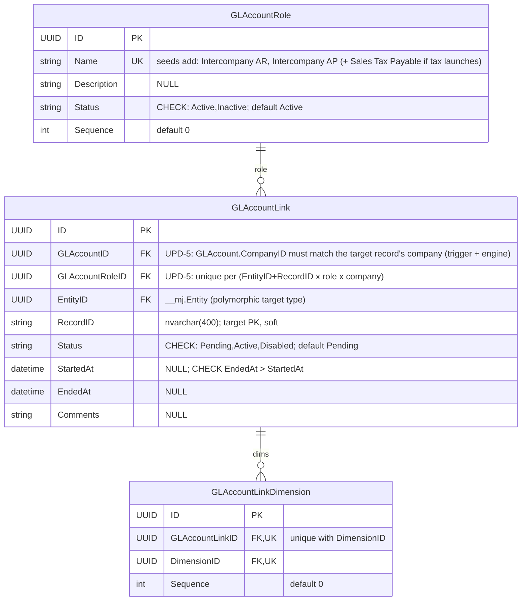
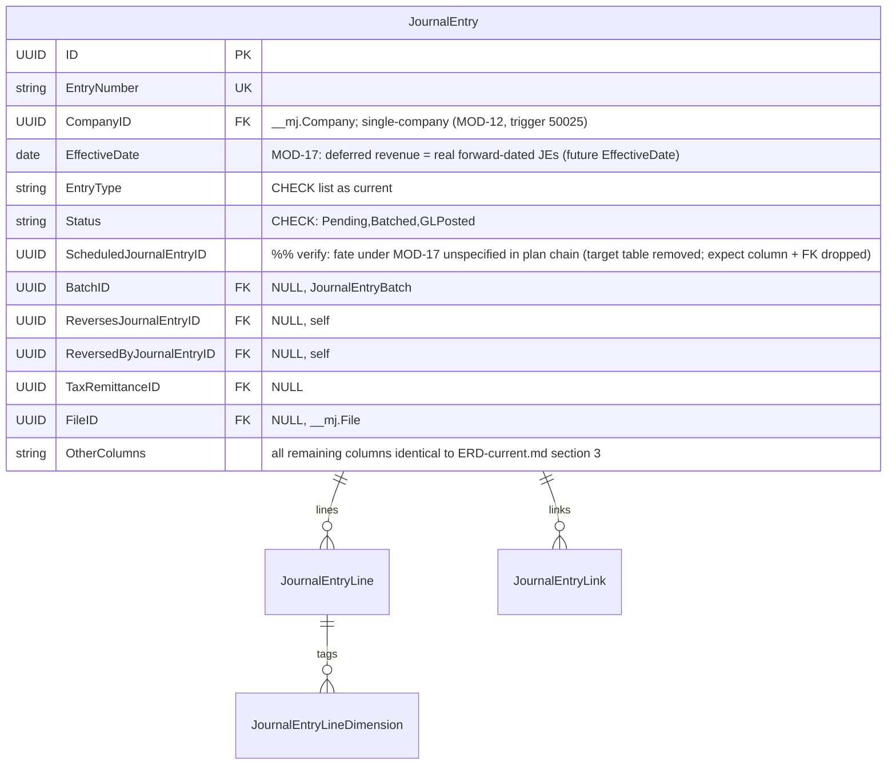
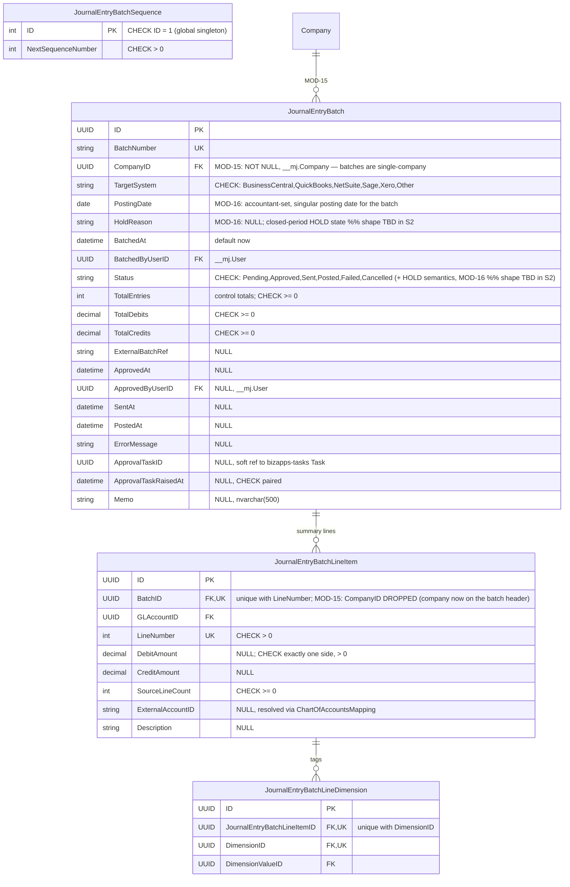
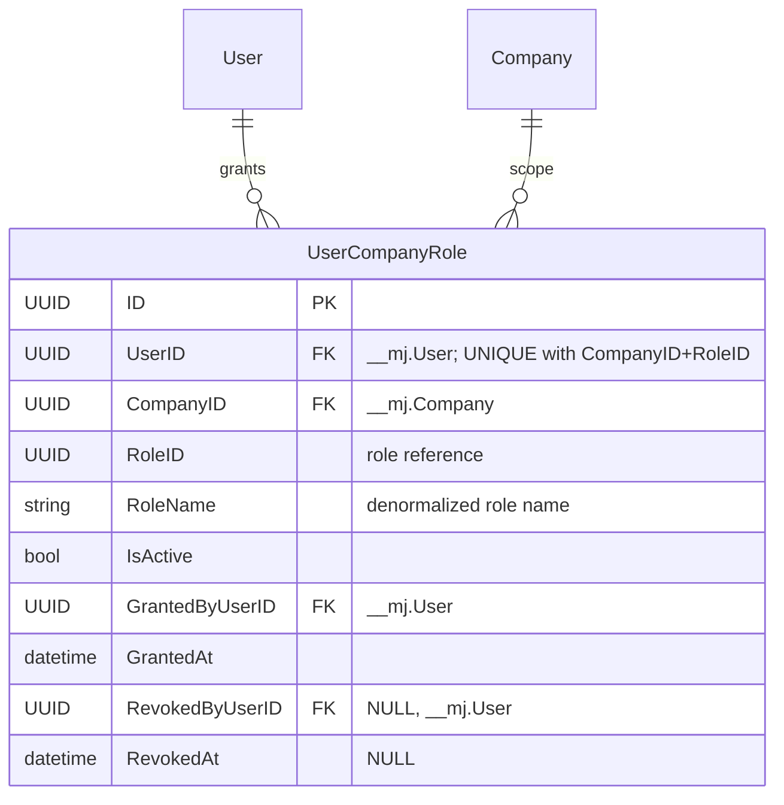

# BizApps Accounting — ERD (PLANNED)

**Date:** 2026-07-20
**Basis:** PLANNED = plan chain through MOD-18/UPD-6 as of 2026-07-20; pending items marked; the ⏸ category-company contradiction is orders-side.
Baseline = the AS-BUILT schema in **ERD-current.md** (migrations @ `V202607171000__v1.0.x__Batch_Memo.sql`) with these deltas applied:

| Delta | Change |
|---|---|
| MOD-15 | `JournalEntryBatch.CompanyID` (FK `__mj.Company`, NOT NULL) added; `JournalEntryBatchLineItem.CompanyID` dropped — batches become single-company |
| MOD-16 | `JournalEntryBatch.PostingDate` (accountant-set, singular) added; closed-period HOLD state (`HoldReason`, shape TBD in S2) |
| MOD-17 | ScheduledJournalEntry trio RETIRED — deferred revenue = real forward-dated `JournalEntry` rows |
| V1.6/S2 | NEW `UserCompanyRole` (per-company role grants) |
| Seeds | New `GLAccountRole` seed rows: Intercompany AR, Intercompany AP (+ Sales Tax Payable if tax launches) |
| UPD-5 | `GLAccountLink` same-company enforcement (trigger + engine) + uniqueness on (target × role × company) |
| MOD-18 | Tax tables unchanged in shape; re-postured as engine-result snapshots |

**Conventions:** identical to ERD-current.md — schema `__mj_BizAppsAccounting`; CodeGen-owned `__mj_CreatedAt`/`__mj_UpdatedAt` on every table (omitted); simplified types; dotted lines = soft refs (no FK).

**Table count: 26** (28 current − 3 ScheduledJournalEntry trio + 1 UserCompanyRole).

---

## §1 Overview — all entities and relationships (planned)

```mermaid
erDiagram
    %% ===== IsA + chart of accounts =====
    Company ||--|| AccountingCompanyProfile : "IsA disjoint child (same UUID)"
    AccountingCompanyProfile |o--o{ AccountingCompanyProfile : "parent (no chains)"
    Currency ||--o{ AccountingCompanyProfile : "functional and reporting"
    GLAccount |o--o{ AccountingCompanyProfile : "5 default-account FKs"
    Company ||--o{ GLAccount : "owns CoA"
    GLAccount |o--o{ GLAccount : parent
    Currency |o--o{ GLAccount : denominates
    GLAccountRole ||--o{ GLAccountLink : role
    GLAccount ||--o{ GLAccountLink : "maps to (same-company enforced, UPD-5)"
    Entity ||--o{ GLAccountLink : "EntityID (polymorphic)"
    GLAccountLink ||--o{ GLAccountLinkDimension : "dimensions to apply"
    Dimension ||--o{ GLAccountLinkDimension : dimension
    Product ||..o{ GLAccountLink : "soft RecordID target"
    ProductCategory ||..o{ GLAccountLink : "soft RecordID target"
    Company ||..o{ GLAccountLink : "soft RecordID target"
    Company ||--o{ ChartOfAccountsMapping : company
    GLAccount ||--o{ ChartOfAccountsMapping : internal
    User |o--o{ ChartOfAccountsMapping : "approved by"

    %% ===== Per-company access (V1.6/S2) =====
    User ||--o{ UserCompanyRole : grants
    Company ||--o{ UserCompanyRole : scope

    %% ===== Journal entries =====
    Company ||--o{ JournalEntry : "single-company (MOD-12)"
    JournalEntryBatch |o--o{ JournalEntry : "BatchID when batched"
    JournalEntry |o--o| JournalEntry : "reverses / reversed-by"
    TaxRemittance |o--o{ JournalEntry : "remittance origin"
    File |o--o{ JournalEntry : "attached source doc"
    JournalEntry ||--o{ JournalEntryLine : lines
    GLAccount ||--o{ JournalEntryLine : account
    Currency |o--o{ JournalEntryLine : "original currency"
    Organization |o--o{ JournalEntryLine : counterparty
    JournalEntryLine ||--o{ JournalEntryLineDimension : tags
    Dimension ||--o{ JournalEntryLineDimension : dimension
    DimensionValue ||--o{ JournalEntryLineDimension : value
    Dimension ||--o{ DimensionValue : values
    DimensionValue |o--o{ DimensionValue : parent
    JournalEntry ||--o{ JournalEntryLink : "lineage links"
    Entity ||--o{ JournalEntryLink : "EntityID (polymorphic)"
    AnyEntityRecord ||..o{ JournalEntryLink : "soft RecordID target"
    Company ||--o{ JournalEntrySequence : "per-company per-FY"
    Order ||..o{ JournalEntry : "soft OrderID"
    OrderLine ||..o{ JournalEntry : "soft OrderLineID"
    OrderLine ||..o{ JournalEntryLine : "soft OrderLineID"
    Subscription ||..o{ JournalEntry : "soft SubscriptionID"
    Payment ||..o{ JournalEntry : "soft PaymentID"
    Contract ||..o{ JournalEntry : "soft ContractID"
    RevRecSchedule ||..o{ JournalEntry : "soft RevRecScheduleID"
    IntercompanyFlow ||..o{ JournalEntry : "soft IntercompanyFlowID"

    %% ===== Batching (single-company per MOD-15) =====
    Company ||--o{ JournalEntryBatch : "MOD-15: header CompanyID"
    User ||--o{ JournalEntryBatch : "batched by"
    User |o--o{ JournalEntryBatch : "approved by"
    Task ||..o{ JournalEntryBatch : "soft ApprovalTaskID (bizapps-tasks)"
    JournalEntryBatch ||--o{ JournalEntryBatchLineItem : "summary lines"
    GLAccount ||--o{ JournalEntryBatchLineItem : account
    JournalEntryBatchLineItem ||--o{ JournalEntryBatchLineDimension : tags
    Dimension ||--o{ JournalEntryBatchLineDimension : dimension
    DimensionValue ||--o{ JournalEntryBatchLineDimension : value
    JournalEntryBatchSequence {
    }

    %% ===== Scheduled JEs: RETIRED (MOD-17) — tables not drawn =====

    %% ===== Tax (MOD-18: engine-result snapshots; shapes unchanged) =====
    TaxAuthority ||--o{ TaxJurisdiction : jurisdictions
    TaxJurisdiction |o--o{ TaxJurisdiction : parent
    TaxJurisdiction ||--o{ TaxRate : rates
    Company ||--o{ TaxLiability : company
    TaxAuthority ||--o{ TaxLiability : authority
    TaxJurisdiction ||--o{ TaxLiability : jurisdiction
    TaxLiability ||--o{ TaxRemittance : payments
    Organization ||--o{ CustomerTaxProfile : customer
    TaxJurisdiction |o--o{ CustomerTaxProfile : jurisdiction

    %% ===== Currency =====
    Currency ||--o{ CurrencySpotRate : "from / to"
```

Pseudo-entities as in ERD-current.md. `ScheduledJournalEntry`/`ScheduledJournalEntryLineItem`/`ScheduledJournalEntryLineDimension` no longer exist in this view (MOD-17).

---

## §2 Chart of accounts & mapping

**UPD-5:** GLAccountLink gains same-company enforcement (a link's GLAccount must belong to the same company as the linked record — trigger + engine check) and uniqueness on (target record × role × company); both are constraints/triggers, not new columns. A denormalized `GLAccountLink.CompanyID` is an **undecided deep-dive candidate** — shown as a comment above, not a column. **Seed delta (data, not schema):** new `GLAccountRole` rows *Intercompany AR* and *Intercompany AP* (+ *Sales Tax Payable* if tax launches) to route intercompany due-to/due-from JE lines; the per-affiliate (entity × counterparty) routing shape is **pending** (MOD-14 in orders) — roles may later resolve per counterparty.

---

## §3 Journal entries

Unchanged from **ERD-current.md §3** (JournalEntry, JournalEntryLine, JournalEntryLineDimension, Dimension, DimensionValue, JournalEntryLink, JournalEntrySequence) with one MOD-17 knock-on:

Balanced-on-lock (50001/50019), single-company 50025, immutability-after-lock, and no-status-regression triggers all persist unchanged. Forward-dated JEs (the MOD-17 replacement for the scheduled trio) are ordinary Pending JEs whose `EffectiveDate` is in the future.

---

## §4 Batching (MOD-15 + MOD-16)

**MOD-15** makes the batch single-company: `CompanyID` moves up to the header (NOT NULL FK) and is dropped from line items — the AM-4 per-company footing trigger (50023) collapses into the whole-batch footing check. **MOD-16** adds an accountant-set singular `PostingDate` and a closed-period **HOLD** state (represented here as `HoldReason NVARCHAR NULL` + a Status note; the exact shape — extra status value vs. flag — is `%% shape TBD in S2`). Immutability and summary-reconciliation triggers otherwise persist.

---

## §5 Scheduled journal entries — RETIRED (MOD-17)

**MOD-17:** the `ScheduledJournalEntry` / `ScheduledJournalEntryLineItem` / `ScheduledJournalEntryLineDimension` trio is **removed**. Deferred revenue / amortization waterfalls are represented as **real forward-dated `JournalEntry` rows** (ordinary Pending JEs with future `EffectiveDate`), so they live under the exact same balance/immutability invariants as every other JE. No tables drawn.
`%% verify:` the plan chain does not spell out the fate of `JournalEntry.ScheduledJournalEntryID` — expect it dropped with the trio.

---

## §6 Tax (MOD-18 — posture change only)

Table shapes are **unchanged** from **ERD-current.md §6** (TaxAuthority, TaxJurisdiction, TaxRate, TaxLiability, TaxRemittance, CustomerTaxProfile — see there for full attributes).
**MOD-18:** these tables are re-postured as **engine-result SNAPSHOTS** — the tax engine computes liability/rate outcomes and persists its results here for audit and remittance tracking; the tables are no longer treated as the live calculation source. Prose note only; no schema delta. (A *Sales Tax Payable* `GLAccountRole` seed accompanies this if tax launches — see §2.)

---

## §7 Currency

Unchanged from **ERD-current.md §7** (Currency, CurrencySpotRate).

---

## §8 Per-company access — NEW `UserCompanyRole` (V1.6/S2)

New in V1.6/S2: per-company role grants (which users may act — approve, batch, post — for which company), with grant/revoke audit stamps and `UNIQUE (UserID, CompanyID, RoleID)`. `%% verify:` whether `RoleID` FKs `__mj.Role` or an app-local role table is not pinned in the delta — modeled as a plain UUID + denormalized `RoleName`.

---

## §9 Interfaces with other apps

Identical to **ERD-current.md §8**, minus the ScheduledJournalEntry soft-origin keys (trio retired, MOD-17), plus:

- **`__mj.User` / `__mj.Company`** — additional hard FKs from the new `UserCompanyRole` (V1.6/S2).
- **`__mj.Company`** — additional hard FK from `JournalEntryBatch.CompanyID` (MOD-15).
- **Orders-side ⏸** — the category-company contradiction (which company a product-category GL mapping binds to when orders cross companies) is an **orders-side** open item; nothing here models it. The per-affiliate GL-routing shape (entity × counterparty) is likewise pending (orders MOD-14).
