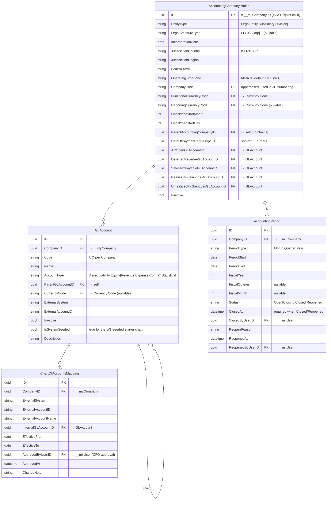
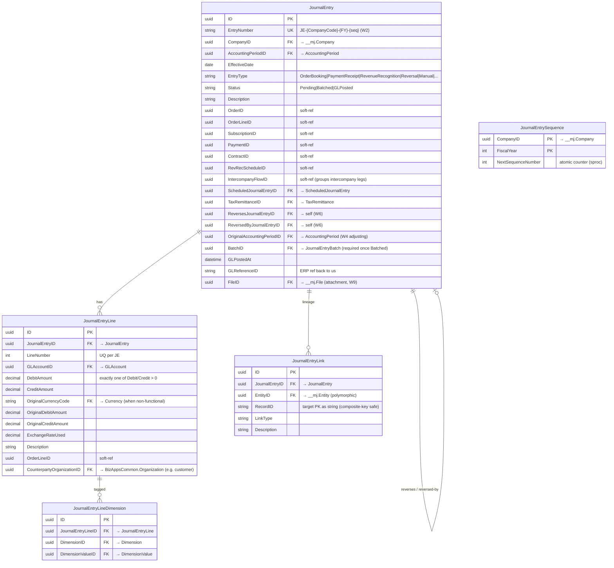
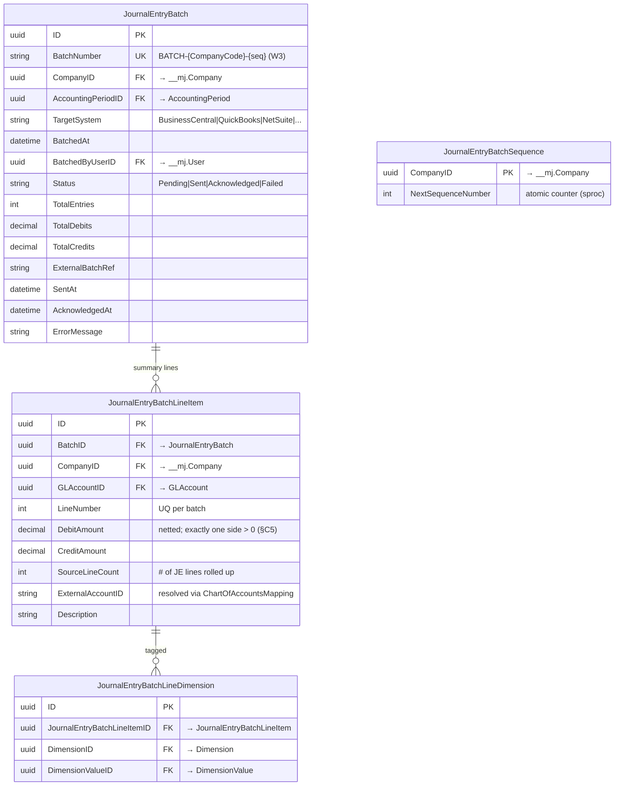
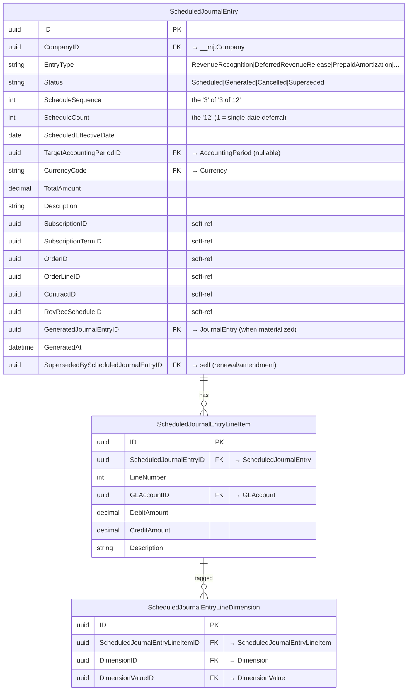
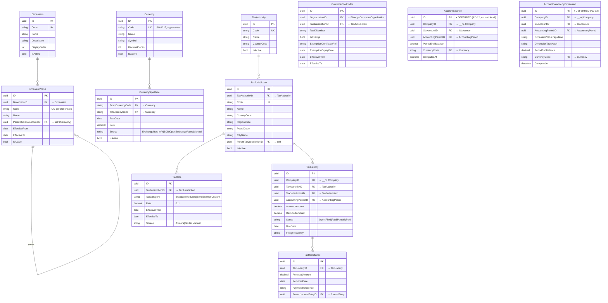
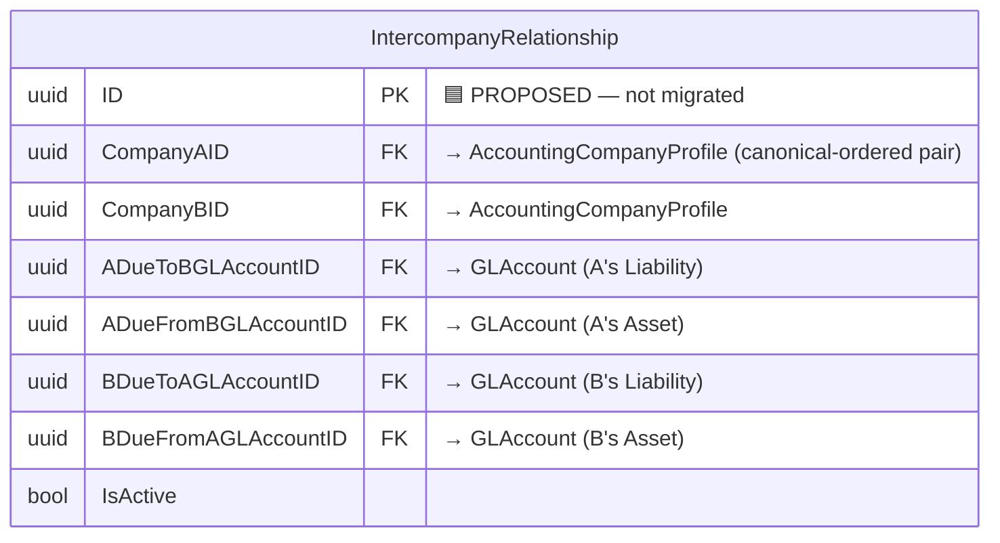

# BizApps Accounting — Entity-Relationship Diagram

> **Source of truth:** `migrations/B202605281200__v0.1.0__Schema_and_Tables.sql` (the frozen baseline).
> **28 entities** in schema `__mj_BizAppsAccounting`. MJ entity names are `MJ_BizApps_Accounting: <PluralName>`
> (e.g. table `JournalEntry` → entity `MJ_BizApps_Accounting: Journal Entries`).
> **Generated 2026-06-29** from the baseline; regenerate if the schema changes.

## How to read this
- **Hard FK** = an enforced foreign key (drawn as a relationship line / marked `FK`).
- **soft-ref** = a plain `UNIQUEIDENTIFIER` with **no FK constraint** — by design, for IDs owned by
  downstream apps this repo has no knowledge of (Orders/Payments/Contracts). Marked `"soft-ref"`; **not**
  drawn as a relationship. This is how lineage is kept without coupling (AD-15).
- **External** (not in this schema): `Company`, `User`, `File`, `Entity` (`__mj`), `Organization` (`__mj_BizAppsCommon`).
- **Status flags:** ✅ built+used · 🟡 schema present, feature later (`CurrencySpotRate` FX follow-on) ·
  ⏸ **deferred** (`AccountBalance*` — AD-12, unused in v1) · 🟦 **proposed, not yet migrated**
  (`IntercompanyRelationship` — OQ-A; shown at the end for context).

---

## 1. Relationship map (the whole shape)

```mermaid
erDiagram
    Company ||--o| AccountingCompanyProfile : "IS-A (same ID)"
    Company ||--o{ GLAccount : ""
    Company ||--o{ AccountingPeriod : ""
    Company ||--o{ JournalEntry : ""
    Company ||--o{ JournalEntryBatch : ""
    Company ||--o{ ChartOfAccountsMapping : ""
    Company ||--o{ TaxLiability : ""
    Company ||--o{ AccountBalance : ""
    Company ||--o{ ScheduledJournalEntry : ""
    Company ||--o{ JournalEntrySequence : ""
    Company ||--o{ JournalEntryBatchSequence : ""

    Currency ||--o{ GLAccount : "denominates"
    Currency ||--o{ AccountingCompanyProfile : "functional/reporting"
    Currency ||--o{ JournalEntryLine : "original ccy"
    Currency ||--o{ CurrencySpotRate : "from/to"

    GLAccount ||--o{ GLAccount : "parent rollup"
    AccountingCompanyProfile ||--o{ AccountingCompanyProfile : "uses-books-of"
    AccountingCompanyProfile }o--o{ GLAccount : "5 default GL refs"

    AccountingPeriod ||--o{ JournalEntry : "posts-in"
    AccountingPeriod ||--o{ JournalEntryBatch : ""
    AccountingPeriod ||--o{ TaxLiability : ""
    AccountingPeriod ||--o{ AccountBalance : ""

    JournalEntry ||--o{ JournalEntryLine : "has"
    JournalEntry ||--o{ JournalEntryLink : "lineage"
    JournalEntry ||--o| JournalEntry : "reverses"
    JournalEntryBatch ||--o{ JournalEntry : "locks"
    JournalEntryBatch ||--o{ JournalEntryBatchLineItem : "summary lines"
    JournalEntryBatchLineItem ||--o{ JournalEntryBatchLineDimension : ""
    JournalEntryLine ||--o{ JournalEntryLineDimension : ""
    GLAccount ||--o{ JournalEntryLine : ""
    GLAccount ||--o{ JournalEntryBatchLineItem : ""

    Dimension ||--o{ DimensionValue : ""
    Dimension ||--o{ JournalEntryLineDimension : ""
    DimensionValue ||--o{ JournalEntryLineDimension : ""

    ScheduledJournalEntry ||--o{ ScheduledJournalEntryLineItem : ""
    ScheduledJournalEntryLineItem ||--o{ ScheduledJournalEntryLineDimension : ""
    ScheduledJournalEntry ||--o| JournalEntry : "materializes-into"

    TaxAuthority ||--o{ TaxJurisdiction : ""
    TaxJurisdiction ||--o{ TaxRate : ""
    TaxJurisdiction ||--o{ TaxLiability : ""
    TaxAuthority ||--o{ TaxLiability : ""
    TaxLiability ||--o{ TaxRemittance : ""
    TaxRemittance ||--o| JournalEntry : "posts"
    Organization ||--o{ CustomerTaxProfile : ""
    TaxJurisdiction ||--o{ CustomerTaxProfile : ""

    GLAccount ||--o{ ChartOfAccountsMapping : ""
    GLAccount ||--o{ AccountBalance : ""
    Entity ||--o{ JournalEntryLink : "polymorphic"
    File ||--o{ JournalEntry : "attachment"
    User ||--o{ JournalEntryBatch : "batched-by"
    AccountingCompanyProfile ||--o{ IntercompanyRelationship : "🟦 proposed (pair)"
    GLAccount ||--o{ IntercompanyRelationship : "🟦 Due-To/Due-From accts"
```

> Soft-refs (no lines above): `JournalEntry.{OrderID, OrderLineID, SubscriptionID, PaymentID, ContractID,
> RevRecScheduleID, IntercompanyFlowID}`, `JournalEntryLine.OrderLineID`, and the `ScheduledJournalEntry`
> origin IDs — all point at Orders/Contracts records and carry **no FK** by design.

---

## 2. Company · Chart of Accounts · Periods · COA mapping

---

## 3. Journal Entries (the ledger core)

---

## 4. Batching → ERP (the headline process)

> Per §C5: a batch's summary lines group by **Company × GLAccount × Dimension-combo** with Dr/Cr **netted**
> to one side. The detailed `JournalEntryLine` rows stay for drill-through.

---

## 5. Scheduled rev-rec waterfall (deferred revenue / amortization)

> The schedule is **computed upstream** (BizAppsOrders) and persisted here; the period-close materializer
> turns each due `Scheduled` row into a real Pending `JournalEntry` (Dr Deferred Revenue / Cr Revenue) and
> sets `GeneratedJournalEntryID` (AD-11). Block 4.

---

## 6. Dimensions · Currency · Tax · Balances

---

## 7. Proposed (not yet migrated) — Intercompany relationship (OQ-A)

Per Amith's OQ-A answer — **under review now** (added for Marcelo to confirm it "fits"). The schema is
**finalized for review, NOT yet migrated**; the intercompany *engine* stays deferred (§C1: balancing-leg
generation lives upstream in Orders/Payments).

---

### Consistency review (for Marcelo — does it fit?)
- **One row per unordered pair** (Amith: "a single row… track all 4 accounts"). `CompanyAID`/`CompanyBID` FK
  to `AccountingCompanyProfile(ID)` (= the company id; ensures both ends are accounting-enabled). Enforce a
  **canonical order** (e.g. by `CompanyCode`) so `(B,A)` can't duplicate `(A,B)`: `UQ(CompanyAID,CompanyBID)`
  + `CK(CompanyAID <> CompanyBID)` + a trigger for the ordering.
- **4 GL accounts, 2 per side** — A's *Due-To-B* (Liability) / *Due-From-B* (Asset); B's mirror. Each must
  live in its owner's COA (`GLAccount.CompanyID = CompanyAID` / `= CompanyBID`) with the right `AccountType` —
  FKs can't enforce that, so a **trigger** does (joins the §11.1 invariant matrix), consistent with how the
  rest of the system enforces invariants at the DB level.
- **Provisioning (eager):** when an ACP is added, a hook creates the relationship row + the 4 GL accounts
  against every existing ACP. The **account-code scheme** (e.g. `11211-<counterpartyCode>` /
  `21501-<counterpartyCode>`) is the main open naming decision.
- **Naming for review:** table `IntercompanyRelationship` (entity `MJ_BizApps_Accounting: Intercompany
  Relationships`) — Amith's alternative was `AccountingCompanyProfileIntercompanyRelationship`. The column
  names (`CompanyAID`, `ADueToBGLAccountID`, …) are placeholders — rename freely.
- **Ties to the rest:** the 4 accounts are ordinary `GLAccount` rows (per-company COA, `IsSystemSeeded`); the
  pair is two `AccountingCompanyProfile`s; a multi-company transaction's legs are grouped by
  `JournalEntry.IntercompanyFlowID` (soft-ref). Per **§C1** this table holds **only the account wiring** — the
  balancing legs themselves are generated **upstream** (Orders/Payments), not by Accounting.

## Domain index (28 entities)
- **Company/COA/Periods (§2):** AccountingCompanyProfile, GLAccount, AccountingPeriod, ChartOfAccountsMapping
- **Journal entries (§3):** JournalEntry, JournalEntryLine, JournalEntryLineDimension, JournalEntryLink, JournalEntrySequence
- **Batching (§4):** JournalEntryBatch, JournalEntryBatchLineItem, JournalEntryBatchLineDimension, JournalEntryBatchSequence
- **Scheduled rev-rec (§5):** ScheduledJournalEntry, ScheduledJournalEntryLineItem, ScheduledJournalEntryLineDimension
- **Dimensions/Currency/Tax/Balances (§6):** Dimension, DimensionValue, Currency, CurrencySpotRate, TaxAuthority, TaxJurisdiction, TaxRate, TaxLiability, TaxRemittance, CustomerTaxProfile, AccountBalance ⏸, AccountBalanceByDimension ⏸
