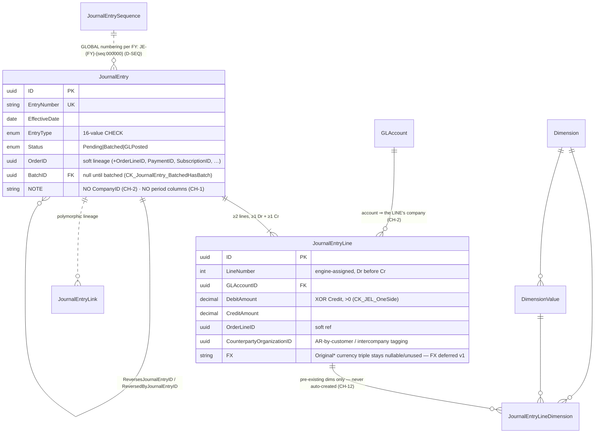
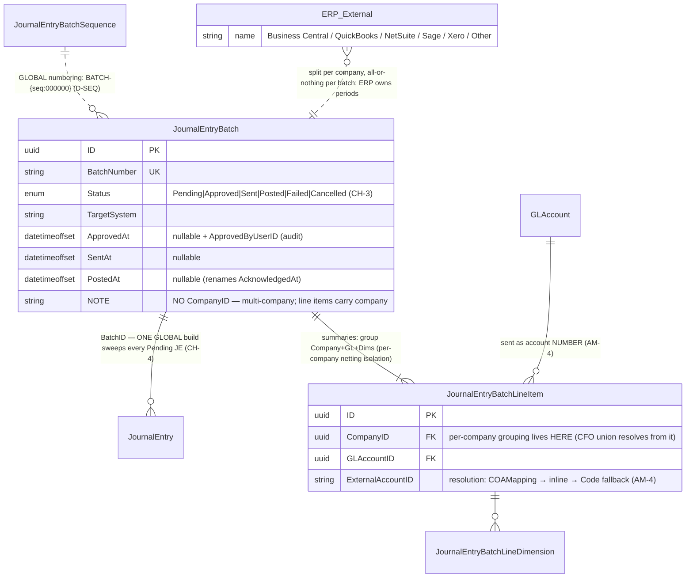

# ERD — bizapps-accounting (CURRENT schema)
**Rewritten 2026-07-06 — the engine-meeting rulings (AM-1..7) LANDED in the v1.0 baseline
(`migrations/B202605281200__v1.0.x__Schema_and_Tables.sql`).** 29 tables / 28 entities in schema
`__mj_BizAppsAccounting`; MJ entity names are `MJ_BizApps_Accounting: <PluralName>`. This is the
at-a-glance schema reference; keep it current with every migration (repo convention — Definition of Done).

**Removed from the previous schema:** ~~`AccountingPeriod`~~ ~~`AccountBalance`~~
~~`AccountBalanceByDimension`~~ + every period FK column + `JournalEntry.CompanyID` +
`JournalEntryBatch.CompanyID` (multi-company).
**New:** `GLAccountRole`, `GLAccountLink`, `GLAccountLinkDimension`.
**Changed:** `GLAccount.AccountType` → 5-enum · batch statuses → 6-value lifecycle · numbering
sequences → GLOBAL (D-SEQ). History/rationale: `plans/erd-accounting-target.md` (the review
artifact this landed from) + `plans/accounting-engine-plan.md` §4.

**How to read this:** Hard FK = enforced foreign key (relationship line / `FK`). *soft-ref* = a plain
UNIQUEIDENTIFIER with no FK — lineage to downstream apps without coupling (AD-15). External (not this
schema): `Company`, `User`, `File`, `Entity` (`__mj`), `Organization` (`__mj_BizAppsCommon`).

## Chart of accounts + the role/link system (AM-2/AM-5)

```mermaid
erDiagram
    Company ||--o| AccountingCompanyProfile : "IsA — same UUID"
    AccountingCompanyProfile ||--o{ GLAccount : "owns CoA"
    GLAccount ||--o{ GLAccount : "ParentGLAccountID"
    GLAccount ||--o{ GLAccountLink : ""
    GLAccountRole ||--o{ GLAccountLink : "which ROLE the link fills (OQ-G resolved: column added)"
    GLAccountLink ||--o{ GLAccountLinkDimension : "which dims apply, ordered"
    Dimension ||--o{ GLAccountLinkDimension : ""
    GLAccountLink }o..|| Company : "polymorphic: company DEFAULTS"
    GLAccountLink }o..|| AnyRecord : "polymorphic: ProductCategory / Product / future"
    GLAccount ||--o{ ChartOfAccountsMapping : "our account ↔ ERP account (approval workflow)"

    GLAccount { uuid ID PK
                uuid CompanyID FK
                string Code "account NUMBER — unique per company (UQ), the ERP wire id (AM-4)"
                string Name
                enum AccountType "Asset|Liability|Equity|Revenue|Expense (AM-3)"
                bool IsActive }
    GLAccountRole { uuid ID PK
                    string Name "Cash · AR · Inventory · COGS · Sales · Sales Discounts · Sales Returns and Allowances · Deferred Revenue (OQ-H: added)"
                    string Description
                    enum Status "Active|Inactive"
                    int Sequence "seeded 10..80 via metadata sync (metadata/gl-account-roles)" }
    GLAccountLink { uuid ID PK
                    uuid GLAccountID FK
                    uuid GLAccountRoleID FK
                    uuid EntityID "polymorphic pair (TaggedItem-style) → __mj.Entity"
                    string RecordID ""
                    enum Status "Pending|Active|Disabled"
                    datetimeoffset StartedAt "nullable — date-effective window (CK_GLAccountLink_Window)"
                    datetimeoffset EndedAt "nullable"
                    string Comments }
    GLAccountLinkDimension { uuid ID PK
                             uuid GLAccountLinkID FK
                             uuid DimensionID FK "VALUES supplied at JE-build time from caller context (OQ-I)"
                             int Sequence "UQ (link, dim)" }
```

The date-effective window is Amith's "new CoA effective Aug 1" scenario: enter the new link today with
StartedAt, EndedAt the old one; the engine's `ResolveLinkedAccount` (latest-start-wins over covering
Active windows) flips automatically; old JEs are never touched.

## Journal entries — multi-company, no periods

```mermaid
erDiagram
    JournalEntry ||--|{ JournalEntryLine : "≥2 lines, ≥1 Dr + ≥1 Cr"
    GLAccount ||--o{ JournalEntryLine : "account ⇒ the LINE's company (CH-2)"
    JournalEntryLine ||--o{ JournalEntryLineDimension : "pre-existing dims only — never auto-created (CH-12)"
    Dimension ||--o{ JournalEntryLineDimension : ""
    DimensionValue ||--o{ JournalEntryLineDimension : ""
    Dimension ||--o{ DimensionValue : ""
    JournalEntry ||--o{ JournalEntry : "ReversesJournalEntryID / ReversedByJournalEntryID"
    JournalEntry ||..o{ JournalEntryLink : "polymorphic lineage"
    JournalEntrySequence ||..o{ JournalEntry : "GLOBAL numbering per FY: JE-{FY}-{seq:000000} (D-SEQ)"

    JournalEntry { uuid ID PK
                   string EntryNumber UK
                   date EffectiveDate
                   enum EntryType "16-value CHECK"
                   enum Status "Pending|Batched|GLPosted"
                   uuid OrderID "soft lineage (+OrderLineID, PaymentID, SubscriptionID, …)"
                   uuid BatchID FK "null until batched (CK_JournalEntry_BatchedHasBatch)"
                   string NOTE "NO CompanyID (CH-2) · NO period columns (CH-1)" }
    JournalEntryLine { uuid ID PK
                       int LineNumber "engine-assigned, Dr before Cr"
                       uuid GLAccountID FK
                       decimal DebitAmount "XOR Credit, >0 (CK_JEL_OneSide)"
                       decimal CreditAmount ""
                       uuid OrderLineID "soft ref"
                       uuid CounterpartyOrganizationID "AR-by-customer / intercompany tagging"
                       string FX "Original* currency triple stays nullable/unused — FX deferred v1" }
```

**Balance rules:** Σ Dr = Σ Cr for the whole entry **and within each company** (AM-4) — company is
implicit via `GLAccount.CompanyID`; enforced in the ENGINE pipeline (typed `UNBALANCED` errors) AND the
balanced-on-lock triggers (**50001** overall, **50019** per company, **50022** line-change recheck).
Immutability after Batched/GLPosted: triggers **50003/50004/50006**. Reversal consistency: **50012**.

## Batching to the ERP (multi-company batches, 6-status lifecycle)

```mermaid
erDiagram
    JournalEntryBatch ||--o{ JournalEntry : "BatchID — ONE GLOBAL build sweeps every Pending JE (CH-4)"
    JournalEntryBatch ||--|{ JournalEntryBatchLineItem : "summaries: group Company+GL+Dims (per-company netting isolation)"
    JournalEntryBatchLineItem ||--o{ JournalEntryBatchLineDimension : ""
    GLAccount ||--o{ JournalEntryBatchLineItem : "sent as account NUMBER (AM-4)"
    JournalEntryBatchSequence ||..o{ JournalEntryBatch : "GLOBAL numbering: BATCH-{seq:000000} (D-SEQ)"
    ERP_External }o..|| JournalEntryBatch : "split per company, all-or-nothing per batch; ERP owns periods"

    JournalEntryBatch { uuid ID PK
                        string BatchNumber UK
                        enum Status "Pending|Approved|Sent|Posted|Failed|Cancelled (CH-3)"
                        string TargetSystem
                        datetimeoffset ApprovedAt "nullable + ApprovedByUserID (audit)"
                        datetimeoffset SentAt "nullable"
                        datetimeoffset PostedAt "nullable (renames AcknowledgedAt)"
                        string NOTE "NO CompanyID — multi-company; line items carry company" }
    JournalEntryBatchLineItem { uuid ID PK
                                uuid CompanyID FK "per-company grouping lives HERE (CFO union resolves from it)"
                                uuid GLAccountID FK
                                string ExternalAccountID "resolution: COAMapping → inline → Code fallback (AM-4)" }
    ERP_External { string name "Business Central / QuickBooks / NetSuite / Sage / Xero / Other" }
```

**Status meanings:** Pending = mutable · Approved = human-locked (CFO decision recorded via the
bizapps-tasks gate; the decision also flips the status) · Sent = on the wire · Posted = ERP confirmed ·
Failed = ERP rejected (`ErrorMessage`; retryable) · Cancelled = terminal. Batch triggers: summary foots
overall (**50014**) and **per company (50023)**; immutability once Approved+ (**50008/50009/50013**).

## Kept but parked (out of the fence)

- **Scheduled JEs** (3 tables) — schedules keyed by `ScheduledEffectiveDate` only; **NO central
  materializer (AM-6)** — domain entity servers generate the real JE and flip the row to Generated
  (`CK_SJE_GeneratedCoherence`, locks **50016/50017/50018**).
- **Tax** (6 tables) — `TaxLiability` period column dropped; otherwise untouched; v1-not-phase-1.
- **Plumbing** — `ChartOfAccountsMapping` (+ `CK_COAMapping_ApprovalCoherence`), the two GLOBAL
  sequences, `JournalEntryLink`, `Currency`/`CurrencySpotRate`.
- **Read models** — 12 `vw_*` reporting views (NOT entities): trial balance, JE audit trail, month-grain
  AR↔GL recon + deferred-revenue rollforward (on `EffectiveDate` — periods are gone), dimension P&L,
  batch dispatch status (+CompanyCount), scheduled-JE summary, FX exposure, AR open/aging by customer,
  sales-tax liability, intercompany flow.

## Removed, and why that's safe

| Gone | Why |
|---|---|
| `AccountingPeriod` + every FK to it | company-specific + ERP-owned; multi-company JEs made ours a liability (CH-1) |
| `AccountBalance` / `AccountBalanceByDimension` | balance tracking is the ERP's job (AM-1) |
| `JournalEntry.CompanyID` / `JournalEntryBatch.CompanyID` | entries + batches span companies (CH-2/CH-4) |
| W4 routing · period-close triggers · the SJE materializer | all period-dependent (CH-1/AM-6) |

## A3 enforcement/implementation audit — 2026-07-14 (schema action plan A3)

Verified against the live dev DB (`MJ_accounting_engine_dev`) + code, with the MOD/UPD overlays applied:

| §5 item (as overlaid) | Verdict |
|---|---|
| 5.1 CHECK constraints | as-built, unchanged; covered by `trigger-preflight.ts` |
| 5.2 balanced-JE triggers | PRESENT (`trg_JournalEntry_BalancedOnLock`, `trg_JEL_RecheckParentBalance`) incl. the V202607081600 reversible-preliminary-lock rework |
| 5.3 immutability triggers | PRESENT — full set: JE / JEL / JEBatch / JEBLI / JEBLDimension / SJE / SJELI + `trg_ACP_NoChains`, `trg_JE_ReversalConsistency`, `trg_JEBatch_SummaryReconciles` |
| 5.4 period-close trigger | **ABSENT — CORRECT and deliberate.** Periods are removed (MOD-1 FINAL; the 2026-07-14 MOD-13 manual-close detour was withdrawn same-day). Do NOT rebuild period machinery; any future timing rule detects by DATE, never a period FK (`plans/DEFERRALS.md`). |
| 5.5 CoA-mapping enforcement | **retired by design** — dispatch account resolution is total (`ChartOfAccountsMapping` override → `GLAccount.ExternalAccountID` → `Code` fallback; `BatchingEngine.ts` §resolution), so the unmapped-GL hard-fail is unnecessary |
| Intercompany wiring (`IntercompanyRelationship`) | **ABSENT accounting-side — CORRECT** (2026-07-06 baseline ruling; MOD-5(c)). The per-pair Due-To/Due-From wiring is the Payments component's (orders O2+); Amith's OQ-A shape is preserved in MOD-5 as the reference. Do not re-add here. |
| §4.9 SJE materialization | schema built; date-driven engine (MOD-11) = feature plan B3 |
| Sequences | intact (JournalEntrySequence per-FY row + BatchSequence singleton). A4 re-keys JE numbering to (CompanyID, FiscalYear) per MOD-12. |
| `ACP.DefaultPaymentTermsTypeID` | soft ref, unchanged — its target now EXISTS (orders S1 shipped `PaymentTermsType` 2026-07-14); stays soft (no cross-app FK) |

**Implementation-status verdicts (Marcelo's "mostly implemented, but not sure"):**
- **MOD-1..10 vs built:** MOD-1 (no periods) ✓ · MOD-2 (BC dispatch stub path) ✓ · MOD-3 (two-level batch lock + tasks-app approval gate: `TasksAppApprovalGate.ts`, V202607081600) ✓ · MOD-4 (netted summaries: `trg_JEBatch_SummaryReconciles` + BatchingEngine netting) ✓ · MOD-5 (intercompany dropped accounting-side) ✓ · MOD-6 (FX upstream; Currency tables dormant) ✓ · MOD-7 (minimal COA seed) ✓ · MOD-8 (oldest-forward batch filter) = feature plan B1.1, NOT yet built (correct — feature wave) · MOD-9 (roles/RLS) = A2, NOT yet built (correct — gated on R1-R3 + co-design) · MOD-10 (GLAccountLink role mapping) ✓.
- **Batch-lock plan (`ActionPlan - Batch approval lock redesign.md`):** phases 1–2 BUILT (`BatchingEngine.cancelBatch`/`regenerateBatch`/atomic `buildBatch`; V202607081600 trigger rework); phase 3 UI + phase 4 demo-state seeds are IN FLIGHT (batch-approvals UI/playwright work active in this instance, uncommitted). Plan stays **Active** — not moved to completed. Test matrix not re-run in this audit (the harness files are mid-edit by the active UI workstream); last recorded run green per `testing.md`.
- **JE-side MOD-12 gap (expected):** `JournalEntry.CompanyID` does not exist yet — that is **A4**, executing next with orders F1.2's per-company split (the two must land together or the order-to-je harness breaks).

## A4 — single-company JE restoration (MOD-12) — executed 2026-07-14

Baseline (`B202605281200`) edited in place (collapse-into-baseline strategy; `V202607081600`'s
reversible-preliminary-lock trigger rework FOLDED into §4.3 and the V-file deleted):

- **`JournalEntry.CompanyID`** reintroduced (`NOT NULL`, FK → `__mj.Company`) — every JE belongs to
  exactly ONE company. The engine pipeline rejects mixed drafts with **`MULTI_COMPANY_DRAFT`**
  (stage 5; the AM-4 per-company balance rule collapsed into whole-entry balance); trigger **50025**
  (in `trg_JournalEntry_BalancedOnLock`) is the un-bypassable floor: at lock, every line's
  `GLAccount.CompanyID` must equal the header CompanyID. CompanyID is in the immutability-frozen set.
- **Numbering** re-keyed per company: `JournalEntrySequence (CompanyID, FiscalYear)` PK + FK;
  `spAssignNextJournalEntryNumber(@CompanyID, @FiscalYear)` resolves `ACP.CompanyCode` (THROW 50024
  when missing) and formats **`JE-{CompanyCode}-{FY}-{seq:000000}`**. Fiscal year derives from the
  company's ACP `FiscalYearStartMonth/Day` (labeled by START year; Jan-1 default = calendar year).
  The batch sequence stays GLOBAL (batches may span companies).
- **`AccountingCompanyProfile.ApprovalCFOUserID`** replaces `ApprovalCFOPersonID` (A4.6 / Q17: the
  approver links `__mj.User`; FK retargeted, folded view/sproc/metadata renamed).
  `TasksAppApprovalGate` assigns approval tasks to CFO **Users**; decisions stay Person-keyed
  (the tasks app's `TaskDecision.DecidedByPersonID` FK).
- **Orders counterpart (F1.2, same wave):** booking emits one single-company draft per company
  (all-or-nothing set with compensation); `Order.JournalEntryID` is stamped only when exactly one JE
  books; the order-level booked guard is `ConfirmedAt` + JE existence via `JournalEntry.OrderID`.
