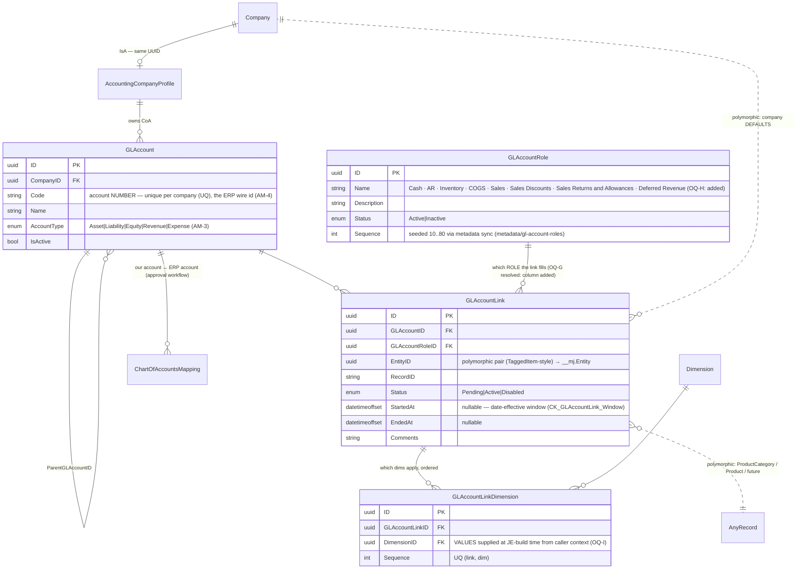
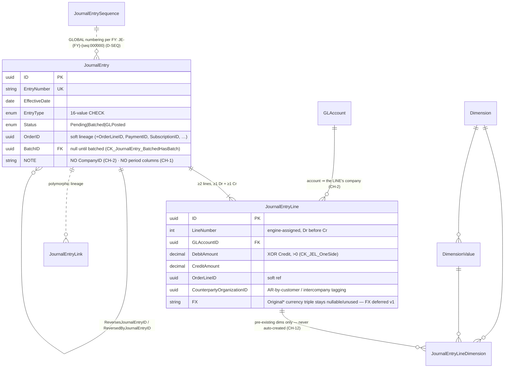
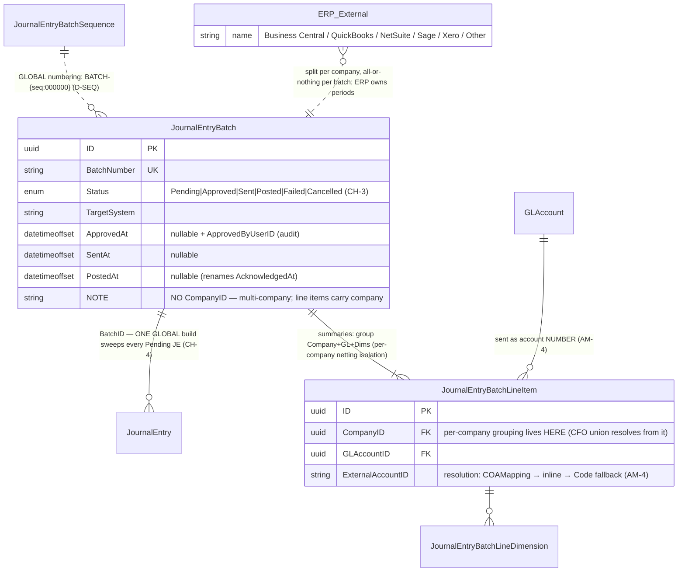

# ERD — bizapps-accounting (CURRENT schema)
**Rewritten 2026-07-06 — the engine-meeting rulings (AM-1..7) LANDED in the v1.0 baseline
(`migrations/B202605281200__v1.0.x__Schema_and_Tables.sql`).** 29 tables / 28 entities in schema
`__mj_BizAppsAccounting`; MJ entity names are `MJ_BizApps_Accounting: <PluralName>`. This is the
at-a-glance schema reference; keep it current with every migration (repo convention — Definition of Done).

**Removed from the previous schema:** ~~`AccountingPeriod`~~ ~~`AccountBalance`~~
~~`AccountBalanceByDimension`~~ + every period FK column + `JournalEntry.CompanyID` +
`JournalEntryBatch.CompanyID` (multi-company).
**New:** `GLAccountRole`, `GLAccountLink`, `GLAccountLinkDimension`.
**Changed:** `GLAccount.AccountType` → 5-enum · batch statuses → 6-value lifecycle · numbering
sequences → GLOBAL (D-SEQ). History/rationale: `plans/erd-accounting-target.md` (the review
artifact this landed from) + `plans/accounting-engine-plan.md` §4.

**How to read this:** Hard FK = enforced foreign key (relationship line / `FK`). *soft-ref* = a plain
UNIQUEIDENTIFIER with no FK — lineage to downstream apps without coupling (AD-15). External (not this
schema): `Company`, `User`, `File`, `Entity` (`__mj`), `Organization` (`__mj_BizAppsCommon`).

## Chart of accounts + the role/link system (AM-2/AM-5)

```mermaid
erDiagram
    Company ||--o| AccountingCompanyProfile : "IsA — same UUID"
    AccountingCompanyProfile ||--o{ GLAccount : "owns CoA"
    GLAccount ||--o{ GLAccount : "ParentGLAccountID"
    GLAccount ||--o{ GLAccountLink : ""
    GLAccountRole ||--o{ GLAccountLink : "which ROLE the link fills (OQ-G resolved: column added)"
    GLAccountLink ||--o{ GLAccountLinkDimension : "which dims apply, ordered"
    Dimension ||--o{ GLAccountLinkDimension : ""
    GLAccountLink }o..|| Company : "polymorphic: company DEFAULTS"
    GLAccountLink }o..|| AnyRecord : "polymorphic: ProductCategory / Product / future"
    GLAccount ||--o{ ChartOfAccountsMapping : "our account ↔ ERP account (approval workflow)"

    GLAccount { uuid ID PK
                uuid CompanyID FK
                string Code "account NUMBER — unique per company (UQ), the ERP wire id (AM-4)"
                string Name
                enum AccountType "Asset|Liability|Equity|Revenue|Expense (AM-3)"
                bool IsActive }
    GLAccountRole { uuid ID PK
                    string Name "Cash · AR · Inventory · COGS · Sales · Sales Discounts · Sales Returns and Allowances · Deferred Revenue (OQ-H: added)"
                    string Description
                    enum Status "Active|Inactive"
                    int Sequence "seeded 10..80 via metadata sync (metadata/gl-account-roles)" }
    GLAccountLink { uuid ID PK
                    uuid GLAccountID FK
                    uuid GLAccountRoleID FK
                    uuid EntityID "polymorphic pair (TaggedItem-style) → __mj.Entity"
                    string RecordID ""
                    enum Status "Pending|Active|Disabled"
                    datetimeoffset StartedAt "nullable — date-effective window (CK_GLAccountLink_Window)"
                    datetimeoffset EndedAt "nullable"
                    string Comments }
    GLAccountLinkDimension { uuid ID PK
                             uuid GLAccountLinkID FK
                             uuid DimensionID FK "VALUES supplied at JE-build time from caller context (OQ-I)"
                             int Sequence "UQ (link, dim)" }
```

The date-effective window is Amith's "new CoA effective Aug 1" scenario: enter the new link today with
StartedAt, EndedAt the old one; the engine's `ResolveLinkedAccount` (latest-start-wins over covering
Active windows) flips automatically; old JEs are never touched.

## Journal entries — multi-company, no periods

```mermaid
erDiagram
    JournalEntry ||--|{ JournalEntryLine : "≥2 lines, ≥1 Dr + ≥1 Cr"
    GLAccount ||--o{ JournalEntryLine : "account ⇒ the LINE's company (CH-2)"
    JournalEntryLine ||--o{ JournalEntryLineDimension : "pre-existing dims only — never auto-created (CH-12)"
    Dimension ||--o{ JournalEntryLineDimension : ""
    DimensionValue ||--o{ JournalEntryLineDimension : ""
    Dimension ||--o{ DimensionValue : ""
    JournalEntry ||--o{ JournalEntry : "ReversesJournalEntryID / ReversedByJournalEntryID"
    JournalEntry ||..o{ JournalEntryLink : "polymorphic lineage"
    JournalEntrySequence ||..o{ JournalEntry : "GLOBAL numbering per FY: JE-{FY}-{seq:000000} (D-SEQ)"

    JournalEntry { uuid ID PK
                   string EntryNumber UK
                   date EffectiveDate
                   enum EntryType "16-value CHECK"
                   enum Status "Pending|Batched|GLPosted"
                   uuid OrderID "soft lineage (+OrderLineID, PaymentID, SubscriptionID, …)"
                   uuid BatchID FK "null until batched (CK_JournalEntry_BatchedHasBatch)"
                   string NOTE "NO CompanyID (CH-2) · NO period columns (CH-1)" }
    JournalEntryLine { uuid ID PK
                       int LineNumber "engine-assigned, Dr before Cr"
                       uuid GLAccountID FK
                       decimal DebitAmount "XOR Credit, >0 (CK_JEL_OneSide)"
                       decimal CreditAmount ""
                       uuid OrderLineID "soft ref"
                       uuid CounterpartyOrganizationID "AR-by-customer / intercompany tagging"
                       string FX "Original* currency triple stays nullable/unused — FX deferred v1" }
```

**Balance rules:** Σ Dr = Σ Cr for the whole entry **and within each company** (AM-4) — company is
implicit via `GLAccount.CompanyID`; enforced in the ENGINE pipeline (typed `UNBALANCED` errors) AND the
balanced-on-lock triggers (**50001** overall, **50019** per company, **50022** line-change recheck).
Immutability after Batched/GLPosted: triggers **50003/50004/50006**. Reversal consistency: **50012**.

## Batching to the ERP (multi-company batches, 6-status lifecycle)

```mermaid
erDiagram
    JournalEntryBatch ||--o{ JournalEntry : "BatchID — ONE GLOBAL build sweeps every Pending JE (CH-4)"
    JournalEntryBatch ||--|{ JournalEntryBatchLineItem : "summaries: group Company+GL+Dims (per-company netting isolation)"
    JournalEntryBatchLineItem ||--o{ JournalEntryBatchLineDimension : ""
    GLAccount ||--o{ JournalEntryBatchLineItem : "sent as account NUMBER (AM-4)"
    JournalEntryBatchSequence ||..o{ JournalEntryBatch : "GLOBAL numbering: BATCH-{seq:000000} (D-SEQ)"
    ERP_External }o..|| JournalEntryBatch : "split per company, all-or-nothing per batch; ERP owns periods"

    JournalEntryBatch { uuid ID PK
                        string BatchNumber UK
                        enum Status "Pending|Approved|Sent|Posted|Failed|Cancelled (CH-3)"
                        string TargetSystem
                        datetimeoffset ApprovedAt "nullable + ApprovedByUserID (audit)"
                        datetimeoffset SentAt "nullable"
                        datetimeoffset PostedAt "nullable (renames AcknowledgedAt)"
                        string NOTE "NO CompanyID — multi-company; line items carry company" }
    JournalEntryBatchLineItem { uuid ID PK
                                uuid CompanyID FK "per-company grouping lives HERE (CFO union resolves from it)"
                                uuid GLAccountID FK
                                string ExternalAccountID "resolution: COAMapping → inline → Code fallback (AM-4)" }
    ERP_External { string name "Business Central / QuickBooks / NetSuite / Sage / Xero / Other" }
```

**Status meanings:** Pending = mutable · Approved = human-locked (CFO decision recorded via the
bizapps-tasks gate; the decision also flips the status) · Sent = on the wire · Posted = ERP confirmed ·
Failed = ERP rejected (`ErrorMessage`; retryable) · Cancelled = terminal. Batch triggers: summary foots
overall (**50014**) and **per company (50023)**; immutability once Approved+ (**50008/50009/50013**).

## Kept but parked (out of the fence)

- **Scheduled JEs** (3 tables) — schedules keyed by `ScheduledEffectiveDate` only; **NO central
  materializer (AM-6)** — domain entity servers generate the real JE and flip the row to Generated
  (`CK_SJE_GeneratedCoherence`, locks **50016/50017/50018**).
- **Tax** (6 tables) — `TaxLiability` period column dropped; otherwise untouched; v1-not-phase-1.
- **Plumbing** — `ChartOfAccountsMapping` (+ `CK_COAMapping_ApprovalCoherence`), the two GLOBAL
  sequences, `JournalEntryLink`, `Currency`/`CurrencySpotRate`.
- **Read models** — 12 `vw_*` reporting views (NOT entities): trial balance, JE audit trail, month-grain
  AR↔GL recon + deferred-revenue rollforward (on `EffectiveDate` — periods are gone), dimension P&L,
  batch dispatch status (+CompanyCount), scheduled-JE summary, FX exposure, AR open/aging by customer,
  sales-tax liability, intercompany flow.

## Removed, and why that's safe

| Gone | Why |
|---|---|
| `AccountingPeriod` + every FK to it | company-specific + ERP-owned; multi-company JEs made ours a liability (CH-1) |
| `AccountBalance` / `AccountBalanceByDimension` | balance tracking is the ERP's job (AM-1) |
| `JournalEntry.CompanyID` / `JournalEntryBatch.CompanyID` | entries + batches span companies (CH-2/CH-4) |
| W4 routing · period-close triggers · the SJE materializer | all period-dependent (CH-1/AM-6) |
