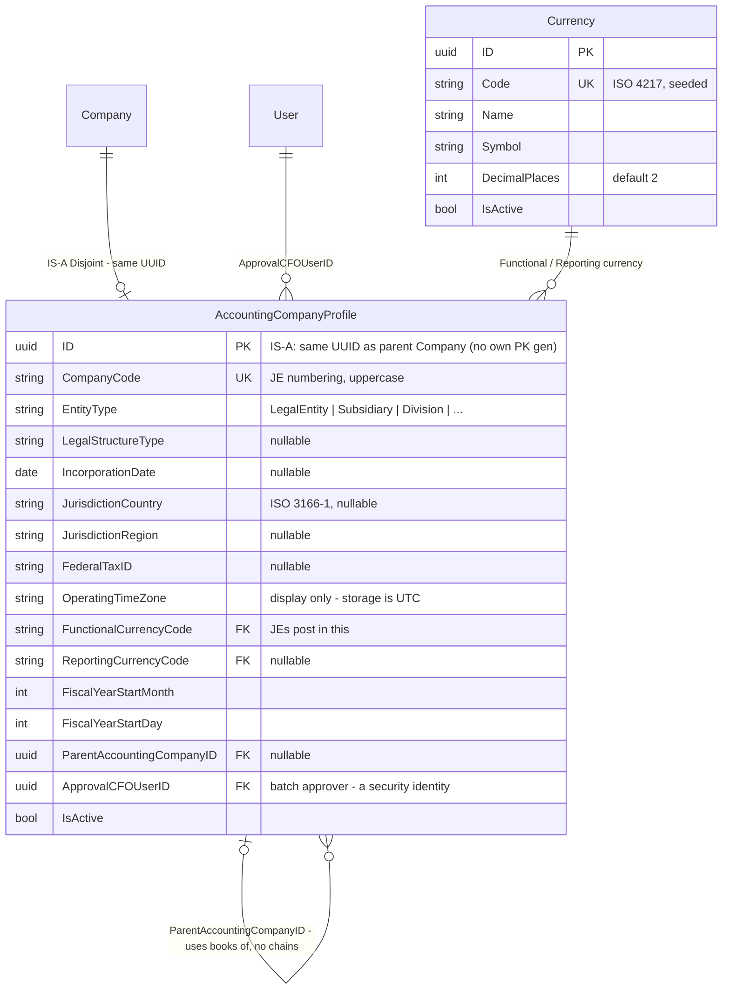
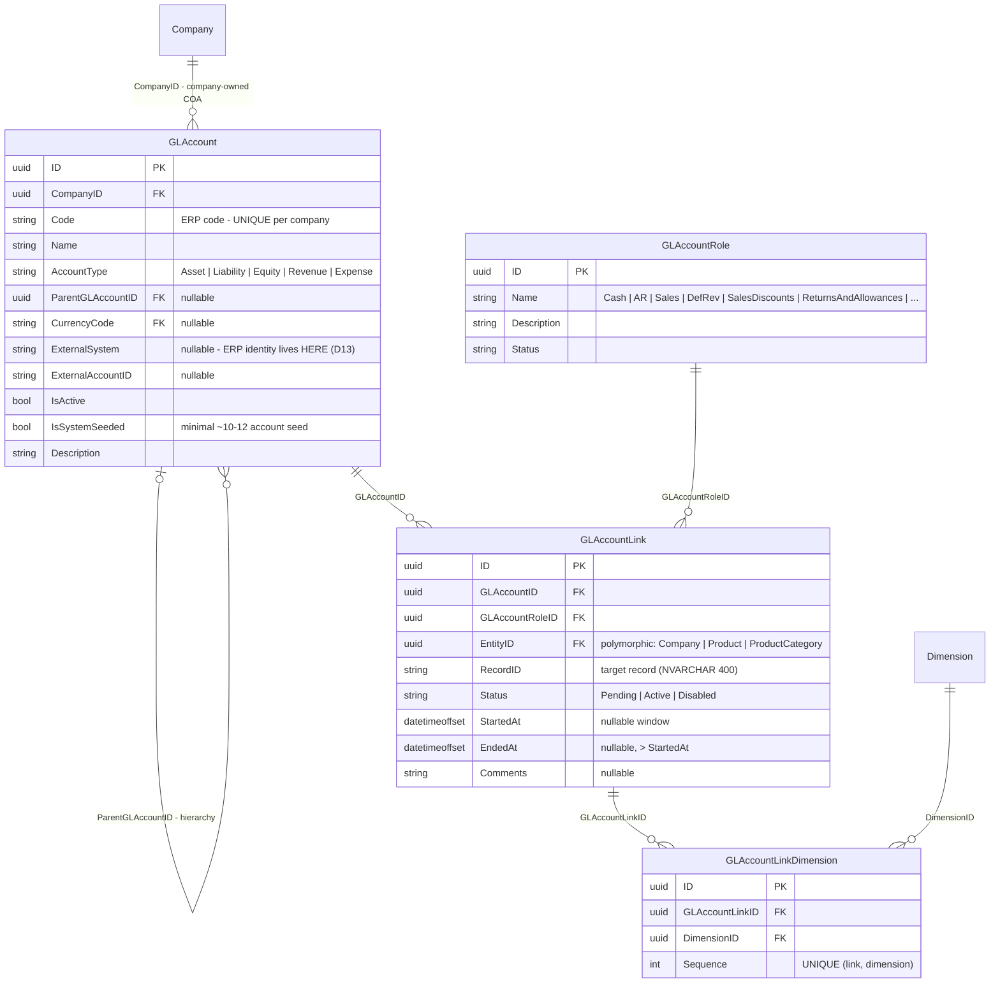
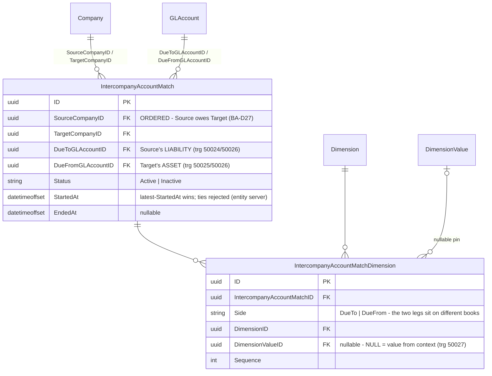
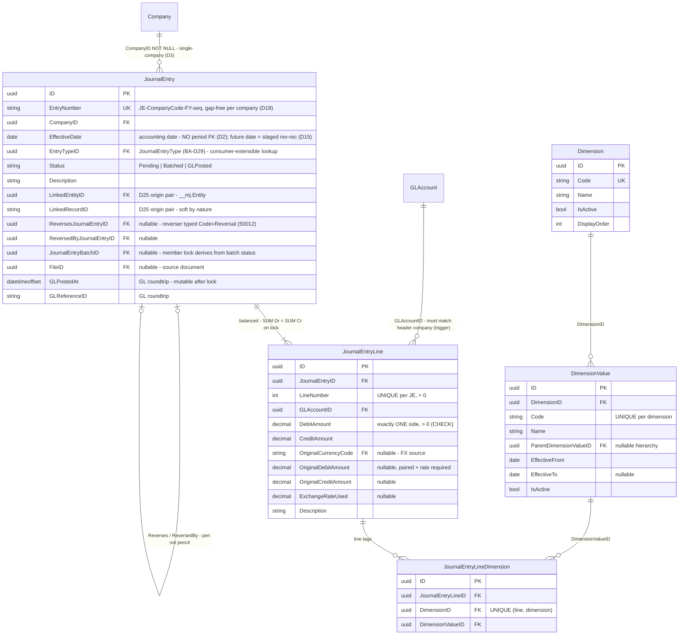
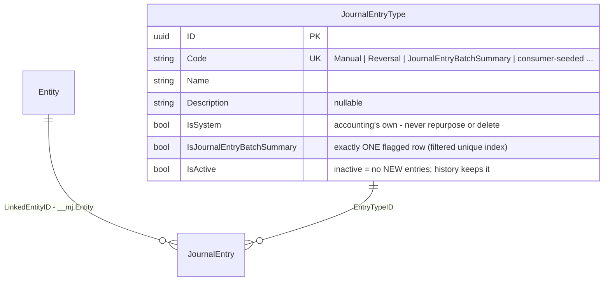
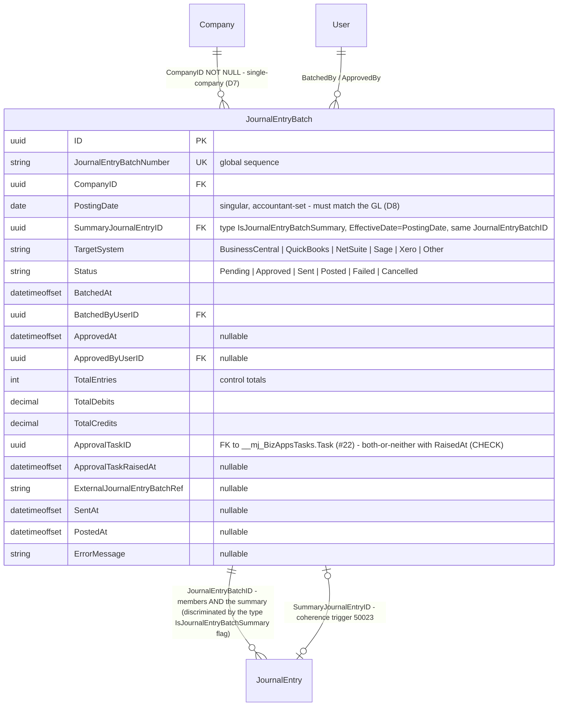
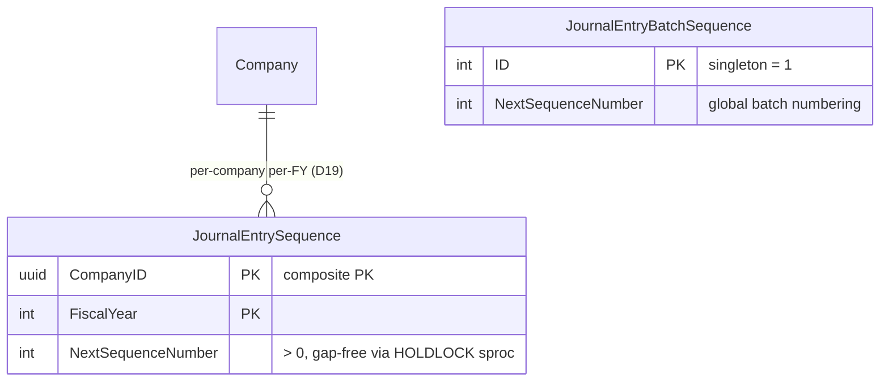
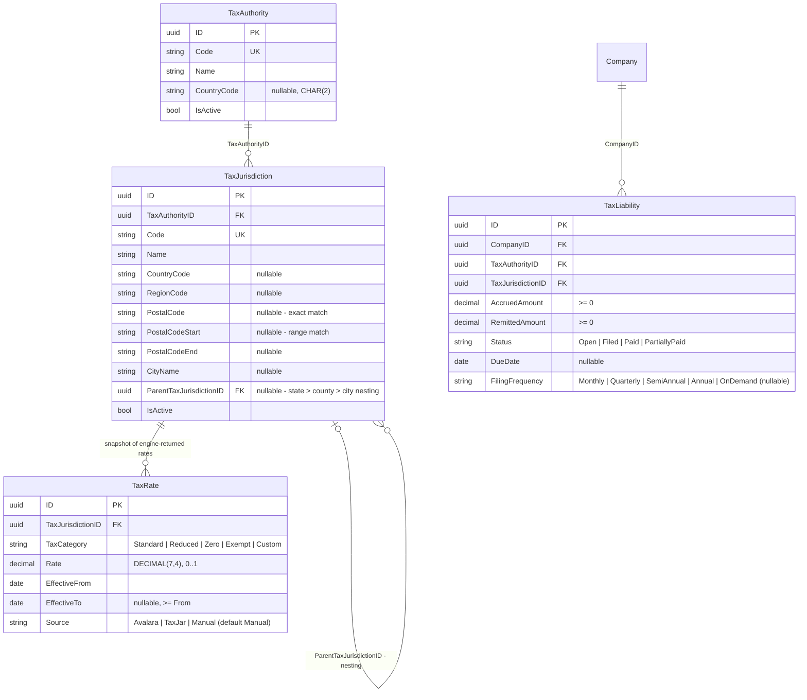
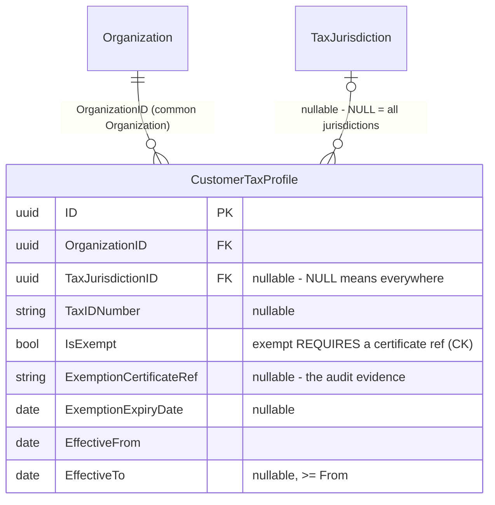
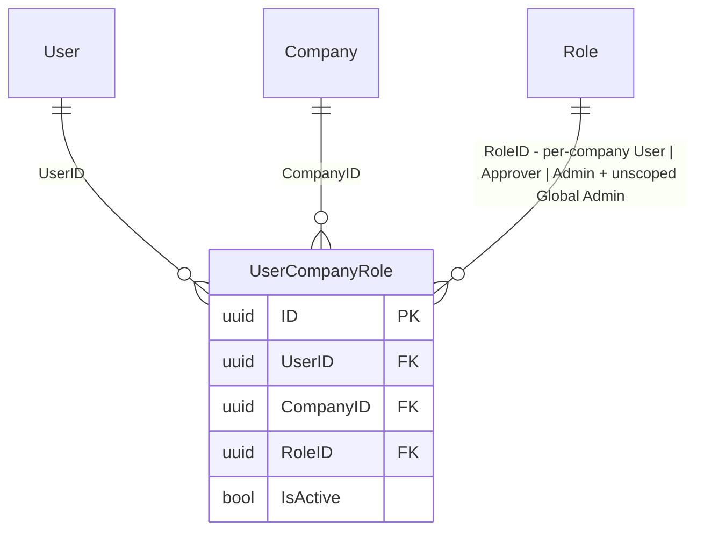

# BizApps Accounting — full ERD (CURRENT schema, sectioned)

> The at-a-glance schema reference for `__mj_BizAppsAccounting` (baseline
> `migrations/B202605281200__v1.0.x__Schema_and_Tables.sql`); MJ entity names are
> `MJ_BizApps_Accounting: <PluralName>`. Keep it current with every migration
> (repo convention — Definition of Done). Each section is deliberately NARROW
> (≤5 entity boxes) so it renders full-size on a 13" laptop — open in VS Code
> Markdown preview, or paste a block into https://mermaid.live to zoom.
>
> **Current as of 2026-07-27** (schema realignment, issues #22 + #24):
> - **NEW `JournalEntryType`** (BA-D29) — extensible JE classification replacing the closed
>   `EntryType` CHECK enum; `JournalEntry.EntryTypeID` FK; `IsJournalEntryBatchSummary` flag replaces the
>   `'JournalEntryBatchSummary'` magic string; accounting seeds only its 8 system rows, consuming apps
>   seed their domain types.
> - **DROPPED `AccountingCompanyProfile.DefaultPaymentTermsTypeID`** (BA-D30) — accounting
>   never references its dependents, hard or soft; per-company default terms move to orders.
> - **`IntercompanyAccountMatch` + `IntercompanyAccountMatchDimension`** (BA-D26..D28,
>   merged 2026-07-26) — the ordered per-company-pair Due To / Due From lookup.
>
> **How to read this:** a relationship line / `FK` = enforced foreign key. **IS-A** (subtype)
> relationships are explicitly labeled `IS-A Disjoint - same UUID` — the child row shares the
> parent's primary key (one table today: `AccountingCompanyProfile` IS-A `__mj.Company`; never
> insert the child without its parent). Everything else, including every `*Dimension` child
> table, is plain composition — a child/config row REFERENCING its parents, not a subtype. Cross-app references
> point UP the dependency graph only and are REAL FKs (issue #22); the ONE sanctioned downstream
> lineage is the polymorphic D25 origin pair (`LinkedEntityID` hard-FK to `__mj.Entity` +
> `LinkedRecordID`, soft by nature). External (not this schema): `Company`, `User`, `File`,
> `Entity` (`__mj`), `Organization` (`__mj_BizAppsCommon`).

---

## 0. Package & domain map (boxed)

```mermaid
flowchart TD
    subgraph MJCore["__mj  (MJ core)"]
        direction LR
        Company[Company]
        User[User]
        Role[Role]
        Entity[Entity]
    end

    subgraph Common["BizApps Common"]
        Organization[Organization]
    end

    subgraph Accounting["BizApps Accounting  (__mj_BizAppsAccounting)"]
        direction TB
        subgraph Setup["Company setup & currency"]
            ACP[AccountingCompanyProfile]
            Currency[Currency]
            CSR[CurrencySpotRate]
        end
        subgraph COA["Chart of accounts & role links"]
            GLAccount[GLAccount]
            GLAccountRole[GLAccountRole]
            GLAccountLink[GLAccountLink]
            GLALD[GLAccountLinkDimension]
        end
        subgraph Dims["Dimensions"]
            Dimension[Dimension]
            DimensionValue[DimensionValue]
        end
        subgraph JEs["Journal entries"]
            JEType[JournalEntryType]
            JournalEntry[JournalEntry]
            JournalEntryLine[JournalEntryLine]
            JELD[JournalEntryLineDimension]
        end
        subgraph Intercompany["Intercompany lookup (BA-D26..D28)"]
            IAM[IntercompanyAccountMatch]
            IAMD[IntercompanyAccountMatchDimension]
        end
        subgraph Batching["Batching & numbering"]
            Batch[JournalEntryBatch]
            JESeq[JournalEntrySequence]
            BatchSeq[JournalEntryBatchSequence]
        end
        subgraph Tax["Tax (engine-recorded)"]
            TaxAuthority[TaxAuthority]
            TaxJurisdiction[TaxJurisdiction]
            TaxRate[TaxRate]
            TaxLiability[TaxLiability]
            CTP[CustomerTaxProfile]
        end
        subgraph Perms["Permissions (planned)"]
            UCR[UserCompanyRole]
        end
    end

    Company -->|IS-A Disjoint - same UUID| ACP
    User -->|ApprovalCFOUserID| ACP
    Currency --> ACP
    Currency --> CSR
    Company -->|owns COA| GLAccount
    Currency --> GLAccount
    GLAccount --> GLAccountLink
    GLAccountRole --> GLAccountLink
    Entity -->|polymorphic target| GLAccountLink
    GLAccountLink --> GLALD
    Dimension --> GLALD
    Dimension --> DimensionValue
    Company -->|single-company D3| JournalEntry
    JournalEntry --> JournalEntryLine
    GLAccount -->|company-match| JournalEntryLine
    Currency -->|original ccy| JournalEntryLine
    JournalEntry -.->|Reverses / ReversedBy| JournalEntry
    JournalEntryLine --> JELD
    DimensionValue --> JELD
    JEType -->|EntryTypeID BA-D29| JournalEntry
    Entity -->|D25 origin pair LinkedEntityID| JournalEntry
    Company -->|Source / Target ordered pair| IAM
    GLAccount -->|DueTo / DueFrom| IAM
    IAM --> IAMD
    Dimension --> IAMD
    Company -->|single-company D7| Batch
    Batch -->|JournalEntryBatchID: members + summary| JournalEntry
    Batch -.->|SummaryJournalEntryID| JournalEntry
    User -->|batched / approved by| Batch
    Company --> JESeq
    TaxAuthority --> TaxJurisdiction
    TaxJurisdiction --> TaxRate
    Company --> TaxLiability
    TaxAuthority --> TaxLiability
    TaxJurisdiction --> TaxLiability
    Organization --> CTP
    TaxJurisdiction --> CTP
    User --> UCR
    Company --> UCR
    Role --> UCR
```

---

## 0b. Everything, one diagram — full detail (zoom & pan)

```mermaid
%%{init: {"er": {"layoutDirection": "TB"}} }%%
erDiagram
    %% ---- company / profile / currency ----
    Company ||--o| AccountingCompanyProfile : "IS-A Disjoint - same UUID"
    User ||--o{ AccountingCompanyProfile : "ApprovalCFOUserID"
    Currency ||--o{ AccountingCompanyProfile : "Functional / Reporting"
    AccountingCompanyProfile |o--o{ AccountingCompanyProfile : "uses books of (no chains)"
    Currency ||--o{ CurrencySpotRate : "From / To"
    %% ---- chart of accounts / roles / links ----
    Company ||--o{ GLAccount : "owns COA"
    GLAccount |o--o{ GLAccount : "ParentGLAccountID"
    Currency ||--o{ GLAccount : "CurrencyCode"
    GLAccount ||--o{ GLAccountLink : "GLAccountID"
    GLAccountRole ||--o{ GLAccountLink : "GLAccountRoleID"
    Entity ||--o{ GLAccountLink : "EntityID (Company | Product | Category)"
    GLAccountLink ||--o{ GLAccountLinkDimension : ""
    Dimension ||--o{ GLAccountLinkDimension : ""
    %% ---- journal entries ----
    Company ||--o{ JournalEntry : "single-company (D3)"
    JournalEntry ||--|{ JournalEntryLine : "balanced on lock"
    GLAccount ||--o{ JournalEntryLine : "company-match trigger"
    Currency ||--o{ JournalEntryLine : "OriginalCurrencyCode"
    JournalEntry |o--o| JournalEntry : "Reverses / ReversedBy"
    JournalEntryType ||--o{ JournalEntry : "EntryTypeID (BA-D29)"
    JournalEntryLine ||--o{ JournalEntryLineDimension : ""
    Dimension ||--o{ DimensionValue : ""
    DimensionValue |o--o{ DimensionValue : "parent"
    DimensionValue ||--o{ JournalEntryLineDimension : ""
    Entity ||--o{ JournalEntry : "LinkedEntityID (D25 origin pair)"
    %% ---- intercompany lookup (BA-D26..D28) ----
    Company ||--o{ IntercompanyAccountMatch : "Source / Target (ordered pair)"
    GLAccount ||--o{ IntercompanyAccountMatch : "DueTo (Source's liability) / DueFrom (Target's asset)"
    IntercompanyAccountMatch ||--o{ IntercompanyAccountMatchDimension : "per-Side dimension pins"
    Dimension ||--o{ IntercompanyAccountMatchDimension : ""
    IntercompanyAccountMatch {
        uuid ID PK
        uuid SourceCompanyID FK "ORDERED - Source owes Target (BA-D27)"
        uuid TargetCompanyID FK "reverse direction = a SEPARATE row"
        uuid DueToGLAccountID FK "Source's LIABILITY (trg 50024/50026)"
        uuid DueFromGLAccountID FK "Target's ASSET (trg 50025/50026)"
        string Status "Active | Inactive"
        datetimeoffset StartedAt "latest wins; Active tie refused (entity server)"
        datetimeoffset EndedAt "nullable - open window"
    }
    IntercompanyAccountMatchDimension {
        uuid ID PK
        uuid IntercompanyAccountMatchID FK
        string Side "DueTo | DueFrom - legs sit on different books"
        uuid DimensionID FK
        uuid DimensionValueID FK "nullable - NULL = value from context (trg 50027)"
        int Sequence
    }
    %% ---- batching ----
    Company ||--o{ JournalEntryBatch : "single-company (D7)"
    JournalEntryBatch ||--o{ JournalEntry : "JournalEntryBatchID (members + summary, by IsJournalEntryBatchSummary type)"
    JournalEntryBatch |o--o| JournalEntry : "SummaryJournalEntryID"
    User ||--o{ JournalEntryBatch : "BatchedBy / ApprovedBy"
    Company ||--o{ JournalEntrySequence : "per-company per-FY numbering"
    %% ---- tax ----
    TaxAuthority ||--o{ TaxJurisdiction : ""
    TaxJurisdiction |o--o{ TaxJurisdiction : "nesting"
    TaxJurisdiction ||--o{ TaxRate : "engine snapshots"
    Company ||--o{ TaxLiability : ""
    TaxAuthority ||--o{ TaxLiability : ""
    TaxJurisdiction ||--o{ TaxLiability : ""
    Organization ||--o{ CustomerTaxProfile : ""
    TaxJurisdiction |o--o{ CustomerTaxProfile : ""
    %% ---- permissions (planned) ----
    User ||--o{ UserCompanyRole : ""
    Company ||--o{ UserCompanyRole : ""
    Role ||--o{ UserCompanyRole : "per-company User | Approver | Admin"

    AccountingCompanyProfile {
        uuid ID PK "IS-A: same UUID as parent Company (no own PK gen)"
        string CompanyCode UK
        string EntityType
        string LegalStructureType
        date IncorporationDate
        string JurisdictionCountry
        string JurisdictionRegion
        string FederalTaxID
        string OperatingTimeZone "display only - UTC storage"
        string FunctionalCurrencyCode FK
        string ReportingCurrencyCode FK
        int FiscalYearStartMonth
        int FiscalYearStartDay
        uuid ParentAccountingCompanyID FK
        uuid ApprovalCFOUserID FK
        bool IsActive
    }
    Currency {
        uuid ID PK
        string Code UK "ISO 4217"
        string Name
        string Symbol
        int DecimalPlaces
        bool IsActive
    }
    CurrencySpotRate {
        uuid ID PK
        string FromCurrencyCode FK
        string ToCurrencyCode FK
        date RateDate
        decimal Rate
        bool IsActive
    }
    GLAccount {
        uuid ID PK
        uuid CompanyID FK
        string Code "UNIQUE per company"
        string Name
        string AccountType "Asset | Liability | Equity | Revenue | Expense"
        uuid ParentGLAccountID FK
        string CurrencyCode FK
        string ExternalSystem "ERP identity (D13)"
        string ExternalAccountID
        bool IsActive
        bool IsSystemSeeded
        string Description
    }
    GLAccountRole {
        uuid ID PK
        string Name "AR | Sales | DefRev | SalesDiscounts | ReturnsAndAllowances | ..."
        string Description
        string Status
    }
    GLAccountLink {
        uuid ID PK
        uuid GLAccountID FK
        uuid GLAccountRoleID FK
        uuid EntityID FK "polymorphic"
        string RecordID
        string Status "Pending | Active | Disabled"
        datetimeoffset StartedAt
        datetimeoffset EndedAt
        string Comments
    }
    GLAccountLinkDimension {
        uuid ID PK
        uuid GLAccountLinkID FK
        uuid DimensionID FK
        int Sequence
    }
    Dimension {
        uuid ID PK
        string Code UK
        string Name
        bool IsActive
        int DisplayOrder
    }
    DimensionValue {
        uuid ID PK
        uuid DimensionID FK
        string Code
        string Name
        uuid ParentDimensionValueID FK
        date EffectiveFrom
        date EffectiveTo
        bool IsActive
    }
    JournalEntryType {
        uuid ID PK
        string Code UK "Manual | Reversal | JournalEntryBatchSummary | consumer-seeded ..."
        string Name
        bool IsSystem "accounting's own - do not repurpose"
        bool IsJournalEntryBatchSummary "exactly one flagged row (filtered UX)"
        bool IsActive
    }
    JournalEntry {
        uuid ID PK
        string EntryNumber UK "JE-CompanyCode-FY-seq gap-free"
        uuid CompanyID FK
        date EffectiveDate "future date = staged rev-rec (D15)"
        uuid EntryTypeID FK "JournalEntryType (BA-D29)"
        string Status "Pending | Batched | GLPosted"
        string Description
        uuid LinkedEntityID FK "D25 origin pair - __mj.Entity"
        string LinkedRecordID "D25 origin pair - soft by nature"
        uuid ReversesJournalEntryID FK
        uuid ReversedByJournalEntryID FK
        uuid JournalEntryBatchID FK "lock derives from batch status"
        uuid FileID FK
        datetimeoffset GLPostedAt
        string GLReferenceID
    }
    JournalEntryLine {
        uuid ID PK
        uuid JournalEntryID FK
        int LineNumber "UNIQUE per JE"
        uuid GLAccountID FK
        decimal DebitAmount "one side only"
        decimal CreditAmount
        string OriginalCurrencyCode FK
        decimal OriginalDebitAmount
        decimal OriginalCreditAmount
        decimal ExchangeRateUsed
        string Description
    }
    JournalEntryLineDimension {
        uuid ID PK
        uuid JournalEntryLineID FK
        uuid DimensionID FK
        uuid DimensionValueID FK
    }
    JournalEntryBatch {
        uuid ID PK
        string JournalEntryBatchNumber UK "global sequence"
        uuid CompanyID FK
        date PostingDate "must match the GL (D8)"
        uuid SummaryJournalEntryID FK "summary JE (type flagged IsJournalEntryBatchSummary)"
        string TargetSystem
        string Status "Pending | Approved | Sent | Posted | Failed | Cancelled"
        datetimeoffset BatchedAt
        uuid BatchedByUserID FK
        datetimeoffset ApprovedAt
        uuid ApprovedByUserID FK
        int TotalEntries
        decimal TotalDebits
        decimal TotalCredits
        uuid ApprovalTaskID "FK to __mj_BizAppsTasks.Task (#22)"
        datetimeoffset ApprovalTaskRaisedAt
        string ExternalJournalEntryBatchRef
        datetimeoffset SentAt
        datetimeoffset PostedAt
        string ErrorMessage
    }
    JournalEntrySequence {
        uuid CompanyID PK
        int FiscalYear PK
        int NextSequenceNumber
    }
    JournalEntryBatchSequence {
        int ID PK "singleton = 1"
        int NextSequenceNumber
    }
    TaxAuthority {
        uuid ID PK
        string Code UK
        string Name
        string CountryCode
        bool IsActive
    }
    TaxJurisdiction {
        uuid ID PK
        uuid TaxAuthorityID FK
        string Code UK
        string Name
        string CountryCode
        string RegionCode
        string PostalCode
        string CityName
        uuid ParentTaxJurisdictionID FK
    }
    TaxRate {
        uuid ID PK
        uuid TaxJurisdictionID FK
        string TaxCategory "Standard | Reduced | Zero | Exempt | Custom"
        decimal Rate "0..1"
        date EffectiveFrom
        date EffectiveTo
        string Source "Avalara | TaxJar | Manual"
    }
    TaxLiability {
        uuid ID PK
        uuid CompanyID FK
        uuid TaxAuthorityID FK
        uuid TaxJurisdictionID FK
        decimal AccruedAmount
        decimal RemittedAmount
        string Status "Open | Filed | Paid | PartiallyPaid"
        date DueDate
        string FilingFrequency
    }
    CustomerTaxProfile {
        uuid ID PK
        uuid OrganizationID FK "common Organization"
        uuid TaxJurisdictionID FK
        string TaxIDNumber
        bool IsExempt "cert required when exempt"
        string ExemptionCertificateRef
        date ExemptionExpiryDate
        date EffectiveFrom
        date EffectiveTo
    }
    UserCompanyRole {
        uuid ID PK
        uuid UserID FK
        uuid CompanyID FK
        uuid RoleID FK
        bool IsActive
    }
```

---

## 1. Company, profile & currency

```mermaid
erDiagram
    Company ||--o| AccountingCompanyProfile : "IS-A Disjoint - same UUID"
    User ||--o{ AccountingCompanyProfile : "ApprovalCFOUserID"
    Currency ||--o{ AccountingCompanyProfile : "Functional / Reporting currency"
    AccountingCompanyProfile |o--o{ AccountingCompanyProfile : "ParentAccountingCompanyID - uses books of, no chains"

    AccountingCompanyProfile {
        uuid ID PK "IS-A: same UUID as parent Company (no own PK gen)"
        string CompanyCode UK "JE numbering, uppercase"
        string EntityType "LegalEntity | Subsidiary | Division | ..."
        string LegalStructureType "nullable"
        date IncorporationDate "nullable"
        string JurisdictionCountry "ISO 3166-1, nullable"
        string JurisdictionRegion "nullable"
        string FederalTaxID "nullable"
        string OperatingTimeZone "display only - storage is UTC"
        string FunctionalCurrencyCode FK "JEs post in this"
        string ReportingCurrencyCode FK "nullable"
        int FiscalYearStartMonth
        int FiscalYearStartDay
        uuid ParentAccountingCompanyID FK "nullable"
        uuid ApprovalCFOUserID FK "batch approver - a security identity"
        bool IsActive
    }
    Currency {
        uuid ID PK
        string Code UK "ISO 4217, seeded"
        string Name
        string Symbol
        int DecimalPlaces "default 2"
        bool IsActive
    }
```

**Absent by design:** the five default-GL-account FK columns — company defaults are
company-level `GLAccountLink` rows (D12). `CurrencySpotRate` exists (from/to/rate/date) for
future FX; FX computation itself is upstream (D16).

---

## 2. Chart of accounts, roles & account links

```mermaid
erDiagram
    Company ||--o{ GLAccount : "CompanyID - company-owned COA"
    GLAccount |o--o{ GLAccount : "ParentGLAccountID - hierarchy"
    GLAccount ||--o{ GLAccountLink : "GLAccountID"
    GLAccountRole ||--o{ GLAccountLink : "GLAccountRoleID"
    GLAccountLink ||--o{ GLAccountLinkDimension : "GLAccountLinkID"
    Dimension ||--o{ GLAccountLinkDimension : "DimensionID"

    GLAccount {
        uuid ID PK
        uuid CompanyID FK
        string Code "ERP code - UNIQUE per company"
        string Name
        string AccountType "Asset | Liability | Equity | Revenue | Expense"
        uuid ParentGLAccountID FK "nullable"
        string CurrencyCode FK "nullable"
        string ExternalSystem "nullable - ERP identity lives HERE (D13)"
        string ExternalAccountID "nullable"
        bool IsActive
        bool IsSystemSeeded "minimal ~10-12 account seed"
        string Description
    }
    GLAccountRole {
        uuid ID PK
        string Name "Cash | AR | Sales | DefRev | SalesDiscounts | ReturnsAndAllowances | ..."
        string Description
        string Status
    }
    GLAccountLink {
        uuid ID PK
        uuid GLAccountID FK
        uuid GLAccountRoleID FK
        uuid EntityID FK "polymorphic: Company | Product | ProductCategory"
        string RecordID "target record (NVARCHAR 400)"
        string Status "Pending | Active | Disabled"
        datetimeoffset StartedAt "nullable window"
        datetimeoffset EndedAt "nullable, > StartedAt"
        string Comments "nullable"
    }
    GLAccountLinkDimension {
        uuid ID PK
        uuid GLAccountLinkID FK
        uuid DimensionID FK
        int Sequence "UNIQUE (link, dimension)"
    }
```

**Resolution walk:** product link → product-company's own category tree → company default →
loud tripwire. Cross-company links hard-blocked; revenue side anchors to the product-company,
AR/cash side to the order-owning company (§5.3).

---

## 2b. Intercompany account matching (BA-D26..D28, merged 2026-07-26)

```mermaid
erDiagram
    Company ||--o{ IntercompanyAccountMatch : "SourceCompanyID / TargetCompanyID"
    GLAccount ||--o{ IntercompanyAccountMatch : "DueToGLAccountID / DueFromGLAccountID"
    IntercompanyAccountMatch ||--o{ IntercompanyAccountMatchDimension : ""
    Dimension ||--o{ IntercompanyAccountMatchDimension : ""
    DimensionValue |o--o{ IntercompanyAccountMatchDimension : "nullable pin"

    IntercompanyAccountMatch {
        uuid ID PK
        uuid SourceCompanyID FK "ORDERED - Source owes Target (BA-D27)"
        uuid TargetCompanyID FK
        uuid DueToGLAccountID FK "Source's LIABILITY (trg 50024/50026)"
        uuid DueFromGLAccountID FK "Target's ASSET (trg 50025/50026)"
        string Status "Active | Inactive"
        datetimeoffset StartedAt "latest-StartedAt wins; ties rejected (entity server)"
        datetimeoffset EndedAt "nullable"
    }
    IntercompanyAccountMatchDimension {
        uuid ID PK
        uuid IntercompanyAccountMatchID FK
        string Side "DueTo | DueFrom - the two legs sit on different books"
        uuid DimensionID FK
        uuid DimensionValueID FK "nullable - NULL = value from context (trg 50027)"
        int Sequence
    }
```

The per-company-pair lookup answering: when Source collects cash settling Target's line, which two
accounts carry the obligation? Orders (the payment emitter) builds the entries; accounting owns the
mapping. A missing pair is a HARD failure at emit time — never a fallback (a guessed account still
balances). Resolution: `AccountingEngineBase.ResolveIntercompanyAccounts`.

---

## 3. Journal entries, lines & dimensions

```mermaid
erDiagram
    Company ||--o{ JournalEntry : "CompanyID NOT NULL - single-company (D3)"
    JournalEntry ||--|{ JournalEntryLine : "balanced - SUM Dr = SUM Cr on lock"
    GLAccount ||--o{ JournalEntryLine : "GLAccountID - must match header company (trigger)"
    JournalEntry |o--o| JournalEntry : "Reverses / ReversedBy - pen not pencil"
    JournalEntryLine ||--o{ JournalEntryLineDimension : "line tags"
    Dimension ||--o{ DimensionValue : "DimensionID"
    DimensionValue ||--o{ JournalEntryLineDimension : "DimensionValueID"

    JournalEntry {
        uuid ID PK
        string EntryNumber UK "JE-CompanyCode-FY-seq, gap-free per company (D19)"
        uuid CompanyID FK
        date EffectiveDate "accounting date - NO period FK (D2); future date = staged rev-rec (D15)"
        uuid EntryTypeID FK "JournalEntryType (BA-D29) - consumer-extensible lookup"
        string Status "Pending | Batched | GLPosted"
        string Description
        uuid LinkedEntityID FK "D25 origin pair - __mj.Entity"
        string LinkedRecordID "D25 origin pair - soft by nature"
        uuid ReversesJournalEntryID FK "nullable - reverser typed Code=Reversal (50012)"
        uuid ReversedByJournalEntryID FK "nullable"
        uuid JournalEntryBatchID FK "nullable - member lock derives from batch status"
        uuid FileID FK "nullable - source document"
        datetimeoffset GLPostedAt "GL roundtrip - mutable after lock"
        string GLReferenceID "GL roundtrip"
    }
    JournalEntryLine {
        uuid ID PK
        uuid JournalEntryID FK
        int LineNumber "UNIQUE per JE, > 0"
        uuid GLAccountID FK
        decimal DebitAmount "exactly ONE side, > 0 (CHECK)"
        decimal CreditAmount
        string OriginalCurrencyCode FK "nullable - FX source"
        decimal OriginalDebitAmount "nullable, paired + rate required"
        decimal OriginalCreditAmount "nullable"
        decimal ExchangeRateUsed "nullable"
        string Description
    }
    JournalEntryLineDimension {
        uuid ID PK
        uuid JournalEntryLineID FK
        uuid DimensionID FK "UNIQUE (line, dimension)"
        uuid DimensionValueID FK
    }
    Dimension {
        uuid ID PK
        string Code UK
        string Name
        bool IsActive
        int DisplayOrder
    }
    DimensionValue {
        uuid ID PK
        uuid DimensionID FK
        string Code "UNIQUE per dimension"
        string Name
        uuid ParentDimensionValueID FK "nullable hierarchy"
        date EffectiveFrom
        date EffectiveTo "nullable"
        bool IsActive
    }
```

---

## 4. JE origin lineage (D25 polymorphic origin pair) + entry types (BA-D29)

```mermaid
erDiagram
    Entity ||--o{ JournalEntry : "LinkedEntityID - __mj.Entity"
    JournalEntryType ||--o{ JournalEntry : "EntryTypeID"

    JournalEntryType {
        uuid ID PK
        string Code UK "Manual | Reversal | JournalEntryBatchSummary | consumer-seeded ..."
        string Name
        string Description "nullable"
        bool IsSystem "accounting's own - never repurpose or delete"
        bool IsJournalEntryBatchSummary "exactly ONE flagged row (filtered unique index)"
        bool IsActive "inactive = no NEW entries; history keeps it"
    }
```

**Origin lineage (D25):** every JE has at most ONE causal source record — `LinkedEntityID` (hard FK
to `__mj.Entity`) + `LinkedRecordID` (the target's PK, NVARCHAR 400 — soft by nature, the record
lives in a downstream schema). Both NULL = manual JE (`CK_JournalEntry_LinkedPair`). This replaced
the per-entity soft-ref columns AND the `JournalEntryLink` table.

**Entry types (BA-D29, issue #24):** the classification is an extensible lookup, not a closed enum.
Accounting seeds only its ledger-mechanics rows (`IsSystem=1`, via `metadata/journal-entry-types/`):
Manual, Reversal, Adjustment, OpeningBalance, JournalEntryBatchSummary, FXRevaluation, PeriodEndAccrual,
Writeoff. Domain types (OrderBooking, PaymentReceipt, ...) are seeded by their owning app via
`mj sync push`. Triggers 50012 (reversal typing) and 50023 (summary coherence) join this table.

---

## 5. Batching & ERP dispatch (summary-JE model)

```mermaid
erDiagram
    Company ||--o{ JournalEntryBatch : "CompanyID NOT NULL - single-company (D7)"
    JournalEntryBatch ||--o{ JournalEntry : "JournalEntryBatchID - members AND the summary (discriminated by the type IsJournalEntryBatchSummary flag)"
    JournalEntryBatch |o--o| JournalEntry : "SummaryJournalEntryID - coherence trigger 50023"
    User ||--o{ JournalEntryBatch : "BatchedBy / ApprovedBy"

    JournalEntryBatch {
        uuid ID PK
        string JournalEntryBatchNumber UK "global sequence"
        uuid CompanyID FK
        date PostingDate "singular, accountant-set - must match the GL (D8)"
        uuid SummaryJournalEntryID FK "type IsJournalEntryBatchSummary, EffectiveDate=PostingDate, same JournalEntryBatchID"
        string TargetSystem "BusinessCentral | QuickBooks | NetSuite | Sage | Xero | Other"
        string Status "Pending | Approved | Sent | Posted | Failed | Cancelled"
        datetimeoffset BatchedAt
        uuid BatchedByUserID FK
        datetimeoffset ApprovedAt "nullable"
        uuid ApprovedByUserID FK "nullable"
        int TotalEntries "control totals"
        decimal TotalDebits
        decimal TotalCredits
        uuid ApprovalTaskID "FK to __mj_BizAppsTasks.Task (#22) - both-or-neither with RaisedAt (CHECK)"
        datetimeoffset ApprovalTaskRaisedAt "nullable"
        string ExternalJournalEntryBatchRef "nullable"
        datetimeoffset SentAt "nullable"
        datetimeoffset PostedAt "nullable"
        string ErrorMessage "nullable"
    }
```

**Lock model (derived, one machinery):** member + summary JEs lock preliminarily at build
(`Batched`, batch still `Pending` — reversible unlock sanctioned), permanently at approval,
`GLPosted` at post. Summary is excluded from netting/count/sweep via its type's `IsJournalEntryBatchSummary` flag (the
discriminator); footing-trigger successor = pending Amith.

---

## 6. Numbering sequences

```mermaid
erDiagram
    Company ||--o{ JournalEntrySequence : "per-company per-FY (D19)"

    JournalEntrySequence {
        uuid CompanyID PK "composite PK"
        int FiscalYear PK
        int NextSequenceNumber "> 0, gap-free via HOLDLOCK sproc"
    }
    JournalEntryBatchSequence {
        int ID PK "singleton = 1"
        int NextSequenceNumber "global batch numbering"
    }
```

---

## 7. Tax (data recorded from a third-party engine — D17)

```mermaid
erDiagram
    TaxAuthority ||--o{ TaxJurisdiction : "TaxAuthorityID"
    TaxJurisdiction |o--o{ TaxJurisdiction : "ParentTaxJurisdictionID - nesting"
    TaxJurisdiction ||--o{ TaxRate : "snapshot of engine-returned rates"
    Company ||--o{ TaxLiability : "CompanyID"

    TaxAuthority {
        uuid ID PK
        string Code UK
        string Name
        string CountryCode "nullable, CHAR(2)"
        bool IsActive
    }
    TaxJurisdiction {
        uuid ID PK
        uuid TaxAuthorityID FK
        string Code UK
        string Name
        string CountryCode "nullable"
        string RegionCode "nullable"
        string PostalCode "nullable - exact match"
        string PostalCodeStart "nullable - range match"
        string PostalCodeEnd "nullable"
        string CityName "nullable"
        uuid ParentTaxJurisdictionID FK "nullable - state > county > city nesting"
        bool IsActive
    }
    TaxRate {
        uuid ID PK
        uuid TaxJurisdictionID FK
        string TaxCategory "Standard | Reduced | Zero | Exempt | Custom"
        decimal Rate "DECIMAL(7,4), 0..1"
        date EffectiveFrom
        date EffectiveTo "nullable, >= From"
        string Source "Avalara | TaxJar | Manual (default Manual)"
    }
    TaxLiability {
        uuid ID PK
        uuid CompanyID FK
        uuid TaxAuthorityID FK
        uuid TaxJurisdictionID FK
        decimal AccruedAmount ">= 0"
        decimal RemittedAmount ">= 0"
        string Status "Open | Filed | Paid | PartiallyPaid"
        date DueDate "nullable"
        string FilingFrequency "Monthly | Quarterly | SemiAnnual | Annual | OnDemand (nullable)"
    }
```

### 7b. CustomerTaxProfile — the BUYER's taxability

```mermaid
erDiagram
    Organization ||--o{ CustomerTaxProfile : "OrganizationID (common Organization)"
    TaxJurisdiction |o--o{ CustomerTaxProfile : "nullable - NULL = all jurisdictions"

    CustomerTaxProfile {
        uuid ID PK
        uuid OrganizationID FK
        uuid TaxJurisdictionID FK "nullable - NULL means everywhere"
        string TaxIDNumber "nullable"
        bool IsExempt "exempt REQUIRES a certificate ref (CK)"
        string ExemptionCertificateRef "nullable - the audit evidence"
        date ExemptionExpiryDate "nullable"
        date EffectiveFrom
        date EffectiveTo "nullable, >= From"
    }
```

Calculation is delegated (D17); these tables record, never author, rates. The two parties are
deliberately separate: `TaxLiability` and the (planned) nexus are about the
**seller** (our company's obligation to collect + what it owes); `CustomerTaxProfile` is about the
**buyer** (this customer's exemption privilege, certificate-backed — `IsExempt=1` requires
`ExemptionCertificateRef`, CHECK-enforced).

> **Planned, NOT in schema (orders pricing design §6, phase 4):** `CompanyTaxNexus`
> (Company × TaxJurisdiction + registration number + dates — the seller-side "must company C
> collect in jurisdiction J?" gate) and a tax-category scope on `CustomerTaxProfile` (keyed by an
> accounting-owned tax category, never an orders product reference — BA-D30). Recorded here so the
> gap list has one home; neither exists until its own baseline pass.

---

## 8. Permissions (planned — D21)

```mermaid
erDiagram
    User ||--o{ UserCompanyRole : "UserID"
    Company ||--o{ UserCompanyRole : "CompanyID"
    Role ||--o{ UserCompanyRole : "RoleID - per-company User | Approver | Admin + unscoped Global Admin"

    UserCompanyRole {
        uuid ID PK
        uuid UserID FK
        uuid CompanyID FK
        uuid RoleID FK
        bool IsActive
    }
```

RLS on all four operations rides one Accounting MJ role, scoped per company by this grant
table; the batch approver enforced at approval is the company's Accounting Approver.
