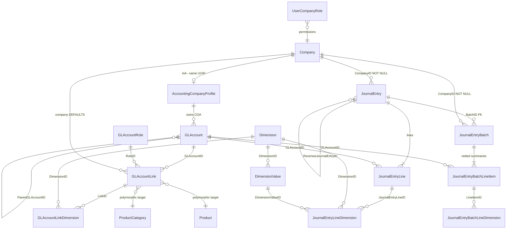
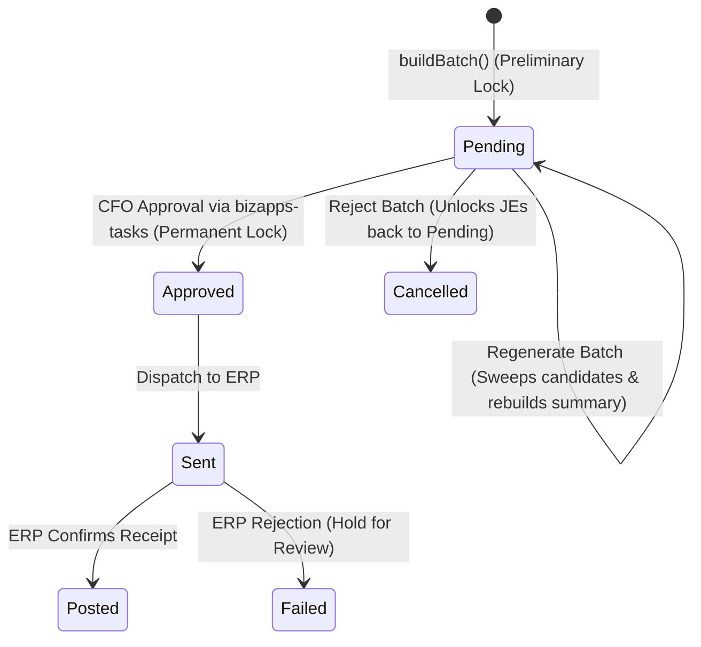

# BizApps Accounting — Consolidated Master Plan (v3)

> **Status:** Canonical Source of Truth / Target Architecture Specification  
> **Repo:** `MemberJunction/bizapps-accounting`  
> **Positioning:** Accounts Receivable Subsidiary Ledger of Record + Supporting Journal Entry (JE) Primitives. (Not a General Ledger).

---

## 1. Context and Positioning

BizAppsAccounting provides the **journal entry primitives and AR subsidiary ledger** for the MemberJunction ecosystem. It is **not a general ledger**.

### 1.1 What We ARE
- **AR Subsidiary Ledger of Record**: System of record for customer-facing accounting events — invoices, payments, deferred revenue rollforward, sales tax accruals, commission accruals, partner rev share, and all JEs originating from a customer transaction.
- **Journal Entry Primitives**: Balanced, immutable-once-approved/batched, dimension-tagged, multi-currency-capable JE infrastructure consumed by upstream apps (`BizAppsOrders`, `BizAppsPayments`, `BizAppsContracts`, etc.).
- **Batching to External GL**: Group, summarize, and dispatch JEs to external ERP/GL systems (Business Central, NetSuite, QuickBooks) per company.

### 1.2 What We Are NOT
- **Not a General Ledger**: The external ERP remains the system of record for full GL trial balances, P&L, and balance sheets.
- **Not a Period Engine**: `AccountingPeriod` is **removed** (MOD-1). Period discipline belongs to the ERP. Closed-period collisions during dispatch result in a **hold & flag** state for accountant review rather than automatic rolling (MOD-16).
- **Not an Expense, Inventory, or Year-End Engine**: Expenses, inventory, COGS, and P&L year-end closing entries live in the ERP or specialized sibling apps.

---

## 2. Core Decisions & System Invariants

| ID | Topic | Ruled Architecture & Behavior |
|---|---|---|
| **MOD-1** | **ERP-Owned Periods** | `AccountingPeriod` table and all period FKs are **removed**. Period closing is the ERP's job. Entries carry only their `EffectiveDate`. |
| **MOD-2** | **Deferred Balances** | `AccountBalance` & `AccountBalanceByDimension` materialization tables are removed from v1; balances are computed on-demand via SQL views (`vw_TrialBalance_AR`, etc.). |
| **MOD-3** | **Batch Lock Levels** | Pre-approval batch build = preliminary/reversible lock (`Pending` JEs locked to batch; reject unlocks JEs back to candidate pool). CFO approval (via `bizapps-tasks`) = permanent lock (`Approved`/`GLPosted`). |
| **MOD-4** | **Summary Netting** | Summary lines net per `(Company × GLAccount × Dimension-combo)`, producing one `JournalEntryBatchLineItem` with the net amount on a single side (Dr or Cr). |
| **MOD-5** | **Intercompany** | Per-company-pair Due-To / Due-From GL accounts (4 per pair). Booking legs emitted by `Orders` (seller-of-record model); cash legs emitted by `Payments`. Accounting receives and batches without auto-generating or netting intercompany positions. |
| **MOD-6** | **Upstream FX** | Realized and unrealized FX are computed and posted upstream (Orders/Payments). Accounting holds GL refs (`RealizedFXGainLossGLAccountID`), validates balance, and provides reporting views (`vw_FxExposure`). |
| **MOD-7** | **Minimal Seed COA** | Seeds only essential subledger accounts (~10-12 accounts: Cash, AR, AR-Intercompany, Sales Tax Payable, Deferred Revenue, Commission Payable, Partner Rev Share Payable, Sales/Subscription Revenue, Realized/Unrealized FX). The rest sync from BC. |
| **MOD-8** | **Batch Selection** | Default batching is **oldest-forward** (empty start + cutoff date/time). Arbitrary batches supported via MJ User-Views (validating unbatched entries only). |
| **MOD-9** | **Permissions & RLS** | Standard MJ roles (`Accounting User`, `Accounting Admin`) + company RLS + `UserCompanyRole` minimal grant table (`UserID`, `CompanyID`, `RoleID`, `IsActive`, `GrantedBy/At`, `RevokedBy/At`). CFO approver links to `__mj.User` (`ApprovalCFOUserID`). |
| **MOD-10** | **Account Mapping** | `GLAccountRole` + `GLAccountLink` + `GLAccountLinkDimension` map accounts to external records by role, date-effective (`ResolveLinkedAccount`: product → category tree → company default). |
| **MOD-11 / MOD-17** | **Forward-Dated JEs Rev-Rec** | Rev-rec staged entries are written as **actual forward-dated `JournalEntry` rows at booking time** (each bearing its `EffectiveDate`). `ScheduledJournalEntry` tables and daily materializer are **RETIRED**. Default batch cutoff = today. |
| **MOD-12 / MOD-15** | **Single-Company** | `JournalEntry` and `JournalEntryBatch` carry a `CompanyID NOT NULL` header. One company per batch. Line-item `CompanyID` is dropped as redundant. |
| **MOD-14** | **Two-Tx Batch Build** | Tx 1: Atomic creation of batch header, summary lines, line dimensions, and JE locks. Tx 2: Creation of CFO approval task + stamping `JournalEntryBatch.ApprovalTaskID` & `ApprovalTaskRaisedAt`. |
| **MOD-16** | **Batch Posting Date** | `JournalEntryBatch.PostingDate` is a singular accountant-set date per batch. One aggregated JE per batch posts to the GL system. Closed-period rejections result in a **hold & flag** review state. |
| **MOD-18** | **Tax Delegation** | Tax calculation delegated to 3rd-party engines (Stripe Tax / Avalara / Vertex). Local tax tables (`TaxJurisdiction`, `TaxRate`) snapshot returned calculation details, never author rates. |
| **MOD-19** | **Schema Cleanup** | `AccountingCompanyProfile` default account FKs replaced by company-level `GLAccountLink` rows; `ChartOfAccountsMapping` table dropped. `GLAccount.AccountType` immutability guard enforced once referenced. |

---

## 3. Entity Model & Target Schema



### 3.1 Key Tables

#### `GLAccount`
```sql
__mj_BizAppsAccounting.GLAccount
  ID UNIQUEIDENTIFIER PK,
  CompanyID UNIQUEIDENTIFIER NOT NULL FK → __mj.Company,
  Code NVARCHAR(40) NOT NULL,           -- e.g. '11201', matches ERP code
  Name NVARCHAR(200) NOT NULL,
  AccountType NVARCHAR(15) NOT NULL,    -- 'Asset' | 'Liability' | 'Equity' | 'Revenue' | 'Expense'
  ParentGLAccountID UNIQUEIDENTIFIER NULL FK → GLAccount,
  CurrencyCode CHAR(3) NULL FK → Currency,
  ExternalSystem NVARCHAR(50) NULL,     -- 'BusinessCentral' | 'QuickBooks'
  ExternalAccountID NVARCHAR(100) NULL, -- ERP account number for batching
  IsActive BIT NOT NULL DEFAULT 1,
  IsSystemSeeded BIT NOT NULL DEFAULT 0,
  UNIQUE (CompanyID, Code)
```

#### `GLAccountRole` & `GLAccountLink`
```sql
__mj_BizAppsAccounting.GLAccountRole
  ID UNIQUEIDENTIFIER PK,
  Name NVARCHAR(100) NOT NULL,          -- 'Cash', 'AR', 'Sales', 'Deferred Revenue', 'Sales Discounts', 'Returns & Allowances'
  Description NVARCHAR(MAX),
  Status NVARCHAR(20) NOT NULL DEFAULT 'Active',
  Sequence INT

__mj_BizAppsAccounting.GLAccountLink
  ID UNIQUEIDENTIFIER PK,
  GLAccountID UNIQUEIDENTIFIER NOT NULL FK → GLAccount,
  GLAccountRoleID UNIQUEIDENTIFIER NOT NULL FK → GLAccountRole,
  EntityID UNIQUEIDENTIFIER NOT NULL,    -- TaggedItem polymorphic target (Company / ProductCategory / Product)
  RecordID NVARCHAR(400) NOT NULL,
  Status NVARCHAR(20) NOT NULL DEFAULT 'Active',
  StartedAt DATETIMEOFFSET NULL,         -- Date-effective windowing
  EndedAt DATETIMEOFFSET NULL,
  Comments NVARCHAR(MAX)
```

#### `JournalEntry` & `JournalEntryLine`
```sql
__mj_BizAppsAccounting.JournalEntry
  ID UNIQUEIDENTIFIER PK,
  EntryNumber NVARCHAR(40) NOT NULL UNIQUE, -- 'JE-{CompanyCode}-{FY}-{seq}'
  CompanyID UNIQUEIDENTIFIER NOT NULL FK → __mj.Company,
  EffectiveDate DATE NOT NULL,
  EntryType NVARCHAR(40) NOT NULL,
  Status NVARCHAR(20) NOT NULL,             -- 'Pending' | 'Batched' | 'GLPosted'
  Description NVARCHAR(MAX),
  OrderID UNIQUEIDENTIFIER NULL,            -- Polymorphic lineage soft-refs
  OrderLineID UNIQUEIDENTIFIER NULL,
  SubscriptionID UNIQUEIDENTIFIER NULL,
  PaymentID UNIQUEIDENTIFIER NULL,
  ContractID UNIQUEIDENTIFIER NULL,
  RevRecScheduleID UNIQUEIDENTIFIER NULL,
  ReversesJournalEntryID UNIQUEIDENTIFIER NULL FK → JournalEntry,
  ReversedByJournalEntryID UNIQUEIDENTIFIER NULL FK → JournalEntry,
  BatchID UNIQUEIDENTIFIER NULL FK → JournalEntryBatch,
  GLPostedAt DATETIMEOFFSET NULL,
  GLReferenceID NVARCHAR(100) NULL

__mj_BizAppsAccounting.JournalEntryLine
  ID UNIQUEIDENTIFIER PK,
  JournalEntryID UNIQUEIDENTIFIER NOT NULL FK → JournalEntry,
  LineNumber INT NOT NULL,
  GLAccountID UNIQUEIDENTIFIER NOT NULL FK → GLAccount,
  DebitAmount DECIMAL(18,2) NULL,
  CreditAmount DECIMAL(18,2) NULL,
  Description NVARCHAR(MAX),
  OrderLineID UNIQUEIDENTIFIER NULL,
  CounterpartyOrganizationID UNIQUEIDENTIFIER NULL,
  CHECK ((DebitAmount IS NOT NULL) <> (CreditAmount IS NOT NULL)),
  UNIQUE (JournalEntryID, LineNumber)
```

#### `JournalEntryBatch` & `JournalEntryBatchLineItem`
```sql
__mj_BizAppsAccounting.JournalEntryBatch
  ID UNIQUEIDENTIFIER PK,
  BatchNumber NVARCHAR(40) NOT NULL UNIQUE, -- 'BATCH-{CompanyCode}-{seq}'
  CompanyID UNIQUEIDENTIFIER NOT NULL FK → __mj.Company,
  PostingDate DATE NOT NULL,                -- Accountant-set posting date
  TargetSystem NVARCHAR(50) NOT NULL,       -- 'BusinessCentral'
  BatchedAt DATETIMEOFFSET NOT NULL,
  BatchedByUserID UNIQUEIDENTIFIER NOT NULL FK → __mj.User,
  Status NVARCHAR(20) NOT NULL,             -- 'Pending' | 'Approved' | 'Sent' | 'Posted' | 'Failed' | 'Cancelled'
  ApprovalTaskID UNIQUEIDENTIFIER NULL,     -- Pointer to bizapps-tasks CFO approval task
  ApprovalTaskRaisedAt DATETIMEOFFSET NULL,
  TotalEntries INT NOT NULL,
  TotalDebits DECIMAL(18,2) NOT NULL,
  TotalCredits DECIMAL(18,2) NOT NULL,
  SentAt DATETIMEOFFSET NULL,
  AcknowledgedAt DATETIMEOFFSET NULL,
  ErrorMessage NVARCHAR(MAX) NULL

__mj_BizAppsAccounting.JournalEntryBatchLineItem
  ID UNIQUEIDENTIFIER PK,
  BatchID UNIQUEIDENTIFIER NOT NULL FK → JournalEntryBatch,
  GLAccountID UNIQUEIDENTIFIER NOT NULL FK → GLAccount,
  LineNumber INT NOT NULL,
  DebitAmount DECIMAL(18,2) NULL,
  CreditAmount DECIMAL(18,2) NULL,
  SourceLineCount INT NOT NULL,
  ExternalAccountID NVARCHAR(100) NULL,
  Description NVARCHAR(MAX) NULL
```

#### `UserCompanyRole`
```sql
__mj_BizAppsAccounting.UserCompanyRole
  ID UNIQUEIDENTIFIER PK,
  UserID UNIQUEIDENTIFIER NOT NULL FK → __mj.User,
  CompanyID UNIQUEIDENTIFIER NOT NULL FK → __mj.Company,
  RoleID UNIQUEIDENTIFIER NOT NULL FK → __mj.Role,
  IsActive BIT NOT NULL DEFAULT 1,
  GrantedByUserID UNIQUEIDENTIFIER NOT NULL FK → __mj.User,
  GrantedAt DATETIMEOFFSET NOT NULL,
  RevokedByUserID UNIQUEIDENTIFIER NULL FK → __mj.User,
  RevokedAt DATETIMEOFFSET NULL,
  UNIQUE (UserID, CompanyID, RoleID)
```

---

## 4. Engine & Operations Architecture

### 4.1 `AccountingEngineBase` (`@mj-biz-apps/accounting-engine-base`)
- Browser-safe metadata engine package. Zero server dependencies (importable by Angular, CLI scripts, and upstream packages).
- Caches GL accounts, roles, links, dimensions, and profiles.
- Implements `ResolveLinkedAccount(entityId, recordId, roleName/roleId, asOfDate)` to resolve account links up the hierarchy (Product → ProductCategory tree → Company Default).

### 4.2 `AccountingEngine` & Remote Operation (`Accounting.CreateJournalEntry`)
- Server write pipeline executing in `packages/Server`.
- Receives `JournalEntryDraft`, validates shape, verifies active accounts and pre-existing dimensions, normalizes debits-first, asserts multi-line balanced invariant (`SUM(Debits) == SUM(Credits)` overall AND per company), and writes atomically via `TransactionGroup`.
- Exposed as a remotable operation `CreateJournalEntryOperation` callable in-process or over GraphQL `ExecuteRemoteOperation`.

---

## 5. Batching & Approval Lifecycle



1. **Build Batch**: Gathers `Pending` JEs up to cutoff `PostingDate`, locks JEs (`Pending` → `Batched`), creates summary lines netted per `(Company × GLAccount × Dimension-combo)` in Tx 1. Raises CFO approval task in Tx 2 (stamping `ApprovalTaskID`).
2. **Reject Batch**: Flips batch status to `Cancelled` and unlocks JEs (`Batched` → `Pending`). JEs return to candidate pool.
3. **Approve Batch**: CFO completes approval task in `bizapps-tasks`. Batch flips to `Approved`, converting the JE lock to **permanent**.
4. **Dispatch Batch**: Posts summary lines to ERP under `PostingDate`. On ERP confirmation, batch flips to `Posted` and JEs flip to `GLPosted`. On ERP rejection, batch flags as `Failed` / **Hold for Review**.

---

## 6. Workflows, Scheduled Actions & AI Agents

### 6.1 Deterministic Lifecycle Hooks (TypeScript Server Hooks)
- **W1 — Profile Init**: On `AccountingCompanyProfile` first save, seeds default COA and creates default `GLAccountLink` company rows.
- **W2 — JE Numbering**: Generates gap-free `JE-{CompanyCode}-{FY}-{seq}` via atomic sproc `spAssignNextJournalEntryNumber`.
- **W3 — Batch Numbering**: Generates `BATCH-{CompanyCode}-{seq}` via `spAssignNextBatchNumber`.
- **W5 — FX Gain/Loss Recording**: On payment JE save, records realized FX gain/loss line to `RealizedFXGainLossGLAccountID`.
- **W6 — Reversal Generation**: `GenerateReversal(reason)` creates a new `Pending` JE with debits/credits swapped, `EntryType='Reversal'`, and reciprocal references (`ReversesJournalEntryID` / `ReversedByJournalEntryID`).

### 6.2 Scheduled Actions (Cron Actions)
- **S1 — Batch Dispatch**: Automates scheduled batch creation per company.
- **S2 — ERP Ack Poller**: Polls ERP response queue to flip batches from `Sent` → `Posted`.
- **S4 — FX Rate Refresh**: Syncs rates from exchange rate APIs into `CurrencySpotRate`.
- **S5 — Tax Rate Sync**: Syncs reference rates from Avalara/TaxJar into `TaxRate`.

### 6.3 AI Agent Catalog
- **A1 Period Close Copilot**: Loop agent running pre-close audit checks and drafting adjusting JEs.
- **A2 COA Mapping Suggester**: Flow agent proposing account link mappings for new external accounts.
- **A3 Manual JE Reviewer**: Flow agent analyzing manual JEs for policy violations.
- **F1 Routine JE Validator**: Fully autonomous flow agent validating incoming drafts against rules.
- **F2 Anomaly Watcher**: Autonomous loop agent detecting unusual posting patterns.

---

## 7. UI Architecture & View/Edit Boundaries

- **Workspaces**: Home of process flows, criteria selection, batch building, and multi-record orchestration.
- **MJ Entity Forms (`openBizDetail`)**: Home of single-record viewing and simple property editing.
- **State-Derived Editability**: Form editability is governed directly by DB immutability triggers (e.g. `Pending` JEs editable, `Batched`/`GLPosted` read-only).
- **UI Aesthetics**: Built using vanilla CSS/MJ styles, container queries (supporting pane splitting), sticky interior headers, tab indicators, and AG Grid column indicators.

---

## 8. Reporting Read-Model Views

The following SQL views provide reporting and analytics directly from JE lines:
* `vw_TrialBalance_AR`: AR subledger trial balance per company.
* `vw_GLDetail_Subledger`: Detailed JE lines with dimension tags.
* `vw_AROpenByCustomer`: Open AR balances per customer.
* `vw_DefRevRollforward`: Deferred revenue beginning balance + additions + recognitions + ending balance.
* `vw_SalesTaxLiability`: Accrued and remitted sales tax per jurisdiction.
* `vw_ARtoGLRecon`: Reconciliation between subledger AR and ERP GL AR account.
* `vw_DimensionPL`: Revenue by analytical dimension.
* `vw_ARAging`: AR aging buckets (Current, 30, 60, 90+ days).
* `vw_FxExposure`: Open foreign currency balances.
* `vw_JEAuditTrail`: Full JE detail with origin lineage for audit drill-through.

---

## 9. Phasing & Verification

### 9.1 Delivery Phases
- **Phase A**: Foundation (`AccountingCompanyProfile`, `GLAccount`, `GLAccountRole`, `GLAccountLink`, BaseEntity hooks).
- **Phase B**: JE primitives (`JournalEntry`, `JournalEntryLine`, DB immutability triggers, `AccountingEngine`).
- **Phase C**: Batching & Lock Redesign (`JournalEntryBatch`, summary netting, two-tx build, approval gate).
- **Phase D**: Dimensions & User Permissions (`Dimension`, `UserCompanyRole`, RLS).
- **Phase E**: Forward-dated Rev-Rec & Upstream Integration (`Orders` / `Payments` integration, correcting orders).
- **Phase F**: Reporting Views & Business Central Integration outbound action.

### 9.2 Verification Strategy
- **Vitest Invariant Test Harness**: Automated tests enforcing DB invariants (balanced JEs, immutability, raw SQL bypass attempts).
- **Runtime Execution**: Validated via server test harnesses (`test-harnesses/server/`).
