# BizAppsAccounting Master Plan

> **Status**: Plan / pre-implementation
> **Target repo**: `MemberJunction/bizapps-accounting` (newly created public OSS repo)
> **Depends on**: `plans/mj-core-changes.md` (MJ core additions to `__mj.Company`)
> **Sibling plans**: `plans/aidp-master-plan.md` (the overarching context), eventual `bizapps-orders-master.md` and `bizapps-contracts-master.md` follow-ups
> **Positioning**: **Accounts receivable subsidiary ledger of record + supporting JE primitives. Not a general ledger.**

---

## 0. Table of contents

1. [Context and positioning](#1-context-and-positioning)
2. [Decisions (BA-D1 through BA-D24)](#2-decisions-ba-d1-through-ba-d24)
3. [Architecture and scope boundaries](#3-architecture-and-scope-boundaries)
4. [Entity model](#4-entity-model)
   - 4.1 GLAccount + hierarchy
   - 4.2 AccountingCompanyProfile (IsA Company child)
   - 4.3 Dimensions + DimensionValue + JE line tagging
   - 4.4 AccountingPeriod
   - 4.5 JournalEntry, JournalEntryLine, JournalEntryBatch
   - 4.6 ChartOfAccountsMapping
   - 4.7 Currency + CurrencyExchangeRate (in BizAppsCommon — referenced)
   - 4.8 Tax: TaxAuthority, TaxJurisdiction, TaxRate, TaxLiability, TaxRemittance
   - 4.9 Recurring journal entries + templates
   - 4.10 Account balance materialization
5. [Database-level enforcement](#5-database-level-enforcement)
6. [Multi-currency mechanics](#6-multi-currency-mechanics)
7. [Period close workflow](#7-period-close-workflow)
8. [JE lifecycle: Pending → Batched → GLPosted](#8-je-lifecycle-pending--batched--glposted)
9. [Pluggable tax engine](#9-pluggable-tax-engine)
10. [Reporting: read-model views + Skip-generated reports](#10-reporting-read-model-views--skip-generated-reports)
11. [Integration with BizAppsOrders + future apps](#11-integration-with-bizappsorders--future-apps)
12. [Migration of CDP `finance.*` data](#12-migration-of-cdp-finance-data)
13. [Phasing and delivery](#13-phasing-and-delivery)
14. [Open questions](#14-open-questions)
15. [Out of scope (explicit)](#15-out-of-scope-explicit)

---

## 1. Context and positioning

BizAppsAccounting provides the **journal entry primitives and AR subsidiary ledger** for the MJ ecosystem. It is **not a general ledger**.

### What we ARE

- **AR subsidiary ledger of record**: the system of record for customer-facing accounting events — invoices, payments, deferred revenue rollforward, sales tax accruals, commission accruals, partner rev share, all the JEs that originate from a customer transaction.
- **Journal entry primitives**: balanced, immutable-once-batched, dimension-tagged, multi-currency-capable JE infrastructure that downstream apps (BizAppsOrders, future BizAppsPayroll, etc.) call into.
- **Subledger period close**: lock our subledger periodically so audit trails are clean.
- **Batching to external GL**: aggregate our JEs and push them to the ERP/GL system (Business Central, QuickBooks, NetSuite, Sage, etc.) per company per period.

### What we are NOT

- **Not a general ledger.** The ERP/accounting system remains the system of record for the full GL.
- **Not a financial-statement generator.** Trial Balance, P&L, Balance Sheet, Statement of Cash Flows come from the ERP.
- **Not a year-end closing engine.** Year-end closing JEs (P&L → Retained Earnings) happen in the ERP.
- **Not an expense-management system.** Expenses (vendor bills, payroll, fixed assets, etc.) live in the ERP or in future BizApps* siblings (BizAppsPayroll, BizAppsExpenseManagement, BizAppsFixedAssets).
- **Not an inventory or COGS engine.** Out of scope.

### Why this scope is the right boundary

- The ERP investment is sunk and works. Replicating its full GL is wasted effort.
- The subledger pattern is well-understood (Zuora → NetSuite, Stripe → QBO) and the boundary is clean.
- Downstream apps (BizAppsOrders especially) need disciplined JE primitives. Providing those without ALSO providing a GL keeps the scope tractable.
- Future `BizAppsGeneralLedger` could layer on top if needed for orgs without a separate ERP. Not in v1.

---

## 2. Decisions (BA-D1 through BA-D24)

These are accounting-layer decisions. References to `M*` decisions point to `plans/aidp-master-plan.md`.

| # | Decision | Rationale |
|---|----------|-----------|
| **BA-D1** | **Subledger positioning** (see §1). BizAppsAccounting is an AR subsidiary ledger of record + JE primitives. The ERP remains the GL. | Sharp scope. Avoids re-implementing functionality that any ERP already does. |
| **BA-D2** | **SQL Server first for development; PostgreSQL via conversion before release.** SQL Server / Azure SQL is the dev and source-of-truth dialect (migrations authored as T-SQL in `migrations/`). PostgreSQL remains a first-class supported target produced by MJ's `sql-converter` / `pg-migrate` tooling (`migrations-pg/`) and validated in CI, but the conversion is run at release time rather than maintained PG-native day to day. | Move fast on the dialect our local MJ stack and tooling already target, while still shipping PG support. Aligns with the "SQL Server is the source of truth; PostgreSQL is converted" rule in `CLAUDE.md`. We will 100% support PG. |
| **BA-D3** | **UUID primary keys throughout.** No INT IDENTITY. | `M5`. Consistent with the rest of the rebuild. |
| **BA-D4** | **`JournalEntry` is the top-level entity in BizAppsAccounting** with polymorphic origin links. Other apps emit JEs by calling into Accounting. | `M7`. Single source of truth for ledger postings; downstream apps call up. |
| **BA-D5** | **Balanced-JE invariant enforced at DB level.** `CHECK` + deferrable constraint or trigger ensures `SUM(Debits) == SUM(Credits)` per JE before commit. | Cannot be bypassed by any code path including direct SA access. Audit guarantee. |
| **BA-D6** | **JE lifecycle: `Pending → Batched → GLPosted`.** Drop the earlier `Posted` state — batching IS the lock event. Voided/Reversal pattern via separate JEs per `M10`. | Per AN-BC discussion. Cleaner. JEs sit in Pending until batch run, then lock. Reversals at business-entity level emit new Pending JEs. |
| **BA-D7** | **Immutability after `Batched`.** `UPDATE` / `DELETE` of JournalEntry or JournalEntryLine where Status ∈ {`Batched`, `GLPosted`} blocked by DB trigger. Reversals via new JE only. | Audit trail by construction. SA-level bypass impossible. |
| **BA-D8** | **First-class dimensions, optional.** `Dimension`, `DimensionValue`, `JournalEntryLineDimension`. Deployments that don't define dimensions get a flat chart with no penalty. | Matches modern ERP pattern (NetSuite, SAP). Lets deployments scale analytical capability without exploding the chart of accounts. |
| **BA-D9** | **`AccountingCompanyProfile` is an IsA Disjoint child of `__mj.Company`.** Holds ALL company-attribute extensions, both accounting-specific (FunctionalCurrencyCode, FiscalYearStartMonth, books-sharing) AND general business attributes (EntityType, LegalStructureType, IncorporationDate, JurisdictionCountry/Region, FederalTaxID). | Per CM1 in `mj-core-changes.md`. MJ core stays minimal — nothing accounting OR business-attribute leaks into it. Country/Region concepts respect BizAppsCommon's ownership of geographic modeling (Address). For v1 we keep this as a single IsA child; if future apps want non-accounting access to EntityType etc., a `CompanyBusinessProfile` in BizAppsCommon with multi-level IsA can be introduced later. |
| **BA-D10** | **Functional currency per `AccountingCompanyProfile`.** JEs always post in the Company's functional currency. JournalEntryLine carries `OriginalCurrency / OriginalAmount / ExchangeRateUsed` when source transaction is in a different currency. | `M12` mechanics. JE header has no Currency field — derived from Company. Realized FX gain/loss auto-emitted by engine on payment-to-AR rate mismatch. |
| **BA-D11** | **REVISED 2026-06: `Currency` (and the exchange-rate table) are OWNED BY BizAppsAccounting, not BizAppsCommon.** Originally Currency/`CurrencyExchangeRate` were slated for BizAppsCommon so other apps could share the currency infra, but common never shipped them. Since BizAppsAccounting is a free OSS app, any app that needs currency can simply take a dependency on it — and we keep the infra under our own control. `Currency` now lives in `__mj_BizAppsAccounting` (seeded ISO-4217 set; landed in the v0.1.0 baseline migration). The exchange-rate table (provisional name `CurrencyExchangeRate`; `CurrencySpotRate` under consideration) is a follow-on FX-feature concern, also Accounting-owned. Pluggable provider via RegisterClass — ship `ExchangeRate-API`, `ECB`, `OpenExchangeRates`, `Manual`. **Auto-fetch disabled by default**; deployments opt in via Scheduled Job (weekly when enabled). | common never built Currency; OSS-dependency model lets consumers opt in without a shared-infra coupling. Avoid mystery cron eating API budget. |
| **BA-D12** | **AccountingPeriod per `AccountingCompanyProfile`.** Each accounting-enabled Company has its own period set. Periods lock JE posting via DB constraint check. | Standard subledger pattern. Multi-company is the common case for BC. |
| **BA-D13** | **Hard close**: once `AccountingPeriod.Status = 'Closed'`, no JE can post with EffectiveDate in that period. **No override.** Reopen requires admin role + reason + audit log entry. | `M9` discipline. Soft close erodes integrity over time. |
| **BA-D14** | **Adjusting entries post to the next open period** with a `OriginalPeriodReference` field on the JE for traceability. | Standard accounting practice after period close. |
| **BA-D15** | **JE numbering**: `JE-{AccountingCompanyProfile.CompanyCode}-{FiscalYear}-{seq}` like `JE-SIDECAR-2026-000001`. Sequence resets at fiscal year boundary, scoped per Company. Gap-free (cancelled/voided numbers not reused). | Familiar pattern for accountants. Per-Company per-FY scoping aligns with audit grouping. `CompanyCode` is stored on the IsA child (not MJ core) so no `__mj.Company` field is required. |
| **BA-D16** | **JournalEntryBatch is the locking event** (not individual JE Post). Batching aggregates JEs by `(Company, AccountingPeriod, TargetSystem)`, locks them, and ships **one consolidated JE per Company** to the ERP. | Per AN-BC. Reduces noise in ERP. Audit trail preserved by the source JEs locked in our system. |
| **BA-D17** | **No intercompany balancing JEs originate in Accounting.** That logic lives in BizAppsOrders (and other JE-emitting apps). Accounting just receives the JE emissions per leg. | Per AN-BC. Accounting is raw primitives; orchestration lives upstream. Keeps Accounting scope tight. |
| **BA-D18** | **JournalEntry templates + recurring entries (`RecurringJournalEntryTemplate` + `RecurringJournalEntry`)** ship in v1. For monthly accruals, FX revaluation, depreciation, prepaid amortization. | Real accounting needs this. Without it, manual posting of accrual JEs every month becomes a burden. |
| **BA-D19** | **Tax engine pluggable via `RegisterClass`/`ClassFactory`.** Ship Avalara + TaxJar adapters + local `TaxRate` table fallback. Underlying `TaxAuthority/Jurisdiction/Rate/Liability/Remittance` entities shared so adapter choice doesn't change schema. | `M13`. Per AN-BC. Avoids vendor lock-in. Local-mode users can manually maintain rates for simple cases. |
| **BA-D20** | **No statistical accounts in v1.** | Per AN-BC. Statistical accounts power management reporting from a GL; we're not a GL. |
| **BA-D21** | **No year-end closing JEs in v1.** | Per AN-BC. ERP territory. |
| **BA-D22** | **Account balance materialization scoped to OUR accounts** — AR by Customer, Deferred Revenue by Subscription, Sales Tax Payable by Jurisdiction, Commission Payable by Salesperson. Closed-period balances materialized; open-period balances computed on demand. | Per AN-BC. We're a subledger; we don't materialize full GL balances. Performance-critical for AR aging and DefRev rollforward. |
| **BA-D23** | **Reporting via Skip-generated interactive components** rendering against shipped read-model views (`vw_TrialBalance_AR`, `vw_GLDetail_Subledger`, `vw_AROpenByCustomer`, `vw_DefRevRollforward`, `vw_SalesTaxLiability`, `vw_ARtoGLRecon`, `vw_DimensionPL`, etc.). Reports in a "Report Gallery" MJ app (separate). | Per AN-BC. Skip generates UI; we ship the data layer. |
| **BA-D24** | **JE generation is metadata-driven, not hardcoded.** Product / SubscriptionPlan / OrderType / etc. metadata in BizAppsOrders determines the JE pattern emitted (`Immediate`, `Ratable`, `Milestone`, `Custom`). Accounting receives the emitted JEs and validates them. | `M11` of master plan. New revrec policies via metadata, not code change. Accounting doesn't need to know about Order types — Orders generates correct JEs. |

---

## 3. Architecture and scope boundaries

### Dependency stack

```
__mj                              (MJ core: Company, User, Role, File, Integration metadata)
   ↑
BizAppsCommon                     (Person, Organization, Address, ContactMethod, Relationship,
                                   Currency, CurrencyExchangeRate)
   ↑
BizAppsAccounting   ◄── this plan (GLAccount, AccountingCompanyProfile [IsA Company],
                                   AccountingPeriod, Dimension, DimensionValue,
                                   JournalEntry, JournalEntryLine, JournalEntryLineDimension,
                                   JournalEntryBatch, ChartOfAccountsMapping,
                                   Tax* entities, RecurringJournalEntryTemplate,
                                   AccountBalance, AccountBalanceByDimension)
   ↑
BizAppsOrders                     (Product, Order, Subscription, Payment, Invoice,
                                   IntercompanyFlow, RevenueRecognitionSchedule
                                   — emits JEs by calling into Accounting)
   ↑
BizAppsContracts                  (Contract envelope, Term, Escalator, Renewal —
                                   emits JEs for contract-level revrec overrides)
   ↑
aidp                              (Consumer: CashFlowCategory, ForecastRun, BudgetVersion,
                                   ReconciliationRun, etc. — reads BizAppsAccounting data)
```

### Boundary contracts

**BizAppsAccounting receives from upstream apps**:
- JE post requests (with header + balanced lines + dimension tags)
- Recurring JE template definitions
- Tax rate lookups (when an adapter is configured)

**BizAppsAccounting provides to upstream apps**:
- JE post primitives (transactional, atomic, balanced)
- Account balance queries (open vs closed period semantics)
- AR aging data (via read-model views)
- Period status checks (is May closed? when does the next open period start?)
- Tax calculation hooks (delegated to pluggable provider)

**BizAppsAccounting does NOT**:
- Know about Orders, Subscriptions, Contracts, Payments — those are upstream-app concepts
- Generate JEs autonomously (only as instructed by upstream apps, or via recurring templates configured upstream)
- Push to external GL (the batching mechanism is provided, but the actual ERP connector lives in MJ Integration framework — see §11)

---

## 4. Entity model

### 4.1 GLAccount + hierarchy

The chart of accounts mirrors the ERP's COA, but BizAppsAccounting owns its copy so JE line items have a stable reference.

```sql
__mj_BizAppsAccounting.GLAccount
  ID UUID PK,
  CompanyID UUID FK → __mj.Company,    -- which Company owns this account
  Code NVARCHAR(40) NOT NULL,           -- e.g. '11101', '40100-SUB' — matches ERP code
  Name NVARCHAR(200) NOT NULL,
  AccountType NVARCHAR(20) NOT NULL,    -- 'Asset' | 'Liability' | 'Equity' | 'Revenue' | 'Expense'
  ParentGLAccountID UUID FK → GLAccount NULL,   -- hierarchical rollup
  CurrencyCode CHAR(3) FK → BizAppsCommon.Currency,  -- account denomination
  ExternalSystem NVARCHAR(50) NULL,     -- 'BusinessCentral' | 'QuickBooks' | ...
  ExternalAccountID NVARCHAR(100) NULL, -- for sync identity
  IsActive BIT NOT NULL DEFAULT 1,
  IsSystemSeeded BIT NOT NULL DEFAULT 0,  -- true for accounts the package seeds
  Description NVARCHAR(MAX),
  UNIQUE (CompanyID, Code)
```

Seeded default COA (opinionated starter set, per AN-BC discussion):

| Code | Name | Type |
|---|---|---|
| 11101 | Operating Cash | Asset |
| 11201 | Accounts Receivable | Asset |
| 11211 | Accounts Receivable - Intercompany | Asset |
| 11301 | Deferred Costs | Asset |
| 21101 | Accounts Payable | Liability |
| 21201 | Sales Tax Payable | Liability |
| 21202 | VAT Payable | Liability |
| 21301 | Deferred Revenue | Liability |
| 21401 | Commission Payable | Liability |
| 21402 | Partner Rev Share Payable | Liability |
| 21501 | Intercompany Payable | Liability |
| 40100 | Sales Revenue | Revenue |
| 40200 | Subscription Revenue | Revenue |
| 40300 | Services Revenue | Revenue |
| 40400 | Distribution Income | Revenue |
| 40500 | Management Fee Revenue | Revenue |
| 40900 | Other Revenue | Revenue |
| 50100 | Sales Commission Expense | Expense |
| 50200 | Partner Revenue Share Cost | Expense |
| 50300 | Bad Debt Expense | Expense |
| 50400 | Realized FX Gain/Loss | Expense (or contra-Revenue) |
| 50500 | Unrealized FX Gain/Loss | Expense |
| 90100 | Refunds | Contra-Revenue |

These are seeded with `IsSystemSeeded = 1`. Deployments can customize codes/names; the seed flag survives so we can identify "platform default" vs "deployment-customized" accounts.

### 4.2 AccountingCompanyProfile (IsA Disjoint child of `__mj.Company`)

This child entity holds **all** Company-attribute extensions that BizAppsAccounting needs — both general business-profile fields (EntityType, LegalStructureType, IncorporationDate, FederalTaxID, JurisdictionCountry/Region) and accounting-specific fields (FunctionalCurrencyCode, FiscalYearStartMonth, books-sharing, default GL accounts). MJ core stays minimal; all these fields live here.

```sql
__mj_BizAppsAccounting.AccountingCompanyProfile
  -- IsA Disjoint child of __mj.Company; ID is the SAME UUID as the parent Company
  ID UUID PK FK → __mj.Company(ID),

  -- General business-profile fields (per BA-D9; would otherwise have gone in MJ core
  -- but kept here to avoid polluting MJ core with country/business concepts)
  EntityType NVARCHAR(30) NOT NULL DEFAULT 'Subsidiary',
    -- 'LegalEntity' | 'Subsidiary' | 'Division' | 'Department' | 'Branch'
    -- | 'Partner' | 'JointVenture' | 'CostCenter' | 'Other'
  LegalStructureType NVARCHAR(30) NULL,
    -- 'LLC' | 'C-Corp' | 'S-Corp' | 'Partnership' | 'SoleProprietorship'
    -- | 'NonProfit-501c3' | 'NonProfit-501c6' | 'International-Ltd'
    -- | 'International-GmbH' | 'International-Pty' | 'International-Other' | 'Other'
  IncorporationDate DATE NULL,
  JurisdictionCountry CHAR(2) NULL,           -- ISO 3166-1 alpha-2 (free-form string;
                                               -- no FK to BizAppsCommon to keep dependency clean)
  JurisdictionRegion NVARCHAR(50) NULL,       -- state/province sub-national, free-form
  FederalTaxID NVARCHAR(40) NULL,             -- EIN, ABN, VAT registration, etc.
  CompanyCode NVARCHAR(20) NOT NULL,          -- short code used in JE numbering
                                               -- (e.g. 'SIDECAR', 'CIMATRI', 'BCHQ')
                                               -- UNIQUE per deployment

  -- Accounting-specific fields
  FunctionalCurrencyCode CHAR(3) NOT NULL FK → BizAppsCommon.Currency,
  ReportingCurrencyCode CHAR(3) FK → BizAppsCommon.Currency NULL,  -- if NULL, same as functional
  FiscalYearStartMonth TINYINT NOT NULL DEFAULT 1,
  FiscalYearStartDay TINYINT NOT NULL DEFAULT 1,
  ParentAccountingCompanyID UUID FK → AccountingCompanyProfile NULL,
    -- If set: this profile uses the books (COA, periods, JEs) of the referenced profile.
    -- Validator: the referenced profile cannot itself have ParentAccountingCompanyID set (no chains).
    -- Validator: ParentAccountingCompanyID and self.ID must be different.
  DefaultPaymentTermsTypeID UUID FK NULL,     -- delegates to BizAppsOrders.PaymentTermsType
  AROpenGLAccountID UUID FK → GLAccount NULL, -- which AR account is "the AR account"
  DeferredRevenueGLAccountID UUID FK → GLAccount NULL,
  SalesTaxPayableGLAccountID UUID FK → GLAccount NULL,
  RealizedFXGainLossGLAccountID UUID FK → GLAccount NULL,
  UnrealizedFXGainLossGLAccountID UUID FK → GLAccount NULL,
  IsActive BIT NOT NULL DEFAULT 1,

  UNIQUE (CompanyCode)
```

The IsA relationship is declared in MJ metadata. CodeGen produces a TypeScript class `AccountingCompanyProfileEntity` that inherits parent fields from `__mjCompanyEntity` and exposes both the business-profile and accounting-specific extensions defined above.

**Validators (enforced via BaseEntity subclass + DB constraints)**:
- `JurisdictionCountry` must match ISO 3166-1 alpha-2 codes if provided (validated at app level; free-form at DB level)
- `LegalStructureType` only meaningful when `EntityType` ∈ {`LegalEntity`, `Subsidiary`, `JointVenture`, `Partner`}
- `ParentAccountingCompanyID` cannot equal `ID` (self-reference forbidden)
- `ParentAccountingCompanyID` cannot itself have a non-null `ParentAccountingCompanyID` (no chains)
- `CompanyCode` UNIQUE and uppercase, max 20 chars, alphanumeric + dash/underscore only (enforced via CHECK constraint)

### 4.3 Dimensions, DimensionValue, JE line tagging

First-class analytical dimensions on JE lines. Optional — a deployment that defines no dimensions just has a flat chart.

```sql
__mj_BizAppsAccounting.Dimension
  ID UUID PK,
  Code NVARCHAR(40) UNIQUE,             -- 'Department', 'CostCenter', 'Project', 'Region', etc.
  Name NVARCHAR(100) NOT NULL,
  Description NVARCHAR(MAX),
  IsActive BIT NOT NULL DEFAULT 1,
  DisplayOrder INT

__mj_BizAppsAccounting.DimensionValue
  ID UUID PK,
  DimensionID UUID FK,
  Code NVARCHAR(80) NOT NULL,           -- e.g. 'Marketing', 'WestCoast', 'ProductLaunch2026'
  Name NVARCHAR(200) NOT NULL,
  ParentDimensionValueID UUID FK → DimensionValue NULL,  -- hierarchical (Region → State → City)
  IsActive BIT NOT NULL DEFAULT 1,
  EffectiveFrom DATE, EffectiveTo DATE NULL,
  UNIQUE (DimensionID, Code)

__mj_BizAppsAccounting.JournalEntryLineDimension
  ID UUID PK,
  JournalEntryLineID UUID FK,
  DimensionID UUID FK,
  DimensionValueID UUID FK,
  UNIQUE (JournalEntryLineID, DimensionID)
```

Reports can group/filter by any dimension. The default ERP reports (TB, P&L) consumed from the ERP side don't see dimensions — those are our analytics. Read-model views support dimension filters.

### 4.4 AccountingPeriod

Per `AccountingCompanyProfile`. Locks JE posting once closed.

```sql
__mj_BizAppsAccounting.AccountingPeriod
  ID UUID PK,
  CompanyID UUID FK → __mj.Company,
  PeriodType NVARCHAR(10) NOT NULL,     -- 'Month' | 'Quarter' | 'Year'
  PeriodStart DATE NOT NULL,
  PeriodEnd DATE NOT NULL,
  FiscalYear INT NOT NULL,
  FiscalQuarter TINYINT,
  FiscalMonth TINYINT,
  Status NVARCHAR(20) NOT NULL,         -- 'Open' | 'Closing' | 'Closed' | 'Reopened'
  ClosedAt DATETIMEOFFSET NULL,
  ClosedByUserID UUID FK → __mj.User NULL,
  ReopenReason NVARCHAR(MAX) NULL,
  ReopenedAt DATETIMEOFFSET NULL,
  ReopenedByUserID UUID FK NULL,
  UNIQUE (CompanyID, PeriodType, PeriodStart)
```

Period generation is automated for the standard calendar but can be manually adjusted (e.g., 4-4-5 retail fiscal patterns) via a JE template or scheduled action.

### 4.5 JournalEntry, JournalEntryLine, JournalEntryBatch

```sql
__mj_BizAppsAccounting.JournalEntry
  ID UUID PK,
  EntryNumber NVARCHAR(40) NOT NULL,    -- 'JE-{Company.Code}-{FiscalYear}-{seq}'
  CompanyID UUID FK → __mj.Company NOT NULL,
  AccountingPeriodID UUID FK NOT NULL,
  EffectiveDate DATE NOT NULL,          -- accounting date
  EntryType NVARCHAR(40) NOT NULL,
    -- 'OrderBooking' | 'PaymentReceipt' | 'RevenueRecognition'
    -- | 'CommissionAccrual' | 'PartnerRevShare' | 'IntercompanyFlow'
    -- | 'WaterfallDistribution' | 'Refund' | 'Writeoff' | 'Reversal'
    -- | 'Manual' | 'TaxRemittance' | 'PeriodEndAccrual' | 'FXRevaluation'
  Status NVARCHAR(20) NOT NULL,         -- 'Pending' | 'Batched' | 'GLPosted'
  Description NVARCHAR(MAX),
  -- Polymorphic origin (any combination, often one):
  OrderID UUID NULL,                    -- BizAppsOrders.Order
  OrderLineID UUID NULL,
  SubscriptionID UUID NULL,
  PaymentID UUID NULL,
  ContractID UUID NULL,                 -- BizAppsContracts.Contract
  RevRecScheduleID UUID NULL,
  IntercompanyFlowID UUID NULL,
  RecurringJournalEntryID UUID FK → RecurringJournalEntry NULL,
  TaxRemittanceID UUID FK → TaxRemittance NULL,
  -- Reversal references
  ReversesJournalEntryID UUID FK → JournalEntry NULL,
  ReversedByJournalEntryID UUID FK → JournalEntry NULL,
  -- Adjusting entry reference
  OriginalAccountingPeriodID UUID FK NULL,  -- if this is an adjusting entry to a closed period
  -- Lifecycle
  BatchID UUID FK → JournalEntryBatch NULL,
  GLPostedAt DATETIMEOFFSET NULL,
  GLReferenceID NVARCHAR(100) NULL      -- ERP's reference back to us

__mj_BizAppsAccounting.JournalEntryLine
  ID UUID PK,
  JournalEntryID UUID FK NOT NULL,
  LineNumber INT NOT NULL,
  GLAccountID UUID FK NOT NULL,
  -- Amounts in functional currency
  DebitAmount DECIMAL(18,2) NULL,
  CreditAmount DECIMAL(18,2) NULL,
  -- Source currency (when different from functional)
  OriginalCurrencyCode CHAR(3) FK → BizAppsCommon.Currency NULL,
  OriginalDebitAmount DECIMAL(18,2) NULL,
  OriginalCreditAmount DECIMAL(18,2) NULL,
  ExchangeRateUsed DECIMAL(18,8) NULL,
  Description NVARCHAR(MAX),
  -- Granular drill references
  OrderLineID UUID NULL,
  CounterpartyOrganizationID UUID NULL,  -- e.g., Customer for AR lines
  CHECK ((DebitAmount IS NOT NULL) <> (CreditAmount IS NOT NULL)),
  CHECK ((OriginalDebitAmount IS NULL) = (OriginalCreditAmount IS NULL)),
  UNIQUE (JournalEntryID, LineNumber)
  -- Balanced-JE invariant (SUM Debits == SUM Credits per JE) enforced via deferred constraint or trigger

__mj_BizAppsAccounting.JournalEntryBatch
  ID UUID PK,
  BatchNumber NVARCHAR(40) UNIQUE,      -- 'BATCH-{Company.Code}-{seq}'
  CompanyID UUID FK → __mj.Company NOT NULL,
  AccountingPeriodID UUID FK NOT NULL,
  TargetSystem NVARCHAR(50) NOT NULL,   -- 'BusinessCentral' | 'QuickBooks' | 'NetSuite' | ...
  BatchedAt DATETIMEOFFSET NOT NULL,
  BatchedByUserID UUID FK NOT NULL,
  Status NVARCHAR(20) NOT NULL,         -- 'Pending' | 'Sent' | 'Acknowledged' | 'Failed'
  -- Aggregate metrics
  TotalEntries INT NOT NULL,
  TotalDebits DECIMAL(18,2) NOT NULL,
  TotalCredits DECIMAL(18,2) NOT NULL,
  -- ERP roundtrip
  ExternalBatchRef NVARCHAR(100),
  SentAt DATETIMEOFFSET NULL,
  AcknowledgedAt DATETIMEOFFSET NULL,
  ErrorMessage NVARCHAR(MAX) NULL
```

### 4.6 ChartOfAccountsMapping

Maps external GL account references to our `GLAccount` records. Critical for batch-to-ERP correctness.

```sql
__mj_BizAppsAccounting.ChartOfAccountsMapping
  ID UUID PK,
  CompanyID UUID FK → __mj.Company NOT NULL,
  ExternalSystem NVARCHAR(50) NOT NULL,
  ExternalAccountID NVARCHAR(100) NOT NULL,
  ExternalAccountName NVARCHAR(200),
  InternalGLAccountID UUID FK NOT NULL,
  EffectiveFrom DATE NOT NULL,
  EffectiveTo DATE NULL,
  ApprovedByUserID UUID FK NULL,        -- CFO-only per master plan Q12 closure
  ApprovedAt DATETIMEOFFSET NULL,
  ChangeNote NVARCHAR(MAX),
  UNIQUE (CompanyID, ExternalSystem, ExternalAccountID, EffectiveFrom)
```

When a new external GL account is detected via the BC connector sync, an admin must explicitly map it. Until mapped, JEs that would reference it are rejected (per `M16` / `D27` from master plan: hard-fail on unmapped GL movements).

### 4.7 Currency + CurrencyExchangeRate (OWNED BY BizAppsAccounting — revised, see BA-D11)

> **REVISED 2026-06:** Currency now lives in `__mj_BizAppsAccounting`, not BizAppsCommon (common never shipped it). The `Currency` table + a seeded ISO-4217 set landed in the v0.1.0 baseline migration; all GL/JE/balance FKs reference `__mj_BizAppsAccounting.Currency(Code)`. The exchange-rate table below is a follow-on (not yet in the baseline). The schema sketches below are retained for shape; substitute schema `__mj_BizAppsAccounting` for `__mj_BizAppsCommon`.

```sql
__mj_BizAppsAccounting.Currency
  ID UUID PK,
  Code CHAR(3) UNIQUE NOT NULL,         -- ISO 4217 (USD, EUR, AUD, JPY, ...)
  Name NVARCHAR(50),
  Symbol NVARCHAR(10),
  DecimalPlaces TINYINT NOT NULL DEFAULT 2,
  IsActive BIT NOT NULL DEFAULT 1

__mj_BizAppsCommon.CurrencyExchangeRate
  ID UUID PK,
  FromCurrencyCode CHAR(3) FK NOT NULL,
  ToCurrencyCode CHAR(3) FK NOT NULL,
  EffectiveDate DATETIMEOFFSET NOT NULL,
  Rate DECIMAL(18,8) NOT NULL,
  Source NVARCHAR(50) NOT NULL,         -- 'ExchangeRate-API' | 'ECB' | 'OpenExchangeRates' | 'Manual'
  INDEX (FromCurrencyCode, ToCurrencyCode, EffectiveDate DESC)
```

A `CurrencyExchangeRateProvider` abstract class (RegisterClass pattern) with implementations for each source. Default deployment ships with `ManualCurrencyExchangeRateProvider` (no auto-fetch). Deployments opt into automated fetch by configuring a Scheduled Action that invokes a non-manual provider on cron (default cadence: weekly).

### 4.8 Tax entities

```sql
__mj_BizAppsAccounting.TaxAuthority
  ID UUID PK,
  Code NVARCHAR(40) UNIQUE,            -- 'US-IRS', 'CA-BOE', 'EU-VAT-DE', etc.
  Name NVARCHAR(200) NOT NULL,
  CountryCode CHAR(2),
  IsActive BIT

__mj_BizAppsAccounting.TaxJurisdiction
  ID UUID PK,
  TaxAuthorityID UUID FK,
  Code NVARCHAR(80) UNIQUE,
  Name NVARCHAR(200) NOT NULL,
  -- Geographic scope
  CountryCode CHAR(2),
  RegionCode NVARCHAR(50),             -- state/province
  PostalCode NVARCHAR(20),             -- if scoped to specific zip range
  PostalCodeStart, PostalCodeEnd,
  CityName NVARCHAR(200),
  ParentTaxJurisdictionID UUID FK → TaxJurisdiction NULL  -- nested (state → county → city)

__mj_BizAppsAccounting.TaxRate
  ID UUID PK,
  TaxJurisdictionID UUID FK NOT NULL,
  TaxCategory NVARCHAR(50) NOT NULL,   -- 'Standard' | 'Reduced' | 'Zero' | 'Exempt' | 'Custom'
  Rate DECIMAL(7,4) NOT NULL,          -- 0.0825 = 8.25%
  EffectiveFrom DATE NOT NULL,
  EffectiveTo DATE NULL,
  Source NVARCHAR(50),                  -- 'Avalara' | 'TaxJar' | 'Manual'

__mj_BizAppsAccounting.TaxLiability
  ID UUID PK,
  CompanyID UUID FK → __mj.Company,
  TaxAuthorityID UUID FK,
  TaxJurisdictionID UUID FK,
  AccountingPeriodID UUID FK,
  AccruedAmount DECIMAL(18,2) NOT NULL,
  RemittedAmount DECIMAL(18,2) NOT NULL DEFAULT 0,
  Status NVARCHAR(20),                  -- 'Open' | 'Filed' | 'Paid' | 'PartiallyPaid'
  DueDate DATE,
  FilingFrequency NVARCHAR(20)         -- 'Monthly' | 'Quarterly' | 'Annual'

__mj_BizAppsAccounting.TaxRemittance
  ID UUID PK,
  TaxLiabilityID UUID FK,
  RemittedAmount DECIMAL(18,2) NOT NULL,
  RemittedDate DATE NOT NULL,
  PaymentReference NVARCHAR(100),
  PostedJournalEntryID UUID FK → JournalEntry

__mj_BizAppsAccounting.CustomerTaxProfile
  ID UUID PK,
  OrganizationID UUID FK → BizAppsCommon.Organization,
  TaxJurisdictionID UUID FK NULL,       -- where customer is taxable
  TaxIDNumber NVARCHAR(100),            -- VAT registration, EIN, etc.
  IsExempt BIT NOT NULL DEFAULT 0,
  ExemptionCertificateRef NVARCHAR(200),
  ExemptionExpiryDate DATE NULL,
  EffectiveFrom DATE NOT NULL,
  EffectiveTo DATE NULL
```

Tax rates can be populated by:
- **Manual entry** (`TaxRate.Source = 'Manual'`) for simple cases (one-state vendor)
- **Avalara adapter** (auto-sync rates per jurisdiction × category)
- **TaxJar adapter** (alternative auto-sync)

The tax engine itself (calculation logic at order time) lives in BizAppsOrders, calling `TaxCalculationProvider` (interface in BizAppsAccounting, implementations registered via `RegisterClass`).

### 4.9 Recurring journal entries

```sql
__mj_BizAppsAccounting.RecurringJournalEntryTemplate
  ID UUID PK,
  Name NVARCHAR(200) NOT NULL,
  Description NVARCHAR(MAX),
  CompanyID UUID FK → __mj.Company,
  EntryType NVARCHAR(40),               -- 'PeriodEndAccrual', 'FXRevaluation', 'Manual', ...
  AmountCalculationType NVARCHAR(40),   -- 'Fixed' | 'Formula' | 'ExternalLookup'
  AmountValue DECIMAL(18,2) NULL,       -- if Fixed
  AmountFormula NVARCHAR(MAX) NULL,     -- if Formula (e.g., "SELECT SUM(...) FROM ...")
  IsActive BIT NOT NULL DEFAULT 1

__mj_BizAppsAccounting.RecurringJournalEntryTemplateLine
  ID UUID PK,
  TemplateID UUID FK,
  LineNumber INT,
  GLAccountID UUID FK,
  DimensionTagsJson NVARCHAR(MAX) NULL,  -- which dimension values to tag on emit
  IsDebitSide BIT,                       -- which side this line is on (Dr or Cr)

__mj_BizAppsAccounting.RecurringJournalEntry
  ID UUID PK,
  TemplateID UUID FK,
  ScheduleCron NVARCHAR(100),            -- standard cron expression
  StartDate DATE,
  EndDate DATE NULL,
  LastEmittedAt DATETIMEOFFSET,
  NextScheduledAt DATETIMEOFFSET,
  RequiresApproval BIT NOT NULL DEFAULT 1,  -- if true, emitted JEs go to Pending awaiting approval
  IsActive BIT NOT NULL DEFAULT 1
```

Seeded templates (shipped with the package):

- Monthly **FX Revaluation** (revalues open foreign-currency balances at period-end spot rate; reverses at start of next period to avoid compounding)
- Monthly **Prepaid Insurance Amortization** (template — deployments instantiate)
- Monthly **Depreciation Accrual** (template — deployments instantiate)
- Monthly **Sales Tax Liability Snapshot** (rolls forward open TaxLiability balances)

### 4.10 Account balance materialization

For closed-period balances only. Open period balances are computed on demand by summing relevant JournalEntryLines.

```sql
__mj_BizAppsAccounting.AccountBalance
  ID UUID PK,
  CompanyID UUID FK → __mj.Company,
  GLAccountID UUID FK,
  AccountingPeriodID UUID FK,
  PeriodEndBalance DECIMAL(18,2) NOT NULL,
  CurrencyCode CHAR(3),
  ComputedAt DATETIMEOFFSET NOT NULL,
  UNIQUE (CompanyID, GLAccountID, AccountingPeriodID)

__mj_BizAppsAccounting.AccountBalanceByDimension
  ID UUID PK,
  CompanyID UUID FK,
  GLAccountID UUID FK,
  AccountingPeriodID UUID FK,
  DimensionValueTagsJson NVARCHAR(MAX),  -- composite dimension key
  PeriodEndBalance DECIMAL(18,2) NOT NULL
```

Subset of accounts materialized (per `BA-D22`):

- All Asset and Liability accounts that we own (AR variants, DefRev, Sales Tax Payable, Commission Payable, Partner Rev Share Payable, Intercompany Payable/Receivable)
- Revenue accounts (for monthly P&L aggregates — though P&L itself comes from ERP)
- Subledger-specific accounts only — not the full chart

Materialization runs as part of period close. Each `AccountingPeriod.Status` transition to `Closed` triggers a materialization job that computes all balances for that period.

---

## 5. Database-level enforcement

Beyond BaseEntity validators (which can be bypassed by direct SA access), critical invariants are enforced at the database level. Implementation in PostgreSQL via CHECK constraints, triggers, and PL/pgSQL functions.

### 5.1 CHECK constraints

```sql
-- JournalEntryLine: exactly one of Debit/Credit is set
ALTER TABLE JournalEntryLine ADD CONSTRAINT chk_je_line_one_side
  CHECK ((DebitAmount IS NOT NULL) <> (CreditAmount IS NOT NULL));

-- Original amounts coexist or both NULL
ALTER TABLE JournalEntryLine ADD CONSTRAINT chk_je_line_original_paired
  CHECK ((OriginalDebitAmount IS NULL) = (OriginalCreditAmount IS NULL));

-- Original currency required if original amounts present
ALTER TABLE JournalEntryLine ADD CONSTRAINT chk_je_line_original_currency
  CHECK ((OriginalDebitAmount IS NULL) OR (OriginalCurrencyCode IS NOT NULL));

-- ExchangeRate required if original amounts present
ALTER TABLE JournalEntryLine ADD CONSTRAINT chk_je_line_exchange_rate
  CHECK ((OriginalDebitAmount IS NULL) OR (ExchangeRateUsed IS NOT NULL));

-- JE status valid transitions
ALTER TABLE JournalEntry ADD CONSTRAINT chk_je_status
  CHECK (Status IN ('Pending', 'Batched', 'GLPosted'));

-- AccountingPeriod status valid
ALTER TABLE AccountingPeriod ADD CONSTRAINT chk_period_status
  CHECK (Status IN ('Open', 'Closing', 'Closed', 'Reopened'));

-- JE EffectiveDate must be within the referenced AccountingPeriod
-- (enforced via trigger because period range is in another row)

-- AccountingCompanyProfile.AccountingCompanyID cannot equal self
ALTER TABLE AccountingCompanyProfile ADD CONSTRAINT chk_acp_self
  CHECK (AccountingCompanyID IS NULL OR AccountingCompanyID <> ID);
```

### 5.2 Deferrable balanced-JE constraint

```sql
-- Enforced via DEFERRABLE trigger that fires at end of transaction
CREATE OR REPLACE FUNCTION check_je_balanced() RETURNS TRIGGER AS $$
BEGIN
  IF (SELECT COALESCE(SUM(DebitAmount), 0) - COALESCE(SUM(CreditAmount), 0)
      FROM JournalEntryLine WHERE JournalEntryID = NEW.ID) <> 0 THEN
    RAISE EXCEPTION 'JournalEntry % is not balanced: Sum(Debits) != Sum(Credits)', NEW.EntryNumber;
  END IF;
  RETURN NEW;
END;
$$ LANGUAGE plpgsql;

CREATE CONSTRAINT TRIGGER trg_je_balanced
  AFTER INSERT OR UPDATE ON JournalEntry
  DEFERRABLE INITIALLY DEFERRED
  FOR EACH ROW EXECUTE FUNCTION check_je_balanced();
```

### 5.3 Immutability triggers

```sql
-- JournalEntry: cannot UPDATE if Status is Batched or GLPosted
CREATE OR REPLACE FUNCTION enforce_je_immutability() RETURNS TRIGGER AS $$
BEGIN
  IF OLD.Status IN ('Batched', 'GLPosted') AND TG_OP = 'UPDATE' THEN
    -- Allow ONLY the GLPostedAt + GLReferenceID + Status changes (the batch-to-GL roundtrip)
    IF (NEW.EntryNumber <> OLD.EntryNumber
        OR NEW.EffectiveDate <> OLD.EffectiveDate
        OR NEW.EntryType <> OLD.EntryType
        -- ... etc, every field except the allowed ones
        ) THEN
      RAISE EXCEPTION 'JournalEntry % is locked (status=%); only GL-roundtrip fields can update',
        OLD.EntryNumber, OLD.Status;
    END IF;
  END IF;
  IF OLD.Status IN ('Batched', 'GLPosted') AND TG_OP = 'DELETE' THEN
    RAISE EXCEPTION 'JournalEntry % cannot be deleted (status=%); use reversal pattern',
      OLD.EntryNumber, OLD.Status;
  END IF;
  RETURN NEW;
END;
$$ LANGUAGE plpgsql;

CREATE TRIGGER trg_je_immutability BEFORE UPDATE OR DELETE ON JournalEntry
  FOR EACH ROW EXECUTE FUNCTION enforce_je_immutability();

-- Same pattern for JournalEntryLine
-- Same pattern for JournalEntryBatch (cannot modify after Sent/Acknowledged)
```

### 5.4 Period-close enforcement

```sql
-- Cannot insert a JE with EffectiveDate in a Closed period (except adjusting entries)
CREATE OR REPLACE FUNCTION enforce_period_close() RETURNS TRIGGER AS $$
DECLARE
  v_period_status NVARCHAR(20);
BEGIN
  SELECT Status INTO v_period_status
    FROM AccountingPeriod
    WHERE ID = NEW.AccountingPeriodID;
  IF v_period_status = 'Closed' AND NEW.OriginalAccountingPeriodID IS NULL THEN
    RAISE EXCEPTION 'Cannot post JE to closed AccountingPeriod % without OriginalAccountingPeriodID reference (adjusting entry)',
      NEW.AccountingPeriodID;
  END IF;
  RETURN NEW;
END;
$$ LANGUAGE plpgsql;

CREATE TRIGGER trg_je_period_close BEFORE INSERT OR UPDATE ON JournalEntry
  FOR EACH ROW EXECUTE FUNCTION enforce_period_close();
```

### 5.5 ChartOfAccountsMapping enforcement

GL accounts referenced by a JE must have either:
- A direct `GLAccount.ExternalAccountID` matching the target ERP's COA, OR
- A `ChartOfAccountsMapping` row resolving the local GLAccount to the target ERP's account

Enforced at batch time (when JEs are sent to ERP), not at JE insert (since you may post JEs for an account before mapping is finalized — that's a workflow issue).

---

## 6. Multi-currency mechanics

### 6.1 Functional currency posting

JEs always post in the Company's `AccountingCompanyProfile.FunctionalCurrencyCode`. The header has no Currency field — derived from the Company.

### 6.2 Original currency tracking on JE lines

When an order or payment occurs in a non-functional currency:

```sql
-- Example: AUD invoice for $1000 in a USD-functional Company at 0.66 USD/AUD
JournalEntryLine record:
  DebitAmount = 660.00              -- functional (USD)
  CreditAmount = NULL
  OriginalDebitAmount = 1000.00     -- original (AUD)
  OriginalCreditAmount = NULL
  OriginalCurrencyCode = 'AUD'
  ExchangeRateUsed = 0.66
```

GL trial balance always tots in functional currency. Drill-into-line shows both.

### 6.3 Realized FX gain/loss

When an AR booked at rate X is paid at rate Y, the difference is realized FX gain/loss. Auto-emitted by the engine on payment receipt:

```sql
-- Original AR booked at AUD 1000 @ 0.66 = USD 660
-- Payment received at AUD 1000 @ 0.64 = USD 640
-- Engine auto-generates this JE on payment:
JournalEntry (EntryType = 'PaymentReceipt'):
  Line 1: Dr Cash               USD 640    (OriginalCurrency=AUD, OriginalAmount=1000, ExchangeRate=0.64)
  Line 2: Cr AR                 USD 660    (clears the original booking)
  Line 3: Dr Realized FX Loss   USD 20     (the difference, in functional only)
-- Balanced: Dr 640+20 = Cr 660 ✓
```

The Realized FX Gain/Loss GL account is referenced via `AccountingCompanyProfile.RealizedFXGainLossGLAccountID`.

### 6.4 Unrealized FX revaluation

At period close, for every open foreign-currency balance (AR, AP, etc.) in any Company, a `RecurringJournalEntry` of type `FXRevaluation` revalues the balance at current spot rate. The difference posts to Unrealized FX Gain/Loss.

The revaluation JE auto-reverses at the start of the next period (template emits both the revaluation entry and its reversal-dated-next-period). Prevents the unrealized adjustment from compounding when the actual settlement occurs.

### 6.5 Reporting currency translation

For consolidation in `aidp`, each Company's functional-currency balances translate to the group reporting currency (USD for BC). Translation methodology:

- **Assets/Liabilities**: current spot rate at period end
- **Equity**: historical rate at original booking (rarely changes)
- **P&L**: weighted-average rate for the period

Translation lives in `aidp` analytics layer, not in Accounting itself. Accounting provides the functional-currency primitives; analytics handles the translation.

---

## 7. Period close workflow

### 7.1 Lifecycle

```mermaid
stateDiagram-v2
    [*] --> Open: period generated
    Open --> Closing: admin initiates close
    Closing --> Closed: validations pass
    Closing --> Open: validations fail; back to Open
    Closed --> Reopened: admin reopens with reason
    Reopened --> Closing: re-initiate close
    Reopened --> Closed: skip Closing if no new activity
```



### 7.2 Close prerequisites (validated during `Closing` state)

- All JEs in the period have `Status = 'Batched'` or `'GLPosted'` (no Pending JEs)
- All batches for the period have `Status = 'Acknowledged'` (ERP confirmed receipt)
- All TaxLiability records for the period have `Status` ∈ `{Open, Filed, Paid}` (i.e., not in an indeterminate state)
- All recurring JE templates due in the period have emitted their entries
- No critical recon variances open (defined per deployment)

If any prerequisite fails, period stays in `Closing` status with the validation report visible. Admin must resolve and re-trigger.

### 7.3 Close action (transition `Closing → Closed`)

1. Materialize all balances for the period into `AccountBalance` and `AccountBalanceByDimension`
2. Set `AccountingPeriod.Status = 'Closed'`, `ClosedAt`, `ClosedByUserID`
3. From this point, the period-close trigger (§5.4) prevents new JE posts to this period
4. Emit a `PeriodClosed` event for downstream consumers (`aidp` recon, etc.)

### 7.4 Reopen

Requires `Finance.Admin` role + a `ReopenReason`. Generates an audit-log entry. Closed → Reopened state. After any new activity, period must be re-closed (back through `Closing`).

### 7.5 Adjusting entries

Post-close JEs that adjust a previously-closed period don't actually post to the closed period. They post to the **next open period** with `OriginalAccountingPeriodID` set to the closed period for traceability. Reports filter to show "May actuals (as of 6/15 close) + June adjustments to May" if desired.

---

## 8. JE lifecycle: Pending → Batched → GLPosted

### 8.1 States

| Status | Meaning | Mutable? | Triggers |
|---|---|---|---|
| `Pending` | Generated by an upstream business event (Order Posted, Payment Captured, recurring template fired). Sits awaiting next batch run. | Yes (only if no FK constraints prevent it; in practice, mutations happen via business-entity reversal which emits new Pending JEs) | None block |
| `Batched` | Included in a `JournalEntryBatch` sent to the ERP. Locked. | **No** | Triggers reject UPDATE / DELETE |
| `GLPosted` | ERP has confirmed receipt and posting. The batch's `Status = 'Acknowledged'`. | **No**, except for receiving the GL reference back | Triggers allow only the GLPostedAt / GLReferenceID / Status to change |

### 8.2 Reversals (per `M10`)

Business-entity-level reversals (Order with `ReversesOrderID`, Payment with `ReversesPaymentID`, etc.) emit **new** Pending JEs in the current open period. Original JEs stay where they are. The audit chain is:

```
Original Business Event (Order #100, Posted) → emits → JE #500 (Pending) → batched → Batched
Reversal Business Event (Order #100-R, Posted) → emits → JE #501 (Pending; ReversesJournalEntryID=#500) → batched → Batched
```

Both JEs exist in the GL. The net is zero. Auditability is preserved by the business-entity reversal link.

### 8.3 Voiding a Pending JE

A `Pending` JE that has been emitted but not yet batched, where the source business event itself is voided before batch run, results in:

- The source business event's status changes to Voided (its own lifecycle)
- The Pending JE is also voided (status flag or hard delete — TBD)
- This is the **only** case where a JE can be effectively "deleted" without a reversal

Open question (§14): hard-delete the Pending JE or just flag it as Voided and still include it in the batch with zero effect? Audit-purity argues for the latter.

### 8.4 Batch run

```
1. Select all Pending JEs by (Company, AccountingPeriod, TargetSystem) where age > BatchInterval
2. Group by Company → one batch per Company
3. Create JournalEntryBatch record (Status='Pending')
4. Set Status='Batched' and BatchID on each JE atomically (transaction)
5. Send to ERP via Integration connector
6. On Sent response from ERP, update Batch.Status='Sent', SentAt
7. On Acknowledged response, update Batch.Status='Acknowledged', AcknowledgedAt
   AND update each JE.Status='GLPosted', GLPostedAt, GLReferenceID
8. On Failed, update Batch.Status='Failed', ErrorMessage; JEs revert to Pending for retry
```

The batch run is itself a Scheduled Action (cron-based, default daily). Manual trigger available for ad-hoc batching.

---

## 9. Pluggable tax engine

### 9.1 Interface

```typescript
// Lives in @memberjunction/bizapps-accounting (core package)
export abstract class TaxCalculationProvider {
  static readonly ProviderType: string;  // 'Avalara' | 'TaxJar' | 'Local' | ...

  abstract calculateTax(
    contextUser: User,
    request: TaxCalculationRequest
  ): Promise<TaxCalculationResult>;

  abstract syncRates?(
    contextUser: User,
    jurisdictions: TaxJurisdiction[]
  ): Promise<TaxRateSyncResult>;
}

export interface TaxCalculationRequest {
  companyId: string;
  customerOrganizationId: string;
  shipToAddressId: string;
  lines: TaxCalculationLine[];
  calculationDate: Date;
}

export interface TaxCalculationLine {
  orderLineId: string;
  productId: string;
  productTaxCategoryId: string;
  amount: number;
  currency: string;
}

export interface TaxCalculationResult {
  lines: Array<{
    orderLineId: string;
    taxByJurisdiction: Array<{
      taxJurisdictionId: string;
      taxRateId: string;
      taxableAmount: number;
      taxAmount: number;
    }>;
    totalTax: number;
  }>;
}
```

### 9.2 Shipped implementations

- **`LocalTaxCalculationProvider`** — reads from `TaxRate` table; supports manual rate entry; suitable for simple single-jurisdiction cases
- **`AvalaraTaxCalculationProvider`** — calls Avalara API; auto-syncs rates; for US multi-state sales tax
- **`TaxJarTaxCalculationProvider`** — calls TaxJar API; alternative to Avalara
- **`HybridTaxCalculationProvider`** — uses local table for VAT/simple cases, falls back to Avalara for US sales tax

Deployments configure their preferred provider via `RegisterClass` resolution.

### 9.3 Tax rate sync

For Avalara/TaxJar providers: a Scheduled Action runs the `syncRates()` method on configurable cadence (default monthly), pulling rates for jurisdictions where the deployment is registered. Updates `TaxRate` records with `Source='Avalara'` (or similar). Conflicts with manually-entered rates resolved per deployment policy (admin chooses keep-manual or accept-sync).

---

## 10. Reporting: read-model views + Skip-generated reports

### 10.1 Read-model views shipped

```sql
vw_TrialBalance_AR              -- AR-side trial balance: AR + DefRev + Sales Tax Payable balances per Company per Period
vw_GLDetail_Subledger           -- all JE lines for our accounts, with dimension tags
vw_AROpenByCustomer             -- open AR balance per Customer per Company
vw_DefRevRollforward            -- Deferred Revenue beginning + additions + recognitions + ending per Period
vw_SalesTaxLiabilityByAuthority -- accrued + remitted per TaxAuthority per Period
vw_ARtoGLRecon                  -- our AR balance vs ERP's AR account balance, per Company per Period
vw_DimensionPL                  -- revenue (subledger) by dimension × period
vw_ARAging                      -- AR aging buckets (current, 30-60, 60-90, 90+)
vw_FxExposure                   -- foreign-currency open balances per Company per Currency
vw_JEAuditTrail                 -- JE detail with origin (Order/Payment/Sub/etc.) for audit drill-through
```

### 10.2 Skip-generated interactive reports

Spec'd in a follow-on doc `plans/bizapps-accounting-reports.md`. Each report has:
- Title + description
- Parameters (Company, Period, Dimension filters, Customer filter, etc.)
- Output shape (table, chart, drill-through links)
- Backing view

Reports generated via `askskip.ai` as interactive components, rendered in MJ Explorer dashboards. Specific reports to generate:

- AR Aging Detail
- Deferred Revenue Rollforward
- Sales Tax Liability Summary
- AR-to-GL Reconciliation
- Subledger Trial Balance
- Revenue by Dimension
- JE Audit Trail
- FX Exposure
- Period Close Status

### 10.3 Report Gallery

A separate "Report Gallery" MJ app (new) provides a centralized place to discover and run reports across BizApps* and aidp. Out of scope for this BizAppsAccounting plan but referenced for completeness.

---

## 11. Integration with BizAppsOrders + future apps

### 11.1 Upstream API

BizAppsAccounting exposes a TypeScript API (and GraphQL via MJ) for upstream apps to invoke:

```typescript
class AccountingService {
  postJournalEntry(je: JournalEntryDraft): Promise<JournalEntry>;
  postJournalEntryBatch(jes: JournalEntryDraft[]): Promise<JournalEntry[]>;
  getAccountBalance(companyId: string, glAccountId: string, asOfDate: Date): Promise<Money>;
  getPeriodStatus(companyId: string, date: Date): Promise<AccountingPeriod>;
  getMappedGLAccount(companyId: string, externalSystem: string, externalAccountId: string): Promise<GLAccount>;
  reverseJournalEntry(originalJeId: string, reason: string): Promise<JournalEntry>;
  scheduleRecurringEntry(template: RecurringJournalEntryTemplate, schedule: string): Promise<RecurringJournalEntry>;
}
```

### 11.2 BizAppsOrders consumption

- Order Post → Orders calls `AccountingService.postJournalEntry()` with the AR booking pattern (Dr AR, Cr Sales/DefRev, Cr Sales Tax Payable)
- Payment Capture → Orders calls with the cash-to-AR pattern (Dr Cash, Cr AR)
- Subscription period rollover → Orders calls with revenue recognition (Dr DefRev, Cr Sales)
- Refund/Reversal Order → Orders calls with the reversal JE that references the original via `ReversesJournalEntryID`
- IntercompanyFlow Post → Orders calls **N times** for the N legs of an intercompany order (per `BA-D17`, the orchestration is in Orders; Accounting just receives each leg as a separate JE post)

### 11.3 Future apps

- **BizAppsPayroll** would emit payroll JEs (Dr Salaries, Cr Cash, Cr Tax Payable, Cr Benefits Payable)
- **BizAppsExpenseManagement** would emit expense JEs (Dr Expense, Cr AP)
- **BizAppsFixedAssets** would emit depreciation JEs (Dr Depreciation, Cr Accumulated Depreciation)
- **BizAppsTreasury** would emit investment / cash management JEs

All call the same `AccountingService` API. The pattern scales.

### 11.4 Downstream consumption (aidp)

aidp reads BizAppsAccounting via cross-schema queries (no Integration framework — same DB):
- `JournalEntryLine` rows feed `ActualLine` aggregation
- `AccountBalance` and `AccountBalanceByDimension` feed dashboards
- Read-model views feed Skip-generated reports in aidp

---

## 12. Migration of CDP `finance.*` data

CDP today has:
- `finance.GLAccount` (INT IDs) → migrate to `__mj_BizAppsAccounting.GLAccount` (UUID IDs via mapping)
- `finance.JournalEntry`, `finance.JournalEntryDetail`, `finance.JournalEntryBatch` → migrate to corresponding new entities
- Historical JE data: status mapping (legacy `Posted` → new `Batched` since batching IS the post in the new model)
- Existing CDP `JournalEntry.ContractTermLineItemID` FK → re-target to BizAppsContracts.ContractTerm equivalent after Contracts migration

Migration scripts under `migration/bizapps-accounting/` in the new aidp repo:
1. Extract `finance.GLAccount` → transform → load to `BizAppsAccounting.GLAccount` with UUID mapping table
2. Extract `finance.JournalEntry` + `finance.JournalEntryDetail` → transform → load to new schema; status mapping; UUID conversion
3. Extract `finance.JournalEntryBatch` → load; status mapping
4. Generate `ChartOfAccountsMapping` entries from existing data (one mapping per GLAccount × BC)
5. Validate: row counts, trial balance comparison, FK integrity
6. Re-link references after BizAppsOrders + Contracts migration completes

Cutover-weekend protocol per `plans/aidp-master-plan.md` §14.

---

## 13. Phasing and delivery

Modular delivery per `M23` from master plan: working modules demonstrable every 2–3 weeks.

### Phase A: Foundation (Weeks 1–3)

- [ ] PG-migrate verification (per `mj-core-changes.md`)
- [ ] GLAccount + seeded default COA
- [ ] AccountingCompanyProfile (IsA child of Company)
- [ ] AccountingPeriod with manual generation
- [ ] CHECK + DEFERRABLE constraints
- [ ] CodeGen integration

**Demo**: create an AccountingCompanyProfile for a Company, generate a period, see the seeded COA, manually post a balanced JE in MJ Explorer.

### Phase B: JE primitives (Weeks 3–6)

- [ ] JournalEntry + JournalEntryLine + JournalEntryBatch entities
- [ ] Immutability triggers
- [ ] Balanced-JE deferrable constraint
- [ ] JE numbering sequences (per Company × FY)
- [ ] Multi-currency: OriginalAmount/Currency/Rate fields
- [ ] Realized FX gain/loss auto-emit on payment-to-AR mismatch
- [ ] Period-close enforcement trigger
- [ ] Batch generation and dispatch (mock target initially)

**Demo**: post JEs in multiple currencies; see auto-FX line generation; close a period; attempt to post to closed period (blocked); reopen; batch JEs.

### Phase C: Dimensions + ChartOfAccountsMapping (Weeks 6–8)

- [ ] Dimension + DimensionValue + JournalEntryLineDimension
- [ ] Dimension management UI in MJ Explorer
- [ ] ChartOfAccountsMapping with admin-only approval workflow
- [ ] Unmapped-GL hard-fail enforcement

**Demo**: tag JE lines with Department + CostCenter dimensions; query a JE with dimension filters; sync external GL accounts via mock connector; admin approves new mappings.

### Phase D: Tax (Weeks 8–11)

- [ ] TaxAuthority, TaxJurisdiction, TaxRate, TaxLiability, TaxRemittance, CustomerTaxProfile
- [ ] TaxCalculationProvider abstract + Local implementation
- [ ] Avalara adapter (basic)
- [ ] TaxJar adapter (basic)
- [ ] Rate sync via Scheduled Action
- [ ] Tax JE patterns documented

**Demo**: calculate sales tax for an order via Local provider; switch to Avalara via config; sync rates; emit tax JE; close period with TaxLiability records.

### Phase E: Recurring JEs + Account balance materialization (Weeks 11–13)

- [ ] RecurringJournalEntryTemplate + RecurringJournalEntry
- [ ] Seeded FX revaluation template
- [ ] Seeded depreciation, prepaid amortization templates
- [ ] AccountBalance + AccountBalanceByDimension
- [ ] Period-close-triggered balance materialization

**Demo**: configure a monthly FX revaluation; close a period; see auto-emitted FX revaluation JE; see materialized balances per account and per dimension.

### Phase F: Reports + read-model views (Weeks 13–15)

- [ ] All `vw_*` read-model views
- [ ] Skip-generated reports (in Report Gallery app) per `plans/bizapps-accounting-reports.md`
- [ ] AR-to-GL recon definition

**Demo**: query each shipped view; render an AR Aging report via Skip; demonstrate drill-through from a cell to underlying JE.

### Phase G: Integration with BizAppsOrders (Weeks 15+)

- [ ] AccountingService TypeScript API
- [ ] BizAppsOrders calls AccountingService for Order Post, Payment Capture, Subscription rollover, Reversal
- [ ] End-to-end demo: place a multi-currency, multi-company order; see JEs emit; capture payment; see Realized FX line; close period; see materialized balances reflect

This is also when BizAppsOrders development would be in flight; cross-team coordination required.

### Total: ~15 weeks of focused dev to a v1 ready for BC consumption

---

## 14. Open questions

1. **Pending JE void vs hard-delete**: when a source business event is voided before batch, should the Pending JE be hard-deleted or flagged as Voided and still emit-to-batch with zero effect? Audit-purity argues the latter; storage simplicity argues the former. **My lean**: flag-and-emit-zero. Confirms?
2. **AccountingCompanyID validation depth**: should we allow multi-level "uses books of" chains (Company A → Company B → Company C)? I excluded chains in `BA-D9` for simplicity. Confirm.
3. **Batch interval default**: daily by default? Some workflows want real-time (every minute), others weekly. Make configurable per deployment per TargetSystem. Confirm default cadence.
4. **Tax provider default**: ship with `LocalTaxCalculationProvider` as default and require deployments to opt-in to Avalara/TaxJar? Or auto-suggest Avalara if the deployment has US TaxJurisdictions configured? **My lean**: Local as default; explicit opt-in to providers.
5. **CurrencyExchangeRate provider default**: confirmed `ManualCurrencyExchangeRateProvider` as default in `BA-D11`. Verify the `ExchangeRate-API` free tier license is compatible with OSS distribution.
6. **Seeded COA opinionation**: ship with the SaaS/services-oriented chart in §4.1, or ship with a minimal "AR + DefRev + Sales + Cash + Tax Payable" 8-account chart? Opinionated argues for adopter convenience; minimal argues for not stepping on deployment customization. **My lean**: ship the full ~20-account chart per §4.1 with all rows marked `IsSystemSeeded=1`; deployments customize freely.
7. **`vw_TrialBalance_AR`**: should this view be exclusive to AR + DefRev + Sales Tax + Commission Payable + Partner Rev Share Payable (subledger accounts only), or include all accounts that our JEs ever touch? Subledger framing argues former. Confirms.
8. **Multi-tenant SaaS deployment of BizAppsAccounting**: out of scope for v1 (BC is one tenant), but the architecture allows it via `__mj.Company` partitioning. Confirm we don't accidentally bake in single-tenant assumptions.
9. **JE attachments**: should `JournalEntry` have a `FileID FK NULL → __mj.File` for attached source documents (PDFs of vendor bills, signed contracts, etc.)? **My lean**: yes; small add. Confirms.
10. **Approval workflow for manual JEs**: should `EntryType = 'Manual'` JEs require an approval before they can go to `Batched`? Standard accounting practice has CFO-level approval for manual GL entries. **My lean**: yes — leverage MJ's approval framework (`__mj.ApprovalRequest`). Confirms.

---

## 15. Out of scope (explicit)

These were considered and excluded from v1 to maintain the subledger scope and v1 timeline:

- **General ledger** functionality (Trial Balance for the FULL chart, P&L, Balance Sheet, Statement of Cash Flows). ERP territory.
- **Year-end closing JEs** (P&L → Retained Earnings). ERP territory.
- **Statistical accounts** (non-monetary tracking). Per `BA-D20`.
- **Inventory and COGS** accounting. Future app.
- **Fixed assets and depreciation** as first-class entities. Templates support depreciation as a recurring JE; first-class FixedAsset entity is in a future `BizAppsFixedAssets`.
- **Loan amortization** as first-class. Future.
- **Multi-currency consolidation translation** (in `aidp` analytics layer instead).
- **Bank reconciliation** workflow (consumers of `vw_FxExposure` and ERP recon do this; future enhancement).
- **Cost accounting** (job costing, allocations across cost centers).
- **Audit workpapers / evidence packages** (future BizAppsAudit app).
- **Withholding tax** (out of v1; future enhancement).
- **Approval workflows for routine JEs** (only Manual JEs require approval per Q10 above; routine JEs from upstream apps flow through).

---

*v1 ships a focused subledger that BC will use as its AR / billing / subscription ledger of record. Open-source from day 1. The MJ ecosystem benefits; BC gets the platform it needs. Future BizApps* siblings extend coverage to payroll, expenses, fixed assets, and beyond.*
