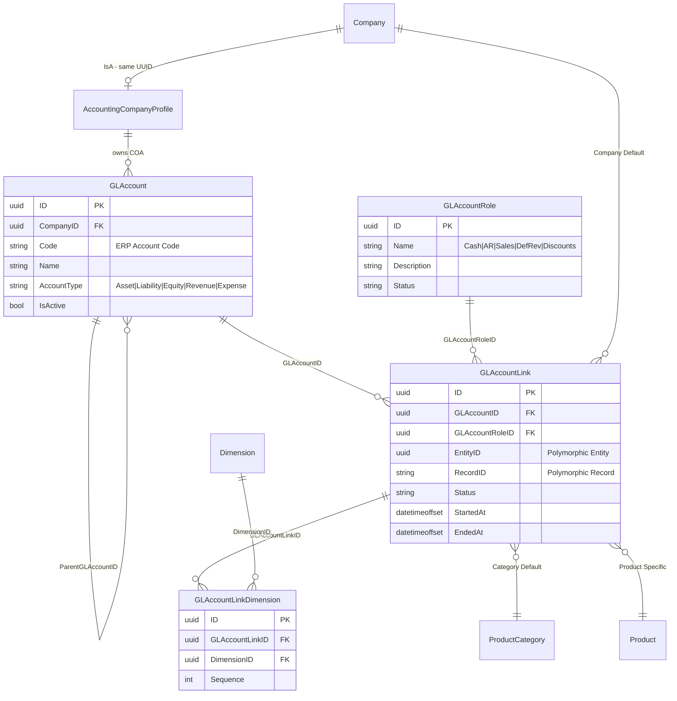
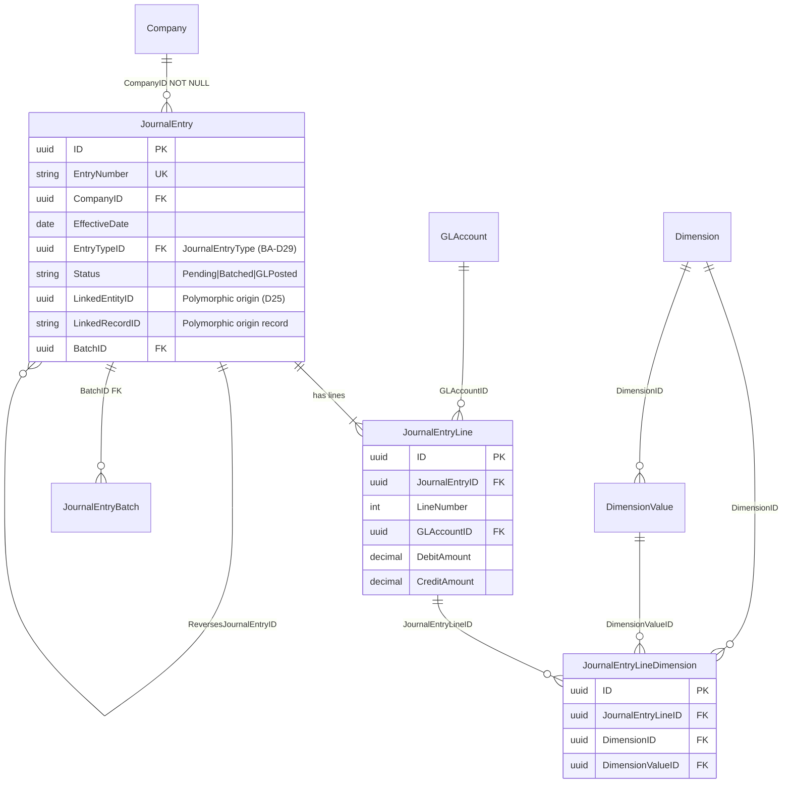
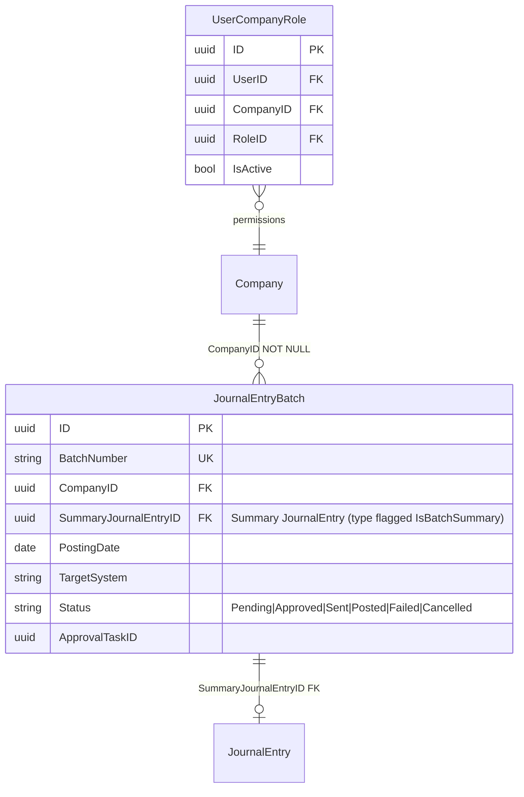
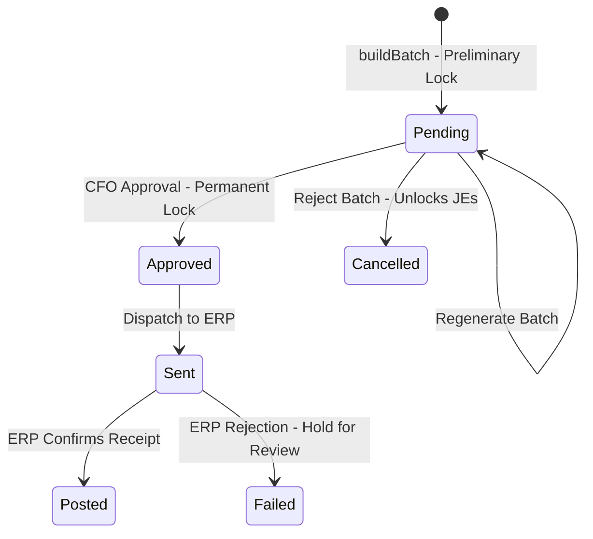

# BizApps Accounting — Master Plan

> **Status:** Single source of truth for the BizApps Accounting rebuild (consolidated 2026-07-22).
> **Repo:** `MemberJunction/bizapps-accounting` · schema `__mj_BizAppsAccounting`.
> **Positioning:** **Accounts-receivable subsidiary ledger of record + journal-entry primitives. Not a general ledger.**
>
> This document consolidates the entire prior plan chain (master plan + modification/update ledgers +
> meeting rulings through 2026-07-22) into one current-state plan. It stands alone: there are no
> companion ledgers, markers, or meeting docs — **git is the history**. Where a decision came from a
> specific person's ruling, the attribution is noted inline so provenance survives without ledger
> machinery.

---

## 0. Table of contents

1. [Context, positioning, and guiding principles](#1-context-positioning-and-guiding-principles)
2. [Architecture and scope boundaries](#2-architecture-and-scope-boundaries)
3. [Design decisions (current)](#3-design-decisions-current)
4. [No periods — the timing model](#4-no-periods--the-timing-model)
5. [Entity model](#5-entity-model)
   - 5.1 GLAccount · 5.2 AccountingCompanyProfile · 5.3 GL account roles & links ·
     5.4 Dimensions · 5.5 JournalEntry + JournalEntryLine · 5.6 JournalEntryBatch + summary lines ·
     5.7 Currency · 5.8 Tax entities · 5.9 What is deliberately absent from the schema
6. [Database-level enforcement](#6-database-level-enforcement)
7. [JE lifecycle and batching workflow](#7-je-lifecycle-and-batching-workflow)
8. [Multi-currency mechanics](#8-multi-currency-mechanics)
9. [Intercompany](#9-intercompany)
10. [Tax](#10-tax)
11. [Reporting: read-model views](#11-reporting-read-model-views)
12. [Permissions, roles, and company scope](#12-permissions-roles-and-company-scope)
13. [UX direction](#13-ux-direction)
14. [Integration contract with BizApps Orders](#14-integration-contract-with-bizapps-orders)
15. [Migration of legacy CDP `finance.*` data](#15-migration-of-legacy-cdp-finance-data)
16. [Build sequencing (current priorities)](#16-build-sequencing-current-priorities)
17. [Open architecture questions](#17-open-architecture-questions)
18. [Out of scope (explicit)](#18-out-of-scope-explicit)
19. [Build inventory](#19-build-inventory-state-as-of-consolidation-2026-07-22)

---

## 1. Context, positioning, and guiding principles

BizApps Accounting provides the **journal-entry primitives and AR subsidiary ledger** for the MJ
ecosystem. It is **not a general ledger**.

### What we ARE

- **AR subsidiary ledger of record:** the system of record for customer-facing accounting events —
  invoices, payments, deferred revenue rollforward, sales-tax accruals, and every JE that originates
  from a customer transaction.
- **Journal-entry primitives:** balanced, immutable-once-locked, dimension-tagged,
  multi-currency-capable JE infrastructure that downstream apps (BizApps Orders, future
  BizApps Payroll, etc.) call into.
- **Batching to the external GL:** aggregate our JEs and post consolidated summaries to the ERP
  (Business Central, QuickBooks, NetSuite, Sage) — the detail stays with us for drill-through.

### What we are NOT

- **Not a general ledger.** The ERP remains the system of record for the full GL.
- **Not a financial-statement generator.** TB / P&L / Balance Sheet / Cash Flows come from the ERP.
- **Not a year-end closing engine.** ERP territory.
- **Not an expense-management, inventory, or COGS system.** ERP or future BizApps siblings.
- **Not a period-close system.** We keep **no accounting-period machinery at all** (see §4).

### Guiding principles (Amith's design ethos)

1. **Mirror real-world accounting practice and structure** so professional accountants and auditors
   find the system approachable and auditable. Between "technically convenient" and "what a real
   ledger does" — do what a real ledger does.
2. **Integrity via the strictest practical DB-level controls (triggers).** No blockchain-style
   store; trust a CFO-level human not to bypass the controls. The invariants must hold even against
   direct SA access.
3. **Pen, not pencil.** Mistakes are corrected with adjusting/correcting entries — locked history is
   never edited or deleted.
4. **The subledger philosophy of detail:** the GL never receives individual transactions — "we do
   not send individual transactions, we aggregate and roll up… you never get individual JEs/dates
   into the GL system" (Amith). The GL holds summaries plus a link back to our detail.
5. **Deterministic test data:** generate our own seed/demo data and validate every change against it.

### Why this scope is the right boundary

The ERP investment is sunk and works; replicating its GL is wasted effort. The subledger pattern is
well-understood (Zuora → NetSuite, Stripe → QBO) and the boundary is clean. Downstream apps need
disciplined JE primitives — providing those without also providing a GL keeps scope tractable.

---

## 2. Architecture and scope boundaries

### Dependency stack

```
__mj                    MJ core: Company, User, Role, File
   ↑
bizapps-common          Person, Organization, Address, ContactMethod
   ↑
bizapps-tasks           Task primitives (batch-approval tasks run through it)
   ↑
bizapps-accounting  ◄── this plan
   ↑
bizapps-orders          Product, Order, OrderLine, Subscription, Payment —
                        emits JEs by calling into Accounting (one JE per order line)
```

- **Currency is OWNED by accounting** (`__mj_BizAppsAccounting.Currency`, seeded ISO-4217).
  bizapps-common never shipped it; any app needing currency takes a dependency on this free OSS app.
- **SQL Server first; PostgreSQL by conversion.** Migrations are authored as T-SQL; the PG
  counterparts are produced by MJ's `sql-converter` tooling and validated in CI at release time.
- **UUID primary keys throughout.** No INT IDENTITY.

### Boundary contracts

**Accounting receives from upstream:** JE create requests (header + balanced lines + dimension
tags) via the `Accounting.CreateJournalEntry` / `CreateJournalEntries` remote operations.

**Accounting provides to upstream:** transactional, atomic, balanced JE creation; role-based GL
account resolution (`AccountingEngineBase.ResolveLinkedAccount`); AR/balance data via read-model
views.

**Accounting does NOT:** know about Orders/Subscriptions/Payments as concepts (only the generic
polymorphic origin pair, D25); generate JEs autonomously; own the ERP connector (dispatch uses the BC REST API — §7.5);
generate intercompany legs (§9); compute FX (§8); calculate tax (§10).

### Standing migration practice (pre-production)

While nothing is deployed, schema changes are made by **editing the ORIGINAL baseline migration in
place**, rebuilding on a clean database, and re-running CodeGen — no incremental fix-up migrations
(Amith, 2026-07-21). Once published, the publish-then-no-breaking-changes policy applies.

---

## 3. Design decisions (current)

The current decision set. Each is the standing ruling — superseded ancestors live only in git.

| # | Decision | Rationale / source |
|---|----------|-----------|
| D1 | **Subledger positioning** (§1). AR subsidiary ledger + JE primitives; the ERP is the GL. | Sharp scope; don't re-implement the ERP. |
| D2 | **No accounting periods, no close machinery — the ERP owns periods.** No `AccountingPeriod` table, no period FK anywhere, no close guard. Batches land in the ERP's ACTIVE period; "that's not our job to worry about" (Amith). Accountants are responsible for batching entries into the right periods; any future timing rule detects by **DATE, never a period FK**. | Amith 2026-07-02, confirmed final by Marcelo 2026-07-14 after a brief manual-close detour was withdrawn same-day. Batch summaries lose date info anyway. |
| D3 | **`JournalEntry` is SINGLE-COMPANY:** `CompanyID NOT NULL` header; every line's account belongs to that company (trigger-enforced). Upstream books one JE per order line, so each JE resolves to exactly one company. | Marcelo 2026-07-13 (locks are JE-grained → per-company independence); Robert concurs. |
| D4 | **Balanced-JE invariant enforced at DB level** (deferred/transaction-scope trigger): `SUM(Debits) = SUM(Credits)` per JE. Cannot be bypassed by any code path. | Audit guarantee. |
| D5 | **JE lifecycle `Pending → Batched → GLPosted`; batching is the lock event — with LEVELS.** Pre-approval batch = preliminary, REVERSIBLE lock; **approval = permanent lock**; **reject UNLOCKS** entries back to the candidate pool; an open batch can be regenerated. | Robert 2026-07-08. |
| D6 | **Immutability after lock** enforced by DB trigger: `UPDATE`/`DELETE` blocked for locked JEs/lines except the GL-roundtrip fields (`GLPostedAt`, `GLReferenceID`, `Status`). Reversals via new JEs only. | Audit trail by construction. |
| D7 | **Batches are SINGLE-COMPANY:** `JournalEntryBatch.CompanyID` header; one batch per company per run, on that company's own cadence. | Robert's proposal; Jeremy sign-off ("actually a better control" — per-company approvers = segregation of duties); Marcelo ruled independently. See §7.2 conditions. |
| D8 | **The batch carries a SINGULAR accountant-set `PostingDate`; one aggregated JE per batch posts to the GL.** Posting date must match between systems; document date is informational only (never cross the two — Jeremy). | Amith's model; Jeremy "100% on board". |
| D9 | **Batch summary granularity = GLAccount × dimension-combo (one aggregated Summary `JournalEntry`).** One net summary line per account×dimension group; null-dimension entries aggregate within their account group. The summary is modeled as **one aggregated `JournalEntry` typed with the `IsBatchSummary`-flagged `JournalEntryType` (BA-D29)** linked via `JournalEntryBatch.SummaryJournalEntryID`, reusing standard `JournalEntryLine` and `JournalEntryLineDimension` rows (`JournalEntryBatchLineItem` tables retired). | Amith 2026-06-28 → 2026-07-22 simplification. |
| D10 | **Batch approval runs through bizapps-tasks** (CFO-level gate): the batch cannot dispatch until the approval task completes. Batch build and task-raise are **ONE transaction** — header + summary + JE locks + the approval Task + the `ApprovalTaskID`+`ApprovalTaskRaisedAt` stamp commit all-or-none; a task failure rolls back the whole build (the pre-write CFO precondition catches the no-approver config case before any write). `ApprovalTaskID` is intended as a **real FK** to the Task (findable, undeletable) — **soft ref interim** until the CodeGen cross-app-FK work ships (~MJ 5.51), then harden. | Amith (approval-via-tasks); Marcelo 2026-07-29 (one transaction, supersedes the 2026-07-16 two-transaction split). |
| D11 | **Role-based polymorphic GL account mapping:** `GLAccountRole` + `GLAccountLink` (+ `GLAccountLinkDimension`) map accounts to Product / ProductCategory / Company by role, date-effective. Consumers resolve product → category tree → company default. | Amith 2026-07-02 engine meeting. Full rules §5.3. |
| D12 | **Company default accounts = company-level `GLAccountLink` rows.** The five `AccountingCompanyProfile` default-account FK columns are REMOVED ("replaced by 5 rows in the GL account link table" — Amith 2026-07-21). There is no system-level default: "GL account defaults start at the company level." Required-role enforcement is parked for later. | Amith 2026-07-21 review. |
| D13 | **`ChartOfAccountsMapping` is DROPPED** — "an appendage from a prior design… blow it away" (Amith). ERP account identity lives on `GLAccount` (`ExternalSystem` + `ExternalAccountID`); we are not the source of truth for the ERP's chart. | Amith 2026-07-21. |
| D14 | **Contra-account roles:** `GLAccountRole` includes **Sales Discounts** and **Returns & Allowances**. Classical contra treatment: gross Cr Sales, discount as Dr Sales-Discounts, AR at net; absent a linked discounts account, net into Sales. | Amith 2026-07-21. |
| D15 | **Deferred revenue = REAL forward-dated JEs written at booking.** No schedule tables, no materializer, no daily job (Robert: a wake-up job is "fragile — just create them"). A 12-month $1,200 sub → 12 × $100 Dr DefRev / Cr Revenue JEs, each with its own EffectiveDate. Changes/cancellations produce **correcting orders whose entries NET against what's staged** — staged entries are never edited or deleted. | Robert's model + Jeremy sign-off ("cleaner model than what I had in mind"). |
| D16 | **All FX (realized + unrealized) is computed and posted UPSTREAM** (Orders/Payments). Accounting keeps only account refs, balance validation, and `vw_FxExposure`. FX overall is deferred until multi-currency activates; the responsibility is **unowned until Payments exists** (flagged, accepted). | Amith 2026-06-30. |
| D17 | **Tax calculation is DELEGATED to a third-party engine** (Stripe Tax / Avalara / Vertex class) behind the `TaxCalculationProvider` seam. We (1) send inputs, (2) record what returns. Our tax tables are **snapshot/reference data** — never a rate authority we maintain or sync. | Robert 2026-07-14. Engine selection + launch timing open (§16). |
| D18 | **Intercompany: accounting still GENERATES no legs — but it now owns the LOOKUP.** No leg generation, no netting, no settlement here; the emitter (Payments, in bizapps-orders) builds the entries. What changed 2026-07-26: the per-company-pair account mapping lives in THIS repo as `IntercompanyAccountMatch` (BA-D26), because it maps GL accounts and dimensions — accounting's own vocabulary — and every future consumer (AP as well as AR) needs the same answer. The reserved "4 accounts per unordered pair" shape is **superseded** by ordered pairs (BA-D27). **Intercompany legs arise on the PAYMENT side, not at booking** (Amith 2026-07-21). | Amith 2026-06-28 → 2026-07-21 → 2026-07-26. |
| D19 | **JE numbering `JE-{CompanyCode}-{FY}-{seq}`** — per company, per fiscal year. Gap-free/consecutive numbering is NOT a requirement (Amith 2026-07-23: no such concept we care about) — the sequence is best-effort; gaps are acceptable. Batch numbering stays a global sequence (revisit if per-company batch numbering is wanted). | Familiar to accountants; FY from company settings. |
| D20 | **No balance materialization.** Read-model views compute on demand; revisit only if read performance demands it. | Amith ("might kill this for the first version"). |
| D21 | **Permissions = standard MJ roles + RLS; the app seeds its own roles** (Accounting User / Admin, optionally Manager). Company-scoped access via a `UserCompanyRole` grant table (per-company User/Approver/Admin + unscoped Global Admin). The CFO approver is a designated **`__mj.User`** link (a security identity — no Employee entity exists). | Robert 2026-07-09; mechanism ruled 2026-07-16. |
| D22 | **Forms-first UX:** every core entity gets a first-class MJ Entity Form composed of widgets dashboards embed directly ("truly one UX"); no bespoke pop-ups — modal/slide-in surfaces render the entity form through MJ's form host. | Amith 2026-07-17. Full UX direction §13. |
| D23 | **UTC everywhere.** Every persisted timestamp is UTC; `OperatingTimeZone` is presentation-only. | Standing convention. |
| D24 | **Metadata-driven JE generation.** Upstream metadata (product type, roles, links) determines the JE pattern; accounting validates and stores. New rev-rec policies come from metadata, not code changes. | Original principle, unchanged. |
| D25 | **JE provenance = ONE polymorphic origin pair on the header:** `JournalEntry.LinkedEntityID`/`LinkedRecordID` (nullable TOGETHER — CHECK; NULL = manual JE). Every JE has exactly one causal origin (per-line booking makes JE↔OrderLine 1:1; payment/tax/batch emitters are all single-origin; multi-record relationships like payment→orders live in domain tables such as `PaymentLine`). Replaces BOTH the as-built seven soft-ref columns (`OrderID`, `OrderLineID`, `SubscriptionID`, `PaymentID`, `ContractID`, `IntercompanyFlowID`, `TaxRemittanceID` — "junky duplicative soft fkeys") AND the as-built `JournalEntryLink` table (M:N machinery nothing needs; reintroduce alongside the pair only if a future emitter genuinely needs N links). `JournalEntryLine.OrderLineID` also drops (redundant under 1:1). All via in-place baseline edit. | Amith 2026-07-23. |
| BA-D26 | **`IntercompanyAccountMatch` lives in accounting.** A per-company-pair lookup answering "when Source collects cash settling Target's line, which two accounts carry the obligation?" — `SourceCompanyID`, `TargetCompanyID`, `DueToGLAccountID`, `DueFromGLAccountID`, date-effective (`Status`/`StartedAt`/`EndedAt`) with GLAccountLink's exact resolution rule. Child `IntercompanyAccountMatchDimension` carries `Side` + `DimensionID` + **nullable `DimensionValueID`**. It is here rather than in orders because it maps GL accounts and dimensions, and a future AP app needs the identical lookup. Resolution: `AccountingEngineBase.ResolveIntercompanyAccounts`. | Amith 2026-07-26; design in bizapps-orders `plans/intercompany-balancing.md`. |
| BA-D27 | **Pairs are ORDERED, not symmetric.** A row means "Source owes Target"; the reverse direction is a SEPARATE row. Supersedes D18's "4 accounts in one unordered row". Two reasons: the directions routinely use different accounts and are configured at different times, and a symmetric row is easy to read backwards — **and a backwards pair still BALANCES**, so no downstream check would ever report it. That same invisibility is why the orientation rules are enforced by DB trigger (50024/50025), the account-type rules too (50026), and why `ResolveIntercompanyAccounts` returns two named, company-stamped legs instead of the raw row. | Amith 2026-07-26. |
| BA-D28 | **No `GLAccountRole` for intercompany.** Roles resolve per-RECORD (this product's revenue account); an intercompany account is per-company-PAIR and cannot be expressed that way. `IntercompanyAccountMatch` is the sole resolution path rather than a second competing one. A missing pair is a HARD failure at emit time — never a fallback to a default account, because a guessed account still balances. | Amith 2026-07-26. |
| BA-D29 | **`JournalEntryType` lookup replaces the closed `EntryType` CHECK enum** (issue #24). A domain app could not classify its own entries without an accounting migration — a hard coupling in the wrong direction, since accounting cannot know what apps will exist. The classification stays (it is genuinely useful) but its closed-enum shape goes: `JournalEntryType` (`Code`/`Name`/`Description`/`IsSystem`/`IsBatchSummary`/`IsActive`, UQ Code) with `JournalEntry.EntryTypeID` FK. Accounting seeds ONLY the ledger-mechanics set it owns (`IsSystem=1`, metadata/journal-entry-types/): Manual, Reversal, Adjustment, OpeningBalance, BatchSummary, FXRevaluation, PeriodEndAccrual, Writeoff. Domain types (OrderBooking, PaymentReceipt, RevenueRecognition, Refund, ...) become their owning app's metadata (`mj sync push`). `IsBatchSummary` replaces the `'BatchSummary'` magic string as the batch-summary discriminator (a filtered unique index allows exactly one flagged row); triggers 50012/50023 now join the type table. Draft contract carries the CODE; the pipeline validates it against live reference data (`ENTRY_TYPE_UNKNOWN`/`_INACTIVE`). | Amith proposal (issue #24) + Marcelo ratification 2026-07-27. |
| BA-D30 | **Accounting never references its own dependents — hard OR soft** (issue #22). `AccountingCompanyProfile.DefaultPaymentTermsTypeID` (a soft ref into `__mj_BizAppsOrders.PaymentTermsType`) is DROPPED: an FK would invert the app graph, and a soft ref is a hack encoding an orders concern in an accounting table. Per-company default payment terms will be modeled on the ORDERS side (an IsA extension on Company or a dedicated orders table). Standing rule: cross-app references must be real FKs and point UP the dependency graph only; the D25 origin pair (`LinkedEntityID` hard-FK to `__mj.Entity` + soft-by-nature `LinkedRecordID`) is the ONE sanctioned downstream-lineage mechanism. `JournalEntryBatch.ApprovalTaskID` hard-FK to bizapps-tasks is DEFERRED until bizapps-tasks installs cleanly as a dependency (issue #22 item 1; the both-or-neither CHECK stays). `mj-app.json`: the `mj-bizapps-common` range moved to the 5.x line so the installer resolves published common (5.32.0); `mj-bizapps-tasks` stays `>=1.0.0 <2.0.0` — tasks IS 1.2.0 today (Marcelo catch, 2026-07-27) and moves to 5.x only with the version-alignment memo. Package version bump deliberately deferred at PR-27; REQUIRED before production deployment (Amith PR-27 review, 2026-07-29). | Amith direction (issue #22) + Marcelo 2026-07-27. |
| BA-D31 | **JE numbering: D19 per-company format STANDS; D-SEQ is RETIRED for JEs.** The 2026-07-06 D-SEQ global-sequence decision belonged to the multi-company era; the 2026-07-22 single-company rewrite already implemented per-company numbering (`JournalEntrySequence` keyed `(CompanyID, FiscalYear)`, `SequenceService` emitting `JE-{CompanyCode}-{FY}-{seq}`). A global counter cannot even define FY (fiscal calendars are per-company) and would put holes in every company's book. Pre-production + rebuild-from-zero practice = no historical numbers to reinterpret. Batches unchanged (`BatchNumber` stays a global sequence). Sequence MACHINERY stays: gap-freedom is not required (D19), so simplifying/retiring the counter table is licensed but unscoped. Consequence: `block0`/`engine-runtime` harness assertions update to the per-company format in their rewrite. | Marcelo ruling 2026-07-28 (resolves the §17.1 contradiction Amith deliberately left open). |
| BA-D32 | **`GLAccountLink` keeps NO explicit `CompanyID` — company derives through the GL account FK** ("follow the FK and read it there; the engine caches both tables, the join costs nothing"). The derivation is safe because the **GLAccount identity lock is IMMEDIATE and UNCONDITIONAL** (Amith 2026-07-29): CompanyID/Code/AccountType/CurrencyCode are frozen the moment the record is created — NOT gated on JE-line references — which kills the drift/probe-C class at the root (an account that can never change can't re-aim its references). Corrections = deactivate + new account. Built with it: **the write-time tie guard** per (record, role, company, window) on `GLAccountLinkEntityServer` (same StartedAt among Active same-company links for one record+role = refused; a trigger backstop stays on the hardening backlog since overlap windows aren't expressible as a UNIQUE index) and **`forCompanyID` on `ResolveLinkedAccount`** (scopes resolution to the booking company for shared records; company derived through the cached GLAccount). Resolution is **not remotable** — GL accounts + links are read-heavy/write-light `AccountingEngineBase` cache citizens (client + server), the cache is source of truth for that validation. | Amith 2026-07-28 meeting + 2026-07-29 note (immediate lock; supersedes both the explicit-CompanyID package and the deferred-lock interim). Implemented 2026-07-29. |
| BA-D33 | **Tax phase-4 placement** (from the orders pricing design §6, aligned with Amith). `CompanyTaxNexus` (Company × TaxJurisdiction + registration number + dates — the seller-side "must company C collect in jurisdiction J?" gate; row existence IS the answer, no row = deliberately no tax) comes INTO accounting — pure accounting vocabulary, property of the legal entity. The product-scoped exemption on `CustomerTaxProfile` also comes here BUT keyed by an ACCOUNTING-OWNED tax category (`TaxRate.TaxCategory` today; promoting it to a first-class lookup a la `JournalEntryType` is the expected shape) — NEVER by an orders product/category reference (BA-D30). Orders maps product → tax category on its side; its tax engine joins the halves reading UP the graph. | Direction agreed with Amith (orders #14/#15, 2026-07-28); builds in a future baseline pass, sequenced after the donor audit. |

---

## 4. No periods — the timing model

Worth its own section because it shapes everything downstream:

- There is **no `AccountingPeriod` table, no period FK, no close workflow, no close guard**. JEs
  carry only dates (`EffectiveDate`). The ERP settles periods: a dispatched batch lands in the ERP's
  active period.
- **Period-boundary discipline is the ACCOUNTANT's, aided by the UI:** batch windows shouldn't
  straddle a boundary that matters; the batch UI's presets (end-of-yesterday / end-of-week /
  end-of-month) and the displayed swept date range are the guardrails — not engine machinery.
- **Closed-period collisions HOLD-and-flag, never auto-roll** (Jeremy): if the ERP rejects a batch
  because its posting date falls in a closed period, the batch/entry is flagged for review in an
  exceptions surface. v1 = react to the BC rejection; a proactive BC period-status feedback loop is
  a later enhancement.
- A future timing/period-restriction system is a **recognized gap, deliberately deferred** (first
  test sets run unrestricted). Design constraint locked in advance: detect by DATE, never a period FK.

---

## 5. Entity model

### 5.0 ERD Diagrams

#### Chart of Accounts, Roles & Account Links

```mermaid
erDiagram
    Company ||--o| AccountingCompanyProfile : "IsA - same UUID"
    AccountingCompanyProfile ||--o{ GLAccount : "owns COA"
    GLAccount ||--o{ GLAccount : "ParentGLAccountID"
    GLAccount ||--o{ GLAccountLink : "GLAccountID"
    GLAccountRole ||--o{ GLAccountLink : "GLAccountRoleID"
    GLAccountLink ||--o{ GLAccountLinkDimension : "GLAccountLinkID"
    Dimension ||--o{ GLAccountLinkDimension : "DimensionID"
    GLAccountLink }o--|| Company : "Company Default"
    GLAccountLink }o--|| ProductCategory : "Category Default"
    GLAccountLink }o--|| Product : "Product Specific"

    GLAccount {
        uuid ID PK
        uuid CompanyID FK
        string Code "ERP Account Code"
        string Name
        string AccountType "Asset|Liability|Equity|Revenue|Expense"
        bool IsActive
    }
    GLAccountRole {
        uuid ID PK
        string Name "Cash|AR|Sales|DefRev|Discounts"
        string Description
        string Status
    }
    GLAccountLink {
        uuid ID PK
        uuid GLAccountID FK
        uuid GLAccountRoleID FK
        uuid EntityID "Polymorphic Entity"
        string RecordID "Polymorphic Record"
        string Status
        datetimeoffset StartedAt
        datetimeoffset EndedAt
    }
    GLAccountLinkDimension {
        uuid ID PK
        uuid GLAccountLinkID FK
        uuid DimensionID FK
        int Sequence
    }
```

#### Journal Entries & Lines

```mermaid
erDiagram
    Company ||--o{ JournalEntry : "CompanyID NOT NULL"
    JournalEntry ||--|{ JournalEntryLine : "has lines"
    GLAccount ||--o{ JournalEntryLine : "GLAccountID"
    JournalEntryLine ||--o{ JournalEntryLineDimension : "JournalEntryLineID"
    Dimension ||--o{ JournalEntryLineDimension : "DimensionID"
    DimensionValue ||--o{ JournalEntryLineDimension : "DimensionValueID"
    Dimension ||--o{ DimensionValue : "DimensionID"
    JournalEntry ||--o{ JournalEntry : "ReversesJournalEntryID"
    JournalEntry ||--o{ JournalEntryBatch : "BatchID FK"

    JournalEntry {
        uuid ID PK
        string EntryNumber UK
        uuid CompanyID FK
        date EffectiveDate
        uuid EntryTypeID FK "JournalEntryType (BA-D29)"
        string Status "Pending|Batched|GLPosted"
        uuid LinkedEntityID "Polymorphic origin (D25)"
        string LinkedRecordID "Polymorphic origin record"
        uuid BatchID FK
    }
    JournalEntryLine {
        uuid ID PK
        uuid JournalEntryID FK
        int LineNumber
        uuid GLAccountID FK
        decimal DebitAmount
        decimal CreditAmount
    }
    JournalEntryLineDimension {
        uuid ID PK
        uuid JournalEntryLineID FK
        uuid DimensionID FK
        uuid DimensionValueID FK
    }
```

#### Batching & ERP Dispatch

```mermaid
erDiagram
    Company ||--o{ JournalEntryBatch : "CompanyID NOT NULL"
    JournalEntryBatch ||--o| JournalEntry : "SummaryJournalEntryID FK"
    UserCompanyRole }o--|| Company : "permissions"

    JournalEntryBatch {
        uuid ID PK
        string BatchNumber UK
        uuid CompanyID FK
        uuid SummaryJournalEntryID FK "Summary JournalEntry (type flagged IsBatchSummary)"
        date PostingDate
        string TargetSystem
        string Status "Pending|Approved|Sent|Posted|Failed|Cancelled"
        uuid ApprovalTaskID
    }
    UserCompanyRole {
        uuid ID PK
        uuid UserID FK
        uuid CompanyID FK
        uuid RoleID FK
        bool IsActive
    }
```

### 5.1 GLAccount

```sql
__mj_BizAppsAccounting.GLAccount
  ID UNIQUEIDENTIFIER PK,
  CompanyID UNIQUEIDENTIFIER NOT NULL FK → __mj.Company,   -- accounts are company-owned
  Code NVARCHAR(40) NOT NULL,            -- matches ERP code
  Name NVARCHAR(200) NOT NULL,
  AccountType NVARCHAR(20) NOT NULL,     -- 'Asset' | 'Liability' | 'Equity' | 'Revenue' | 'Expense'
  ParentGLAccountID UNIQUEIDENTIFIER NULL FK → GLAccount,  -- hierarchy
  CurrencyCode CHAR(3) FK → Currency,
  ExternalSystem NVARCHAR(50) NULL,      -- 'BusinessCentral' | ... (ERP identity lives HERE — D13)
  ExternalAccountID NVARCHAR(100) NULL,
  IsActive BIT NOT NULL DEFAULT 1,
  IsSystemSeeded BIT NOT NULL DEFAULT 0,
  Description NVARCHAR(MAX),
  UNIQUE (CompanyID, Code)
```

**Seeded COA is MINIMAL** (~10–12 essential subledger accounts: Cash, AR, Sales Tax Payable,
Deferred Revenue, Commission Payable, Partner Rev Share Payable, Sales/Subscription Revenue, FX
gain/loss). The rest sync from the ERP. "Radical simplification — lean on dimensions" (Amith).

There is **no global account pool** — accounts belong to companies.

### 5.2 AccountingCompanyProfile (IsA Disjoint child of `__mj.Company`)

Holds all Company-attribute extensions accounting needs — business-profile fields and
accounting-specific fields. MJ core stays minimal.

```sql
__mj_BizAppsAccounting.AccountingCompanyProfile
  ID UNIQUEIDENTIFIER PK FK → __mj.Company(ID),   -- same UUID as the parent Company
  -- Business profile
  EntityType NVARCHAR(30) NOT NULL DEFAULT 'Subsidiary',
  LegalStructureType NVARCHAR(30) NULL,
  IncorporationDate DATE NULL,
  JurisdictionCountry CHAR(2) NULL,
  JurisdictionRegion NVARCHAR(50) NULL,
  FederalTaxID NVARCHAR(40) NULL,
  OperatingTimeZone NVARCHAR(60) NULL,    -- presentation only; storage is UTC (D23)
  CompanyCode NVARCHAR(20) NOT NULL,      -- JE numbering; UNIQUE, uppercase
  -- Accounting
  FunctionalCurrencyCode CHAR(3) NOT NULL FK → Currency,
  ReportingCurrencyCode CHAR(3) NULL,
  FiscalYearStartMonth TINYINT NOT NULL DEFAULT 1,
  FiscalYearStartDay TINYINT NOT NULL DEFAULT 1,
  ParentAccountingCompanyID UNIQUEIDENTIFIER NULL,  -- "uses the books of"; no chains; not self
  ApprovalCFOUserID UNIQUEIDENTIFIER NULL FK → __mj.User,  -- designated batch approver
  IsActive BIT NOT NULL DEFAULT 1,
  UNIQUE (CompanyCode)
```

**No default-GL-account FK columns** (D12): a company's default accounts are **five company-level
`GLAccountLink` rows** (roles AR, Sales, Deferred Revenue, Sales Discounts, Returns & Allowances —
plus whatever else a deployment links). Enforcement that a company carries all required role links
is deferred ("we're going to come back to it" — Amith).

### 5.3 GL account roles & links (role-based polymorphic mapping)

```sql
__mj_BizAppsAccounting.GLAccountRole        -- role registry: AR, Sales, Deferred Revenue,
  ID, Name, Description, IsActive           -- Inventory, COGS, Sales Discounts, Returns & Allowances

__mj_BizAppsAccounting.GLAccountLink        -- polymorphic, date-effective account routing (as-built shape)
  ID, GLAccountID FK, GLAccountRoleID FK,
  EntityID UNIQUEIDENTIFIER NOT NULL,       -- polymorphic entity ref: Company | Product | ProductCategory
  RecordID NVARCHAR(400) NOT NULL,          -- polymorphic target record
  Status NVARCHAR(10) NOT NULL,             -- 'Pending' | 'Active' | 'Disabled'
  StartedAt, EndedAt DATETIMEOFFSET NULL,   -- date-effective window (CHECK EndedAt > StartedAt)
  Comments NVARCHAR(MAX) NULL
  -- + GLAccountLinkDimension for analytical tags carried into resolved lines
```

**Resolution walk** (`AccountingEngineBase.ResolveLinkedAccount`): product link → up the
product-company's OWN category tree → product-company company-default → loud tripwire if nothing
resolves.

**Company-scoping rules (LOCKED — Marcelo, Robert-confirmed):**

1. **Categories are per-company rows** (`ProductCategory.CompanyID NOT NULL` on the orders side)
   with identical-name display-collapse in the UI — no shared registry object. Robert: "five
   companies, 5 t-shirt categories… crossing them, no."
2. **Company is the resolver's INPUT** (the product's `CompanyID` is the source of truth). A
   fallback may reduce specificity, never change company.
3. **Anchor split (Robert):** the product-company anchors the **revenue side** (revenue / DefRev /
   COGS accounts); the **AR + cash side anchors to the ORDER-owning company** (seller of record).
4. **Enforcement tiers (creation-time; invalid data impossible):**
   **HARD-BLOCK** — product- or category-level link to another company's account · two accounts on
   one category for the same role · product without a CompanyID · product assigned to another
   company's category. Enforced in the **engine** (typed errors) + a **DB validation trigger** as
   the raw-SQL floor.
   **WARN (incomplete, not invalid)** — assigning a product to a category with no route for its
   company: legal, falls through to the company default; assignment-time warning with a pop-out to
   fix the route.
5. **Cross-company revenue flows are intercompany TRANSACTIONS** (due-to/due-from machinery), never
   mapping routes — the mapping layer refuses cross-company entirely.

### 5.4 Dimensions

First-class analytical dimensions on JE lines; optional (no dimensions = flat chart, no penalty).

```sql
Dimension        (ID, Code UNIQUE, Name, Description, IsActive, DisplayOrder)
DimensionValue   (ID, DimensionID FK, Code, Name, ParentDimensionValueID NULL, IsActive,
                  EffectiveFrom, EffectiveTo, UNIQUE (DimensionID, Code))
JournalEntryLineDimension       (JournalEntryLineID, DimensionID, DimensionValueID,
                                 UNIQUE (JournalEntryLineID, DimensionID))
GLAccountLinkDimension          (GLAccountLinkID, DimensionID, Sequence — UNIQUE (link, dimension))
```

Dimension tags survive end-to-end: JE line → batch summary line (the netting key includes the
dimension combo) → the ERP, so departmental/segment financials remain reproducible GL-side.

### 5.5 JournalEntry + JournalEntryLine

```sql
__mj_BizAppsAccounting.JournalEntry
  ID UNIQUEIDENTIFIER PK,
  EntryNumber NVARCHAR(40) NOT NULL,     -- 'JE-{CompanyCode}-{FY}-{seq}' (D19)
  CompanyID UNIQUEIDENTIFIER NOT NULL FK → __mj.Company,   -- SINGLE-company (D3)
  EffectiveDate DATE NOT NULL,           -- the accounting date; NO period FK (D2)
  EntryTypeID UNIQUEIDENTIFIER NOT NULL, -- FK to JournalEntryType (BA-D29): extensible lookup, consumers seed their own rows
                                         -- | 'Refund' | 'Writeoff' | 'Reversal' | 'Manual' | 'BatchSummary' | ...
  Status NVARCHAR(20) NOT NULL,          -- 'Pending' | 'Batched' | 'GLPosted'
  Description NVARCHAR(MAX),
  -- Polymorphic origin (D25): exactly one causal source record; NULL/NULL = manual JE
  LinkedEntityID UNIQUEIDENTIFIER NULL,   -- FK → __mj.Entity (OrderLine | Payment | ...)
  LinkedRecordID NVARCHAR(400) NULL,      -- CHECK: both set or both NULL
  -- Reversal chain
  ReversesJournalEntryID UNIQUEIDENTIFIER NULL FK → JournalEntry,
  ReversedByJournalEntryID UNIQUEIDENTIFIER NULL FK → JournalEntry,
  -- Lifecycle
  BatchID UNIQUEIDENTIFIER NULL FK → JournalEntryBatch,
  GLPostedAt DATETIMEOFFSET NULL,
  GLReferenceID NVARCHAR(100) NULL

__mj_BizAppsAccounting.JournalEntryLine
  ID UNIQUEIDENTIFIER PK,
  JournalEntryID FK NOT NULL, LineNumber INT NOT NULL,
  GLAccountID FK NOT NULL,               -- must belong to the header company (trigger)
  DebitAmount DECIMAL(18,2) NULL,        -- exactly one side set (CHECK)
  CreditAmount DECIMAL(18,2) NULL,
  OriginalCurrencyCode CHAR(3) NULL,     -- source-currency tracking (§8)
  OriginalDebitAmount, OriginalCreditAmount DECIMAL(18,2) NULL,
  ExchangeRateUsed DECIMAL(18,8) NULL,
  Description NVARCHAR(MAX),
  -- (CounterpartyOrganizationID REMOVED 2026-07-29, Amith: customer attribution is handled at
  --  the business-logic level in ORDERS — an unneeded appendage at the accounting level.)
  UNIQUE (JournalEntryID, LineNumber)
```

Notes:

- **No `AccountingPeriodID`** anywhere (D2). **No `ScheduledJournalEntryID`** — the scheduled-JE
  machinery is retired (D15) and the column drops with it (no lineage worth keeping,
  pre-production — Marcelo 2026-07-21).
- **No per-entity origin FK columns** (D25): the as-built baseline still carries `OrderID`,
  `OrderLineID`, `SubscriptionID`, `PaymentID`, `ContractID`, `IntercompanyFlowID`,
  `TaxRemittanceID` on `JournalEntry`, `OrderLineID` on `JournalEntryLine`, and the
  `JournalEntryLink` table — all drop via in-place baseline edit, replaced by the single
  `LinkedEntityID`/`LinkedRecordID` origin pair. With one JE per order line (orders D10) the
  JE↔line mapping is 1:1, so neither a link table nor a line-level drill ref adds anything.
- Forward-dated rev-rec JEs are ordinary rows in this table with future `EffectiveDate`s.

### 5.6 JournalEntryBatch (Simplified Summary Model)

```sql
__mj_BizAppsAccounting.JournalEntryBatch
  ID UNIQUEIDENTIFIER PK,
  BatchNumber NVARCHAR(40) UNIQUE,        -- global sequence (D19)
  CompanyID UNIQUEIDENTIFIER NOT NULL FK → __mj.Company,  -- SINGLE-company batch (D7)
  SummaryJournalEntryID UNIQUEIDENTIFIER NULL FK → JournalEntry, -- Aggregated summary JE (type flagged IsBatchSummary)
  TargetSystem NVARCHAR(50) NOT NULL,     -- one company AND one target per batch
  PostingDate DATE NOT NULL,              -- singular, accountant-set at build (D8);
                                          -- default from the batch window; must match the GL
  BatchedAt DATETIMEOFFSET NOT NULL, BatchedByUserID FK NOT NULL,
  Status NVARCHAR(20) NOT NULL,           -- 'Pending' | 'Approved' | 'Sent' | 'Posted' | 'Failed' | 'Cancelled'
  TotalEntries INT, TotalDebits DECIMAL(18,2), TotalCredits DECIMAL(18,2),
  -- Approval task pointer (D10) — stamped in the batch-build transaction (one transaction,
  -- 2026-07-29); CHECK forbids half-stamped
  ApprovalTaskID UNIQUEIDENTIFIER NULL,   -- soft ref interim; hardens to a real FK when the CodeGen cross-app-FK work ships (~5.51)
  ApprovalTaskRaisedAt DATETIMEOFFSET NULL,
  -- ERP roundtrip
  ExternalBatchRef NVARCHAR(100), SentAt, AcknowledgedAt, ErrorMessage
```

- **Simplified Summary Model:** Batch summary lines are modeled as **one aggregated `JournalEntry` (typed with the `IsBatchSummary`-flagged `JournalEntryType`, `EffectiveDate = PostingDate`)** linked via `SummaryJournalEntryID`.
- Its lines (`JournalEntryLine`) net debits/credits per `(GLAccount × Dimension-combo)`, and tags (`JournalEntryLineDimension`) preserve dimensional breakdown. Dedicated `JournalEntryBatchLineItem` and `JournalEntryBatchLineDimension` schema tables are **retired/dropped** — reusing `JournalEntryLine` saves schema clutter and reuses 100% of line validation, DB constraints, and UI line viewer components out of the box.
- **Lifecycle:** the summary JE is created at batch build already **`Batched`, carrying the
  batch's `BatchID` like the members** — so it rides the ONE derived lock machinery: preliminary
  until approval (regeneration uses the standard unlock→rebuild→relock), permanent after, and
  `GLPosted` when the batch posts. It is distinguished from members purely by its type's `IsBatchSummary` flag (BA-D29 — a flag join, not a magic string).
- **Default exclusion:** the `IsBatchSummary`-typed summary is excluded by default from batch-candidate
  gathering (engine + UI — a summary can never be swept into a later batch) and from the
  read-model views (an "include summaries" toggle is permissible).
- **Query Partitioning:** Subledger detail queries exclude (and GL dispatch / summary queries select) JEs whose `JournalEntryType` has `IsBatchSummary = 1` — joined via `EntryTypeID`, or selected directly via `JournalEntryBatch.SummaryJournalEntryID`.
- **Pending Amith's input:** (a) whether a dispatch-time trigger should still assert the summary
  foots to the batch control totals, or the lock-at-creation + tests suffice; (b) whether
  summaries should live in a separate table vs. this same-table model with default exclusion.

### 5.7 Currency

```sql
__mj_BizAppsAccounting.Currency
  ID, Code CHAR(3) UNIQUE NOT NULL,      -- ISO 4217, seeded
  Name, Symbol, DecimalPlaces TINYINT NOT NULL DEFAULT 2, IsActive
```

An exchange-rate table + pluggable rate providers (manual default, no auto-fetch) is the reserved
follow-on shape — **deferred until multi-currency activates** (D16).

### 5.8 Tax entities (snapshot/reference — never a rate authority)

`TaxAuthority`, `TaxJurisdiction`, `TaxRate`, `TaxLiability`,
`CustomerTaxProfile` (exemption status/certificates) — shapes as built in the baseline.
Accounting keeps the tax ACCRUAL only (`TaxLiability`); remitting to the authority is an
ERP/GL concern with no table here. Under D17
these **record what the third-party engine returned** (multi-jurisdiction per line); there is no
"Local" rate-authoring path and no rate-sync build. The `TaxCalculationProvider` abstract seam
stands; the chosen engine is a provider implementation.

### 5.9 What is deliberately ABSENT from the schema

| Absent | Why |
|---|---|
| `AccountingPeriod` (+ period FKs, close machinery) | D2 — the ERP owns periods |
| `ScheduledJournalEntry` trio + materializer op | D15 — rev-rec is real forward-dated JEs |
| `AccountBalance` / `AccountBalanceByDimension` | D20 — views compute on demand |
| `ChartOfAccountsMapping` | D13 — ERP identity lives on `GLAccount` |
| ACP default-GL-account FK columns | D12 — company-level `GLAccountLink` rows |
| `JournalEntryBatchLineItem.CompanyID` | D7 — the batch header carries the company |
| `IntercompanyRelationship` wiring | D18 — Payments owns the wiring when built |
| `Recurring*` template trio | Replaced by the forward-dated-JE model (D15) |
| `JournalEntry` origin FK columns (`OrderID`, `OrderLineID`, `SubscriptionID`, `PaymentID`, `ContractID`, `IntercompanyFlowID`, `TaxRemittanceID`), `JournalEntryLine.OrderLineID`, and the `JournalEntryLink` table | D25 — provenance is the single polymorphic `LinkedEntityID`/`LinkedRecordID` origin pair on the JE header; all three still in the as-built baseline, drop pending |

---

## 6. Database-level enforcement

Critical invariants hold at the database level (T-SQL triggers/CHECKs), immune to app-layer bypass:

1. **One-side rule:** exactly one of Debit/Credit per line (CHECK); original amounts paired with
   currency + rate (CHECKs).
2. **Balanced-JE invariant:** SUM(Dr) = SUM(Cr) per JE, enforced at transaction scope.
3. **Single-company rule:** every line's `GLAccount.CompanyID` equals the JE header's `CompanyID`
   (trigger; typed engine error `MULTI_COMPANY_DRAFT` before it).
4. **Immutability by status:** locked JEs/lines reject UPDATE/DELETE except GL-roundtrip fields;
   batches freeze at Sent/Acknowledged.
5. **Reversal consistency:** the reversal chain's cross-links stay coherent (trigger).
6. **Batch footing (pending Amith's input):** whether a dispatch-time trigger asserts the summary
   JE foots to the batch control totals, or the summary's lock-at-creation + tests suffice.
7. **Approval-pointer coherence:** `ApprovalTaskID`/`ApprovalTaskRaisedAt` set together (CHECK).
8. **Mapping validation floor:** the §5.3 hard-block rules carry a DB validation trigger under the
   engine's typed errors.

---

## 7. JE lifecycle and batching workflow


```mermaid
stateDiagram-v2
    [*] --> Pending : buildBatch - Preliminary Lock
    Pending --> Approved : CFO Approval - Permanent Lock
    Pending --> Cancelled : Reject Batch - Unlocks JEs
    Pending --> Pending : Regenerate Batch
    Approved --> Sent : Dispatch to ERP
    Sent --> Posted : ERP Confirms Receipt
    Sent --> Failed : ERP Rejection - Hold for Review
```

### 7.1 States

| Status | Meaning | Mutable? |
|---|---|---|
| `Pending` | Emitted by an upstream event or staged forward-dated rev-rec. Awaiting batch. | Yes |
| `Batched` (unapproved batch) | In a Pending batch — **preliminary, reversible lock**: can't be double-batched, but reject/regenerate frees it. | No (but releasable) |
| `Batched` (approved batch) | **Permanent lock** through dispatch. | No |
| `GLPosted` | ERP acknowledged the batch. | Only GL-roundtrip fields |

**Reversals (pen, not pencil):** business-entity reversals emit NEW Pending JEs cross-linked via
`ReversesJournalEntryID`/`ReversedByJournalEntryID`. Both sides live in the ledger; the net is zero.

### 7.2 Batch build

- `buildBatch(companyId, dateFilter)` gathers ONLY that company's Pending JEs — one batch per
  company per run, each company on its own cadence.
- **Standard filter semantics (Robert):** empty start date + populated end date/time — ALL unbatched
  entries from earlier dates, ascending. A date-only end is inclusive of that whole date.
- **Forward-dated entries are swept only if the filter reaches that far: default cutoff = today.**
  Building a future-reaching batch requires explicitly setting the filter; batch approval displays
  the swept date range **and the min/max `EffectiveDate` across the member JEs** — the approver
  sees exactly what date span they are committing (Amith 2026-07-23). This date-awareness is the
  only "scheduling" machinery the system has: forward-dated JEs just sit Pending until a window
  reaches them.
- **Arbitrary batches via MJ User Views:** build a view of desired records → "generate batch from
  view"; the engine validates the view resolves ONLY unbatched entries (rejects loudly otherwise).
- The whole batch (header + summary lines + dimensions + control totals + JE locks) commits in
  **ONE transaction** — all rows or none (D10).
- **Intercompany cadence conditions (Jeremy's acceptance conditions for single-company batches):**
  (1) companies with an active intercompany relationship keep their batch cadences ALIGNED (the
  batch UI should surface this); (2) the intercompany rec process tracks "posted in source, not yet
  in ERP" as a reconciling-item TYPE, not a break.

### 7.3 Approval

Raising the CFO approval task (bizapps-tasks) stamps the batch's task pointer in its own
transaction. **Approve** → permanent lock, dispatch allowed. **Reject** → entries UNLOCK back to
the candidate pool; the open batch can be regenerated. Regeneration of a batch invalidates any
pending approval (mechanism for reset-vs-replace deliberately deferred). The enforced decider
is the **Accounting Approver for the batch's company** (any-linked-person resolution is dev
scaffolding only, replaced before non-dev use).

### 7.4 Dispatch

One aggregated JE per batch (the summary JE) posts to the GL, dated `PostingDate`. Status walk:
`Pending → Approved → Sent → Posted` (member JEs + the summary JE → `GLPosted`) ·
`Sent → Failed` (ERP rejection — hold for review/retry) · `Pending → Cancelled` (reject —
member JEs unlock back to the candidate pool). Closed-period rejections HOLD-and-flag (§4).

### 7.5 BC dispatch mechanics (Jeremy/Robert, 2026-07-17)

- **Straight to the API — no CSV intermediary:** BC REST API v2.0
  (`companies({id})/journals({journalId})/journalLines`), Azure AD OAuth client-credentials — the
  only supported SaaS path. Posting date is API-settable (verify with a test post).
- **Separate, write-scoped app registration** just for journal posting (don't widen the existing
  read-only reporting registration) — Jeremy's recommendation, Robert to confirm.
- **External dependency:** BC company-config standardization (9+ BC companies with inconsistent
  posting groups / number series / dimensions / journal templates). **Jeremy owns** researching +
  standardizing before integration wiring; "simple and consistent is better."

---

## 8. Multi-currency mechanics

- **JEs post in the company's functional currency** (`FunctionalCurrencyCode`); the header carries
  no currency field.
- **Original-currency tracking on lines:** `OriginalCurrencyCode` / `OriginalDebit/CreditAmount` /
  `ExchangeRateUsed` when the source transaction is in a different currency. Totals foot in
  functional; drill-in shows both.
- **All FX computation/posting is upstream** (D16) — accounting never generates FX entries. The
  exchange-rate table, rate providers, revaluation, and reporting-currency translation are all
  deferred until multi-currency activates.
- Known open design point, deferred with FX: what multi-currency batch control totals MEAN when
  currencies differ (Marcelo's lean: show totals in the current company's currency).

---

## 9. Intercompany

- **Accounting generates no legs, but owns the lookup** (D18, BA-D26). The emitter — the payment
  path in bizapps-orders — builds the entries; this repo answers *which accounts*.
- **Booking JEs carry NO intercompany legs** (Amith 2026-07-21): an order books one JE per order
  line under the line's company (§14). Intercompany balancing arises on the **payment side**, when
  cash collected by one entity settles a line owned by another.
- **AR grain is settled** (Amith, 2026-07-26): A/R is **per company, per line**. The earlier
  seller-of-record booking-leg model (Robert, 2026-07-20) is **withdrawn, not deferred** — it is no
  longer an open item and no longer gates this work.

### 9.1 `IntercompanyAccountMatch` (built 2026-07-26)

| Column | Meaning |
|---|---|
| `SourceCompanyID` | The company that COLLECTED the cash and therefore owes. |
| `TargetCompanyID` | The company that OWNS the line the cash settled, and is therefore owed. |
| `DueToGLAccountID` | Intercompany **payable** — a **Liability** on Source's books. |
| `DueFromGLAccountID` | Intercompany **receivable** — an **Asset** on Target's books. |
| `Status` / `StartedAt` / `EndedAt` | Date-effective, resolved exactly as `GLAccountLink` is. |

Child `IntercompanyAccountMatchDimension` adds `Side` (`DueTo`/`DueFrom`), `DimensionID`,
`DimensionValueID` (**nullable**) and `Sequence`. The nullable value is the one real departure from
`GLAccountLinkDimension`, which carries the Dimension alone because a transaction supplies the value
from context. An intercompany leg has no such context — it is raised to balance *another* company's
revenue, with no originating record to read a department from — so a value can be pinned here, and
NULL keeps the take-it-from-context behaviour. `Side` exists because the two legs sit on different
companies' books and routinely tag different values for the same Dimension.

**Ordered, not symmetric** (BA-D27). One row is one direction.

**Why the enforcement is heavier than it looks like it needs to be.** Every rule here guards a
single failure mode: a mis-oriented or mis-typed pair still produces a **perfectly balanced**
journal entry. It posts, every balance assertion passes, and the only symptom is two companies'
balance sheets disagreeing months later. So:

- `trg_IAM_AccountIntegrity` (50024/50025/50026) enforces in the DB, unbypassable, that DueTo
  belongs to Source and is a Liability, and DueFrom belongs to Target and is an Asset.
- `trg_IAMD_DimensionValueBelongs` (50027) keeps a pinned value inside its Dimension — these rows
  are configuration and never pass through the draft pipeline that checks this for JE lines.
- `IntercompanyAccountMatchEntityServer` repeats the orientation/type rules for a readable message,
  and adds the one rule only it can: **two Active rows for the same pair sharing a `StartedAt` are
  refused**. Overlapping windows are legitimate (that is how a mapping is superseded), but a tie
  makes resolution arbitrary — the tie-break is a strict `>` — and both candidates balance.
- `ResolveIntercompanyAccounts` returns two **named, company-stamped legs**, so a caller cannot
  re-derive the orientation wrongly.

Covered by `test-harnesses/server/intercompany-runtime.ts` (17 checks across all three layers) and
16 mutation-verified unit tests in `packages/EngineBase`.

**Settlement is named, not built.** These balances accumulate; clearing them when entities actually
move money is a deliberate follow-on, and should be a decision rather than a surprise.

---

## 10. Tax

Per D17: a third-party engine calculates; we send inputs (ship-to/customer address, product tax
category, customer tax profile incl. exemptions) and record the multi-jurisdiction results per
line. Our tax tables snapshot what returned. The `TaxCalculationProvider` seam stands.

**Open (finance calls, not engineering):** engine selection (Stripe Tax = low-friction launch
candidate; Avalara-class when non-Stripe channels/exemption-cert management matter) and launch
timing (launching WITH tax vs without is an explicit business call). We sell to nonprofits —
exemption-certificate handling matters; the profile is ours, cert validation may come from the
engine.

---

## 11. Reporting: read-model views

> **Creation deferred (2026-07-22):** the views are not in the baseline today; each is (re)built
> as needed when a report ships.

Shipped view layer (compute on demand — D20):

```
vw_TrialBalance_AR          AR-side trial balance per company
vw_GLDetail_Subledger       all JE lines for our accounts, with dimension tags
vw_AROpenByCustomer         open AR per customer per company
vw_DefRevRollforward        DefRev beginning + additions + recognitions + ending
vw_SalesTaxLiability        accrued + remitted per authority
vw_ARtoGLRecon              our AR balance vs the ERP's (recon definition in progress)
vw_DimensionPL              subledger revenue by dimension
vw_FxExposure               foreign-currency open balances
```

Skip-generated interactive reports + a Report Gallery app are **deferred** (the views answer the
essential questions now; report pages are mocked and sequenced behind the impact screens).

---

## 12. Permissions, roles, and company scope

- **Seeded roles** (Accounting User / Admin[/Manager]) + entity CRUD permissions + RLS (D21).
- **Company-scoped access mechanism (ruled):** a `UserCompanyRole` grant table — per-company
  User/Approver/Admin sibling roles + an unscoped Global Admin, audit columns, one Accounting MJ
  role with RLS filters on all four operations. The A2 co-design (Marcelo + Robert) executes it;
  v1 is non-blocking.
- **Batch-approver enforcement** (the company's designated Accounting Approver) is required before
  any non-dev use (§7.3).
- **Company-scope UX semantics are deliberately UNRULED:** Marcelo's model is that selecting
  companies makes the frontend behave **as if the others don't exist** (filter options, dropdowns,
  everything) — not mere query filtering. A dedicated scope-planning pass from Marcelo will define
  it; until then, no scope doctrine and no scope code.

---

## 13. UX direction

The binding UI-architecture direction (schema/engine remain this plan's core; these are the rules
the UI work executes under):

1. **Forms-first (Amith):** every core entity gets a first-class MJ Entity Form (extend the
   generated form; the MJ agents-app forms are the reference implementation), composed of reusable
   widgets that dashboards embed directly — the drill-in form and the dashboard panel are the same
   components. No bespoke pop-ups: modal/slide-in surfaces render the entity form through MJ's form
   host. Entity browse surfaces reuse `ng-entity-viewer` + User Views.
2. **Form vs workspace boundary (Marcelo):** the entity form is the home of **simple one-record
   edits + detail viewing**; the **workspace is the home of creation and advanced/multi-record
   edits**. Process surfaces (criteria → preview → commit) are always workspaces. A pop-out lets a
   record be opened in its workspace from its form.
3. **Edit gating rides what MJ ships — NOTHING invented:** MJ has per-field ReadOnly metadata, a
   form-wide EditMode, permission-gated Edit, layered validation, and atomic parent+children saves —
   but no record-state-conditional lock. Therefore the **DB immutability triggers remain the sole
   enforcement authority**; the forms merely set EditMode/hide Edit from record status (JE: Pending
   editable, Batched+ read-only; batch: Pending editable, Approved+ read-only) and render the
   state's REAL verbs (Generate reversal / Cancel / Refund) — never a disabled Save.
4. **List idiom:** per-column filtering/sorting in the column headers (AG Grid native; sortable AND
   filterable columns visually indicated, limited to indexed columns); the card above each list
   shrinks to the time-span control + high-value preset chips (JE lists: Unbatched · Manual awaiting
   approval · Batched · this month; Batches: Open · Awaiting approval · Dispatch failed · Held).
5. **Chrome (Matt):** container queries, not media queries (Explorer panes split/pop out — layouts
   respond to the CONTAINER); sticky page header + filters, only content scrolls; required-state
   indicators (red-dot) on editor tabs with save gated on completeness; tables may run to pane
   edges.
6. **Manual JEs:** provenance unmistakable on every JE surface (origin lineage loud); creating is
   authorization-gated; manual-ness visually prominent, never a subtle field.

---

## 14. Integration contract with BizApps Orders

The accounting-facing shape of the order booking (the orders repo owns its own plan):

- **One JE per ORDER LINE — and one JE per PAYMENT LINE** (Amith 2026-07-21, reaffirmed +
  extended 2026-07-28): each order line and each payment line books its own single-company JE;
  `OrderLine.JournalEntryID` carries the ref. The order header has no JE ref. There is no
  order↔JE junction. **Display aggregation is UI-only:** an accounting-engine helper (Amith,
  2026-07-28) groups the per-line JEs per order / per payment for presentation (grouped by
  default, expandable to individual JEs) — never aggregated in the database.
- **Booking pattern per line:** Dr line-company AR (net) · Cr Sales (gross) · Dr Sales-Discounts
  for discounts (netting into Sales when the role is unlinked) · deferred-revenue-typed products
  credit DefRev instead of Sales, with the recognition waterfall staged as forward-dated JEs (D15).
- **Booked atomically with the order lock:** on the order's transition into its locked status, an
  outer transaction saves the order, books the per-line JEs via the accounting engine, stamps each
  `OrderLine.JournalEntryID`, and commits — ANY failure rolls back everything (a locked order
  without JEs is an invalid state).
- **Account resolution** comes from the role/link walk (§5.3) via the orders-side engine cache.
- **Cross-app reference hardness:** `OrderLine.JournalEntryID` is a **SOFT ref for now** — it
  becomes a **HARD, nullable FK** once the MJ CodeGen include-mode work lands (Marcelo owns that
  PR). The JE origin pair (D25) is polymorphic and stays soft by nature. The go-forward standard: parent→required-dependency FKs are hard and
  nullable up the tree.
- Payments (cash application, intercompany clearing legs), subscriptions' correcting-order netting,
  and tax-line recording all flow through the same `CreateJournalEntry` surface as they land.

**Engine/API surface (accounting side):** `AccountingEngineBase` (client-safe cache + resolution) /
`AccountingEngine` (server) · `Accounting.CreateJournalEntry` + atomic `CreateJournalEntries` (one
TransactionGroup, all-or-none) · JE validation library (balance, single-company, account existence,
typed errors) · sequence service (gap-free not required, D19). Big work rides **Remote Operations** — never bespoke
resolvers or client-side multi-save choreography.

**Caching doctrine (Amith 2026-07-28):** read-heavy/write-light data — GL accounts, GL account
links, intercompany matches, JE types — lives in the `AccountingEngineBase` cache (auto-refreshed,
client + server), and **the cache serves as source of truth for write-time validation** of that
data (refines the earlier DB-first-at-write-layer stance). Write-heavy data (JEs, JE lines) is
never engine-cached; recent-transactional data uses the MJ Global LRU cache if caching is ever
needed.

---

## 15. Migration of legacy CDP `finance.*` data

CDP today has `finance.GLAccount` (INT identity IDs), `finance.JournalEntry`,
`finance.JournalEntryDetail`, and `finance.JournalEntryBatch`. At cutover these migrate into
`__mj_BizAppsAccounting`:

1. Extract `finance.GLAccount` → transform → load to `GLAccount` with an INT→UUID mapping table;
   populate `ExternalSystem` + `ExternalAccountID` from the existing BC account identities (this
   replaces the retired mapping-table step — ERP identity lives on `GLAccount`, D13).
2. Extract `finance.JournalEntry` + `finance.JournalEntryDetail` → transform → load; UUID
   conversion; **status mapping: legacy `Posted` → new `Batched`** (batching IS the post in the
   new model).
3. Extract `finance.JournalEntryBatch` → load; status mapping.
4. Re-link cross-app references (e.g. the legacy `JournalEntry.ContractTermLineItemID` FK) after
   the Orders/Contracts migrations complete.
5. Validate: row counts, trial-balance comparison, FK integrity.

Migration scripts live with the aidp migration tooling; cutover follows the aidp cutover-weekend
protocol.

---

## 16. Build sequencing (current priorities)

Ruling of record (Amith 2026-07-21, Marcelo re-prioritized 2026-07-22): **build first, iterate in
the system** — get the database built and work through bugs against the running system; plans stay
thin; Amith reviews the BUILT code.

1. **NOW — Orders per-line booking** (the priority): the per-line JE factory + order Save rework +
   `OrderLine.JournalEntryID`, with the contra-role seed (Sales Discounts, Returns & Allowances)
   and company-default `GLAccountLink` rows seeded for testing.
2. **Accounting schema cleanup — deferred, notated** (do later, deliberately): drop the 5 ACP
   default-account FK columns (+ build the per-company role→account management UI), drop
   `ChartOfAccountsMapping` (+ remove its page/service/op). Not needed for orders — the resolver
   reads `GLAccountLink` regardless. **Provenance rework (D25) rides this wave:** drop the seven
   `JournalEntry` origin FK columns, `JournalEntryLine.OrderLineID`, and the `JournalEntryLink`
   table; add the `LinkedEntityID`/`LinkedRecordID` pair + both-or-neither CHECK (in-place
   baseline edit).
3. **Batch rework slice:** single-company batch header (D7), `PostingDate` (D8), approver
   enforcement, dropping the batch-line `CompanyID` (entangled with the header move — do together).
4. **Rev-rec rework:** retire the as-built ScheduledJournalEntry trio/materializer in favor of
   forward-dated JEs (D15); batch-filter defaults + approval date-range display.
5. **Cross-app FK hardening** once the CodeGen include-mode PR lands (Marcelo owns).
6. **Later, triggers named:** timing/period-restriction system (if requirements emerge) · balance
   materialization (if read performance demands) · FX/multi-currency activation · tax engine
   selection + wiring (finance call) · manual-JE approval gate (with the roles work — does the gate
   earn its place over "the RIGHT to create one carries the authority"? — Marcelo) · Report Gallery
   pages · Users & Roles + Approvals settings screens (gated on A2 + approval-policy shape) ·
   required-role-links enforcement on companies (Amith: "we'll come back to it").

---

## 17. Open architecture questions

Only genuine unresolved tensions inside the architecture itself. Where we have a defensible
default we proceed on it and the answer adjusts course.

1. **The live server harnesses are stale and have been silently non-functional** (found
   2026-07-26). `trigger-preflight.ts` listed FIVE triggers retired in the 2026-07-22 baseline
   rewrite, so `assertInvariantTriggers` aborted every harness at bootstrap with a false
   "Missing (5/12)" — which in turn hid that the harnesses themselves had drifted from the
   rewritten schema. The list is now correct; the drift underneath it is not fixed, because two of
   the three failures need a ruling rather than a patch:
   - **`block0` / `engine-runtime`: JE numbering — RESOLVED 2026-07-28 (BA-D31).** Marcelo ruled:
     D19 per-company format stands, D-SEQ retired for JEs (batches keep the global sequence);
     sequence machinery stays, simplification licensed. The harnesses update to assert
     `JE-{CompanyCode}-{FY}-{seq}` as part of their rewrite.
   - **`block2`: asserts against `ChartOfAccountsMapping`**, a table DROPPED in the rewrite (its
     service was retired 2026-07-23). That harness needs rewriting against the current design, not
     repairing.
   - **`block1`: bootstraps a `JournalEntryBatch` without `CompanyID`**, which the rewrite made
     required (D7, single-company batches). Mechanical — **Amith offered to take it; accepted
     2026-07-28.** block2 is ours, folded into the donor-vs-current audit.
   Deliberately not fixed here: the numbering contradiction is a plan-level decision, and rewriting
   block2 overlaps active work in this area.
   **2026-07-27 status (schema realignment):** the stale `block0/1/2` + `engine-runtime` harnesses
   additionally drifted on BA-D29 (they set/filter the removed `EntryType` string column) — fold
   that into their eventual rewrite. Green live harnesses as of the realignment rebuild:
   `phase2-encapsulation.live.test.ts` (vitest, 10/10 — has its own trigger check in
   `live-bootstrap.ts`, so it was never gated by the broken preflight) and
   `intercompany-runtime.ts` (17/17), both re-proven against the BA-D29/D30 schema.
2. **Immutable ledger vs mutable account classification:** `GLAccount.AccountType` can change
   after JEs reference the account, silently reclassifying locked history. Direction ruled
   (lock-on-first-use + a retirement date); the enforcement mechanism lands with the schema-cleanup
   slice.
3. **Pending-JE void semantics:** when a source event voids before batching — hard-delete the
   Pending JE, or flag it Voided and carry it at zero effect? (Audit purity leans flag.) The JE
   lifecycle is otherwise fully specified; this branch is not.
4. **Locking doctrine — NEEDS DISCUSSION (Marcelo + Amith session wanted, raised 2026-07-28).**
   Probe finding on the intercompany build: `UPDATE GLAccount SET CompanyID = <other>` on a
   pair's Due To account succeeds silently (IAM triggers fire on IAM writes only; the GLAccount
   identity lock counts only JE-line references) — the pair becomes internally contradictory and
   resolution stamps legs against the wrong books. The point-fix was deferred to the hardening
   backlog (BA-D32 rev. 2026-07-28 — no explicit CompanyID; holes issue), but the symptom is
   systemic: every invariant has grown its own ad-hoc lock (JE by status, GLAccount by
   JE-reference, IAM ties by entity rule, GLAccountLink by nothing, JournalEntryType system rows
   by entity lock) and each new table re-litigates what locks, when (once referenced? once
   Active?), and how locked config is then maintained (edit-in-place vs supersede-by-window vs
   end-date-and-replace). Wanted: ONE doctrine applied uniformly. **Tracking home: GitHub issue
   #30 — the append-only "Swiss Cheese" hardening backlog (Amith PR-27 review, 2026-07-29:
   agreed on locking, handled there).** The 2026-07-29 immediate-unconditional GLAccount identity
   lock (BA-D32) settled the doctrine for the chart of accounts; the session decides the rest.
5. **Two small questions pending Amith (asked 2026-07-28, #25 thread):** (a) was the
   entity-only StartedAt tie guard deliberate? A filtered unique index
   (`UNIQUE (Source, Target, StartedAt) WHERE Status='Active'`) can express it — offered for the
   next baseline pass. (b) does he want a simple account-level intercompany designation (e.g.
   `IsIntercompany` the pair triggers additionally require)? 50026's Liability/Asset check ruled
   sufficient for now (Marcelo); designation would be validation vocabulary only, resolution
   stays on the pair (BA-D28). Also feeds OQ-A (per-pair account provisioning).

---

## 18. Out of scope (explicit)

General-ledger functionality (full TB / P&L / balance sheet / cash flows) · year-end closing JEs ·
statistical accounts · inventory & COGS · fixed assets/depreciation as first-class ·
loan amortization · consolidation translation (analytics layer) · bank reconciliation workflow ·
cost accounting/allocations · audit workpapers · withholding tax · approval workflows for routine
JEs (only Manual JEs are candidates — and even that gate is an open design question).

---

## 19. Build inventory (state as of consolidation, 2026-07-22)

For orientation only — the plan above is the authority; this notes what already exists on the donor
branch (`feature/je-entry-engine`) and is being re-landed deliberately on this branch.

**Built + validated:** GLAccount/roles/links + resolution engine · AccountingCompanyProfile ·
single-company JEs (numbering, balanced/immutability/reversal/single-company triggers) ·
dimensions · batch engine with lock levels, view-driven batches, tasks-app approval gate ·
`CreateJournalEntry`/`CreateJournalEntries` remote ops (atomic, typed errors) · read-model views ·
seeded minimal COA + deterministic demo data · tiered test harnesses (unit / live server / API /
Playwright) · orders-side per-line booking (factory + Save override + 8/8 harness, on the orders
donor branch).

**Built but pending rework to this plan's shape:** batches (as-built multi-company, no
PostingDate) → D7/D8; ScheduledJournalEntry trio + materializer (as-built) → retire per D15; ACP
default-account columns + ChartOfAccountsMapping + erp-mapping page (as-built) → remove per
D12/D13.

**Not yet built:** BC API dispatch (mock target today) · seeded roles/RLS + settings screens ·
approver enforcement · report pages · tax-engine wiring · payments/intercompany machinery.
