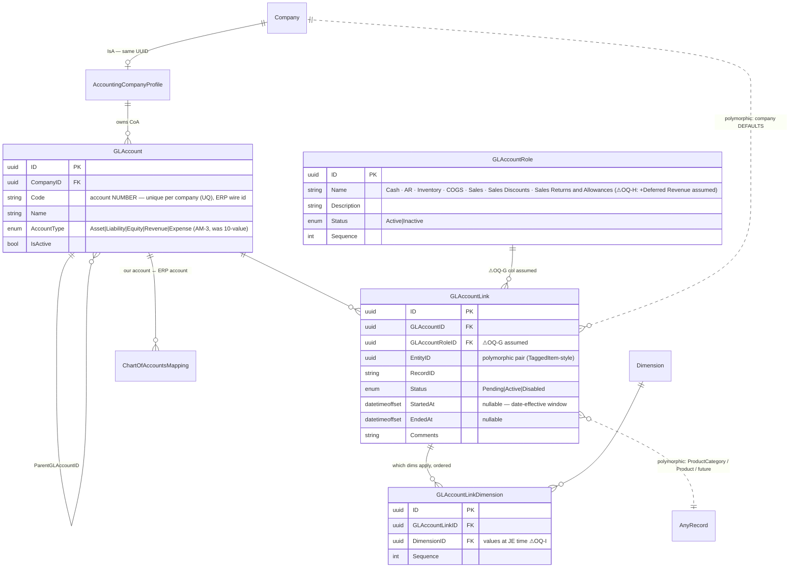
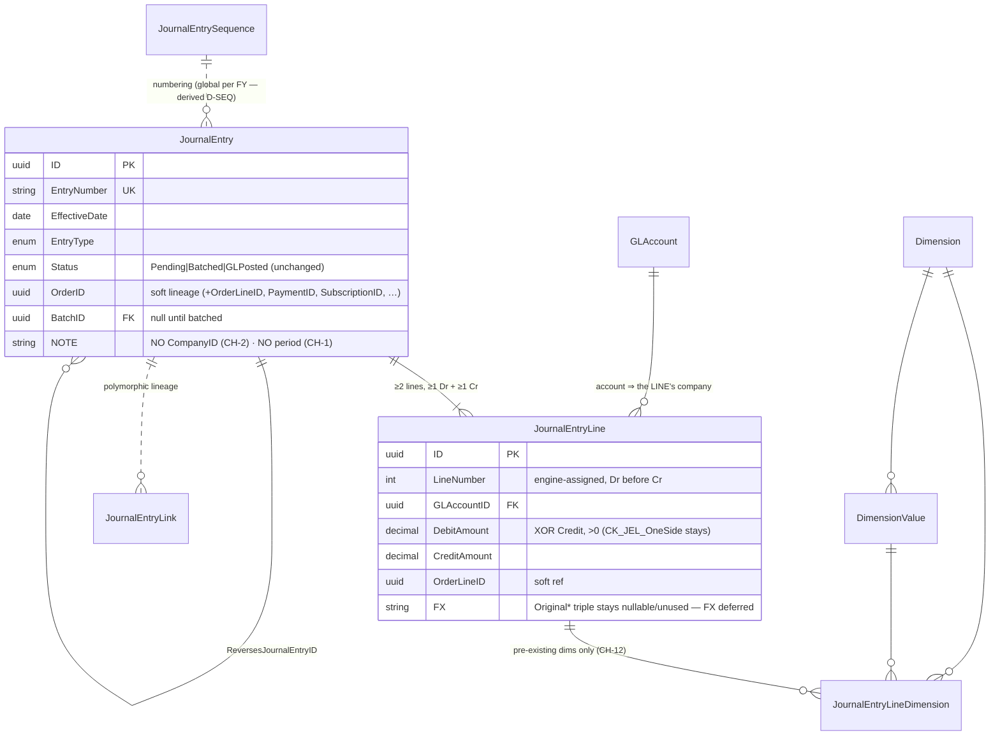
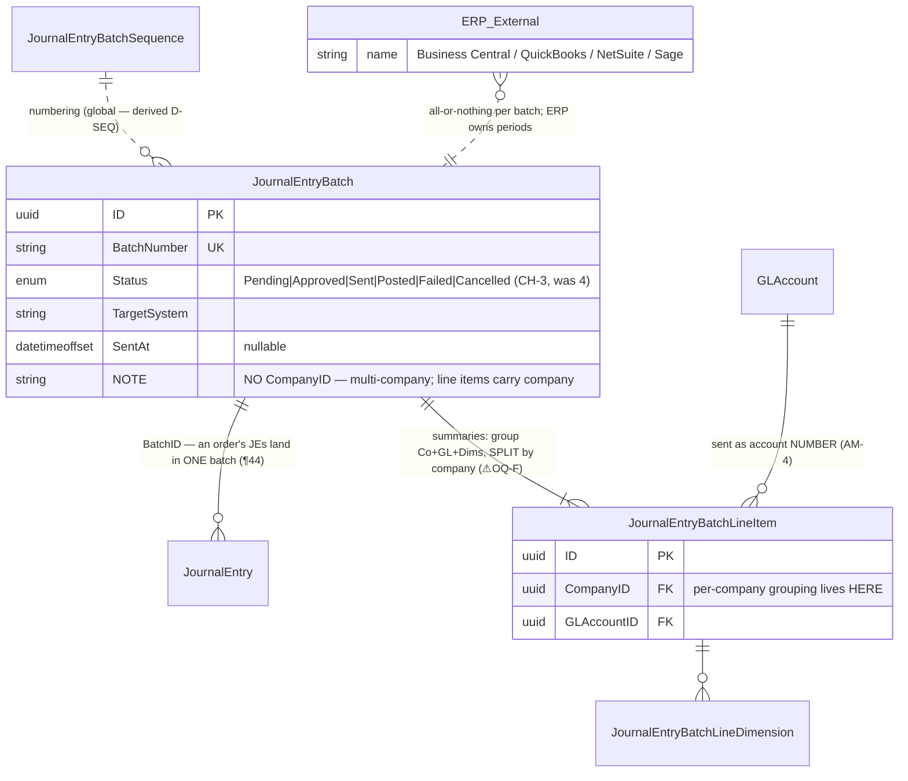

# ERD — bizapps-accounting TARGET schema (post 2026-07-03 rulings)
**v1.2 (RECREATED 2026-07-06 — original lost with the `accounting-engine-work` instance)**

Companion to `accounting-engine-plan.md` §4. System-wide views: `erd-orders-accounting-interface.md` +
`erd-full-system.md` (same folder). Authority: AM-1..7 > 07-02 transcript (¶). ⚠ = open question.
Review artifact — baseline not edited yet.

**Removed from today's v1.0 baseline:** ~~`AccountingPeriod`~~ ~~`AccountBalance`~~
~~`AccountBalanceByDimension`~~ + the period FK columns everywhere + `JournalEntry.CompanyID` +
`JournalEntryBatch.CompanyID` (multi-company).
**New:** `GLAccountRole`, `GLAccountLink`, `GLAccountLinkDimension`.
**Changed:** `GLAccount.AccountType` → 5-enum · batch statuses → 6-value.

## Chart of accounts + the mapping system (A1/A2)

The date-effective window is Amith's "new CoA effective Aug 1" scenario: enter the new link today with
StartedAt, EndedAt the old one; resolution flips automatically; old JEs never touched.

## Journal entries (A3) — multi-company, no periods

Balance rules: Σ Dr = Σ Cr for the whole entry **and** within each company (AM-4) — company is implicit
via `GLAccount.CompanyID`; enforced in the engine AND the balanced-on-lock triggers. Immutability trigger
(locked after Batched/GLPosted) stays.

## Batching to the ERP (A4)

Status meanings: Pending = mutable/deletable · Approved = human-locked (new control step) · Sent = on the
wire · Posted = ERP confirmed (renames Acknowledged) · Failed = ERP rejected (retry loop + escalating
alerts) · Cancelled = terminal, from Pending or unsent Approved.

## Kept but parked (out of the fence)

- **Scheduled JEs** (3 tables) — `TargetAccountingPeriodID` dropped; NO materializer (AM-6): domain entity
  servers generate them; Robert to walk through.
- **Tax** (6 tables) — `TaxLiability.AccountingPeriodID` dropped; otherwise untouched; v1-not-phase-1.
- **Plumbing** — `ChartOfAccountsMapping`, sequences, `JournalEntryLink`, `Currency`/`CurrencySpotRate`.

## Removed, and why that's safe

| Gone | Why |
|---|---|
| `AccountingPeriod` + every FK to it | company-specific + ERP-owned; multi-company JEs made ours a liability (¶5-7, 65-67) |
| `AccountBalance` / `AccountBalanceByDimension` | "Claude-isms" (AM-1) — balance tracking is the ERP's job |
| `JournalEntry.CompanyID` / `JournalEntryBatch.CompanyID` | entries + batches span companies (CH-2/CH-4) |

Pre-release app ⇒ baseline migration is editable; rebuild = clean DB + CodeGen (Amith-sanctioned, AM-7).
