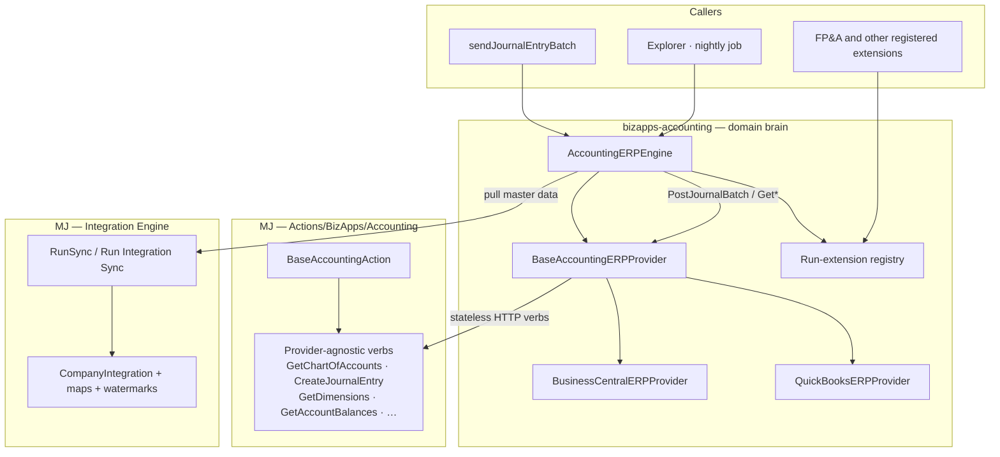

# Accounting ERP provider layer

**Status:** Rev 2 — incorporates Amith 2026-08-29 inline comments  
**This PR:** plan only. No code.  
**Wave:** three PRs together, in order **MJ → bizapps-accounting → bizapps-fpna**.  
**Related (leave open):** [accounting#74](https://github.com/MemberJunction/bizapps-accounting/pull/74), [accounting#112](https://github.com/MemberJunction/bizapps-accounting/pull/112). Exploratory prototypes. Close later with a kind note once the three code PRs exist.

**Docs convention:** mermaid where it helps; cross-repo links use `https://github.com/MemberJunction/<repo>/blob/next/…`.

---

## 1. Jobs

Accounting is a **subledger**, not the GL. Three jobs talk to an external accounting system (Business Central now; any ERP later):

| Job | Direction | Unit of work | Who owns the write |
|---|---|---|---|
| Master data | **Pull** | Chart of accounts, dimensions, dimension values | **This app** → `GLAccount`, `Dimension`, `DimensionValue` |
| Journal dispatch | **Push** | One approved **Journal Entry Batch** (summary JE), all-or-nothing | **This app** → stamp batch + member JEs `GLPosted` + external id |
| Downstream facts | **Pull / verb** | Account balances, later budget / opex | **Other apps** via registered extensions (FP&A → `CashBalance` / `CashBalanceLine`) |

Shared: credentials, company, scheduling, run audit. **Not** shared: a record-sync loop for posting. A batch is not “sync the Journal Entry table.”

**AM-4** (locked in this app’s master plan): when we post to the ERP we send **account numbers**, and we **split by company**. The ERP is the GL; we never invent a single blended company on their side.

---

## 2. Three layers

| Layer | Repo | Knows about |
|---|---|---|
| **Stateless ERP verbs** | MJ `packages/Actions/BizApps/Accounting` | HTTP to BC/QBO/… Chart, dimensions, create a balanced journal, balances. **Zero knowledge of bizapps-accounting.** Usable by any BizApp. |
| **Domain brain** | **This repo** | `GLAccount`, `Dimension`, `DimensionValue`, JE Batch lifecycle, AM-4, fan-out, daily job, **extension seam**. Consumes the MJ verbs. |
| **Extensions** | Other Open Apps (FP&A first) | Register at accounting-engine Config. Run after/alongside a sync or a named verb. Accounting executes them; it does not know `CashBalance`. |

ERP is always **ERP** (acronym, caps).

---

## 3. MJ layer — verbs any app can call

**Today:** `@memberjunction/actions-bizapps-accounting` already has this, but **per-provider class names** (`CreateQuickBooksJournalEntryAction`, `GetBusinessCentralGLAccountsAction`). QBO can create a journal; BC cannot yet. README says these may “migrate” to generic Integration CRUD — **do not**. CRUD-per-object is the wrong grain.

**Redo:**

- Keep `BaseAccountingAction` (credentials via `CompanyIntegration`, env-first OAuth, JE **balance** check — that check is provider-agnostic).
- One **standard verb set**. Each verb is a **base class**; **subclasses** are the ERP plugins (`…BusinessCentral`, `…QuickBooks`). Callers and agents use the **verb name**, not the vendor name. The executor resolves the company’s Integration and dispatches to the subclass.
- Implement **one subclass per ERP we support in MJ**, covering every action already in this package (GL accounts, GL entries, account balances, create journal, plus BC customers/invoices if they stay as verbs).
- **CreateJournalEntry** on BC is the missing twin of QBO’s existing action.
- These actions **only pull and push data** plus trivial validation (balanced lines, required fields). They do **not** upsert `GLAccount` rows, do **not** flip batch status, do **not** write `CashBalance`.

World-class README in that package: what the verbs are, how a new ERP subclasses, mermaid of verb → provider, links to [this plan on `next`](https://github.com/MemberJunction/bizapps-accounting/blob/next/plans/erp-provider-layer.md) once merged.

Generic **Integration Actions** (`IntegrationActionExecutor`) stay for “list BC customers” style object CRUD. They are not how we post a batch.

---

## 4. This app — `AccountingERPEngine`

Lives here (`EngineBase` types + `CoreEntitiesServer`). **No BC/QBO SDK imports.** Talks only to MJ verbs + Integration Engine + extensions.

### 4.1 Provider plugin — **abstract base class**, not an interface

`BaseAccountingERPProvider`. One subclass per ERP, `@RegisterClass` keyed by Integration name.

The **base** does everything that is the same for every ERP:

- Resolve `CompanyIntegration` for this company.
- Call the matching MJ verb (CreateJournalEntry, GetChartOfAccounts, …).
- Map account numbers (AM-4) from `GLAccount.ExternalAccountID` / `Code` before post.
- Translate MJ verb results into this app’s types.

Subclasses only override what is actually different (rare: extra BC company-id header, QBO realm). Prefer “base did it” over copy-paste in BC vs QBO.

### 4.2 Engine verbs

**SyncMasterData({ objects })**  
`objects`: `accounts` | `dimensions` | `dimensionValues`. Calls `IntegrationEngine.RunSync` narrowed by **object name** for every active credentialed Company Integration. Per-company failure isolation. Same engine for nightly job and Explorer button (`Accounting.RunERPSync` remote op). UI does not fan out.

**PostJournalBatch(batch)**  
Replaces `ErpPoster` / `mockErpPoster`.

1. Load summary JE lines.
2. Resolve each line to an ERP account **number**.
3. `BaseAccountingERPProvider.CreateJournalEntry` (→ MJ verb).
4. Success → `Sent → Posted`, stamp **external id** on the batch / summary JE, flip member JEs to `GLPosted`.
5. Failure → **never** mark Posted; keep Sent (or fail the send) with the error. No external id, no Posted.

Tests keep a mock **provider subclass**.

**Not a verb on this engine:** writing FP&A cash. See extensions.

### 4.3 Run-extension seam (other apps)

Accounting does **not** import `@mj-biz-apps/fpna-*`.

After `SyncMasterData` (and optionally after other engine runs), the engine invokes every **registered extension**.

- **Interface** in this repo (small: `onAfterSyncMasterData(ctx)`, maybe `onAfterPostJournalBatch(ctx)`). Context includes company id, as-of, which objects ran, `CompanyIntegrationID`, provider, user.
- **Registration:** `@RegisterClass` plus a metadata row so a host can enable/disable without a rebuild (proposal: MJ Action or a JSON list on the Integration / Company Integration — **no new table unless we must**). FP&A registers `ImportBankAccountBalances` in its server bootstrap.
- Each extension uses the **higher-order accounting brain** (BankAccount links, functional currency, AM-4 numbers) and the **MJ verbs** (`GetAccountBalances`). It writes **its own** tables.

FP&A’s extension: `GetAccountBalances(asOf)` for Active `BankAccount` GLs → `CashBalance` + `CashBalanceLine`, `Source='ERP'`. `FPNA.GetCashPosition` stays a **compute** over that. Point-in-time photo, not an incremental watermark.

Any later app (payroll, expense) registers the same way.

### 4.4 Daily job metadata

Default scheduled job in **this** repo: `metadata/scheduled-jobs/` → `AccountingERPEngine.SyncMasterData` once per day, all objects, all credentialed companies. One job, not N. Hosts can disable.

---

## 5. Integration Engine — pull only for slowly changing master data

| Need | Path |
|---|---|
| Nightly upsert of **COA, dimensions, dimension values** into **our** tables | Entity maps + `RunSync`. Engine only fans out and names objects. |
| One balanced journal, then **our** batch state machine | MJ verb `CreateJournalEntry` via `PostJournalBatch`. |
| Balances for cash | **FP&A extension**, MJ verb `GetAccountBalances`. Not a map onto `CashBalanceLine` (every AsOf is a new photo). |

One **Company Integration** per company per ERP (name is the vendor, e.g. Business Central). Many entity maps. Accounting and FP&A **share** it. Hosts pick their ERP; we are not married to BC.

Steal from #74/#112 (as notes, not by merging those PRs): field maps (`number → Code`, category → AccountType, …), Priority order, stamp local company/dimension ids because field-map lookup is static, object-name narrowing.

Do **not** steal: app-owned `BusinessCentralConnector` ClassFactory hijack, fan-out in a page, a second job driver that duplicates the engine.

---

## 6. Downstream (FP&A) — third PR in the wave

- Register the cash-import extension on accounting-engine Config.
- Docs in FP&A: how the extension is registered, what `GetCashPosition` expects after a successful import, mermaid back to [this plan](https://github.com/MemberJunction/bizapps-accounting/blob/next/plans/erp-provider-layer.md) and the [MJ actions README](https://github.com/MemberJunction/MJ/blob/next/packages/Actions/BizApps/Accounting/README.md) (paths as of `next`).
- No BC subclass in FP&A.

---

## 7. What we will not do

- A parallel Accounting Integrations engine.
- An app-owned BC connector that wins ClassFactory for the whole host.
- Fan-out or `RunSync` loops in Angular.
- Outbound entity-map of every Journal Entry.
- Persist `GetCashPosition`.
- Accounting engine writing `CashBalance`.
- MJ Actions package importing bizapps-accounting.

---

## 8. Build wave (three PRs, one wave)

1. **MJ** — standardize `Actions/BizApps/Accounting`: verb base + subclasses per ERP; BC `CreateJournalEntry`; README + mermaid; unit tests per verb (balance, mapping, error codes).
2. **bizapps-accounting** — `BaseAccountingERPProvider` + `AccountingERPEngine` + `Accounting.RunERPSync` + wire `PostJournalBatch` (mock + one real plugin) + extension registry + `metadata/scheduled-jobs` daily sync + docs that **point at** the MJ README + integration + unit tests (batch stamp / fail-closed Posted, fan-out isolation, extension invoked).
3. **bizapps-fpna** — cash-import extension + tests that a fake provider + BankAccount links produce `CashBalance` lines; `GetCashPosition` still fails loud with no import; docs.

Then close #74 / #112.

---

## 9. Close of the prototypes (later, not now)

When the three code PRs exist, comment on #74 and #112:

> Thank you — the field maps, stamping local company/dimension ids, object-name narrowing, and “one Company Integration, additive maps” are the design we are keeping. We are not merging this PR. Instead we are putting **stateless ERP verbs** in MJ `Actions/BizApps/Accounting` (any app can call them; they do not know about this Open App), an **`AccountingERPEngine` + `BaseAccountingERPProvider`** in this repo for GL/dimension upserts, JE-batch atomicity, and a **run-extension seam** other apps register (FP&A cash import is the first). Pull of COA/dimensions uses the MJ Integration Engine; posting a batch uses `CreateJournalEntry`, not an outbound table sync. Plan: [`plans/erp-provider-layer.md`](https://github.com/MemberJunction/bizapps-accounting/blob/next/plans/erp-provider-layer.md). Code: MJ PR …, accounting PR …, FP&A PR …. Grateful for the prototype — it unblocked the maps and the fan-out shape.

Do **not** close them from this plan PR.

---

## 10. Decisions locked from Rev 1 comments

| # | Decision |
|---|---|
| Provider shape | **Abstract base class** (`BaseAccountingERPProvider`), not a bare interface |
| MJ Actions | Verb base + ERP subclasses; **no** knowledge of this app |
| COA / dimensions | Integration **maps** + daily job in `metadata/scheduled-jobs` |
| JE post | MJ `CreateJournalEntry` + this app’s batch state machine |
| Balances / cash | **FP&A extension**, not accounting engine code |
| Company Integration | **One** per company per ERP, shared by apps |
| Jobs | **One** scheduled job → `SyncMasterData` |
| Caps | **ERP**, not Erp |

**Still a product choice, not a blocker:** enable/disable extensions via ClassFactory-only vs a metadata flag on the Integration. Start ClassFactory; add a flag if hosts need to turn FP&A import off without a rebuild.
